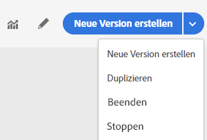

# Einstellen einer Journey

Mit den Optionen **[!UICONTROL Anhalten]** und **[!UICONTROL Abschließen]** können Sie **live geschaltete** Journeys einstellen. Das Einstellen einer Journey bedeutet, **dass die Ankunft neuer Kunden in der Journey blockiert wird** und dass die Kunden, die bereits an der Journey teilnehmen, diese bis zum Ende durchführen können. Dies ist die empfohlene Art und Weise, eine Journey zu beenden, da sie für die Kunden das beste Erlebnis bietet. Das Anhalten einer Journey bedeutet, dass Personen, die bereits an der Journey teilnehmen, in ihrem Fortschritt angehalten werden. Die Journey ist im Grunde abgeschaltet.

>[!NOTE]
>
>Beachten Sie, dass Sie eine abgeschlossene oder angehaltene Journey nicht fortsetzen können.

## Abschließen einer Journey

Sie können eine Journey manuell abschließen, um sicherzustellen, dass Kunden, die bereits an der Journey teilnehmen, ihren Pfad zwar abschließen können, neue Anwender jedoch nicht auf die Journey zugreifen können.

Eine abgeschlossene Journey-Version kann nicht neu gestartet oder gelöscht werden. Sie können eine neue Version davon erstellen oder sie duplizieren.

Sie können eine Journey anhalten, indem Sie auf **[!UICONTROL Abschließen]** klicken, während Sie mit der Maus in der Liste der Journeys auf eine Journey zeigen.

Außerdem haben Sie folgende Möglichkeiten:

1. Klicken Sie auf der **[!UICONTROL Startseite]** auf die Journey, die Sie abschließen möchten.
1. Klicken Sie oben rechts auf den Abwärtspfeil.

   

1. Klicken Sie auf **[!UICONTROL Abschließen]**. Ein Dialogfeld wird angezeigt.
1. Klicken Sie zur Bestätigung auf **[!UICONTROL Abschließen]**.

## Anhalten einer Journey

Sie können eine Journey anhalten, wenn ein Notfall aufgetreten ist und die Verarbeitung in der Journey sofort beendet werden muss.

Eine angehaltene Journey-Version kann nicht neu gestartet werden.

Sie können eine Journey anhalten, wenn ein Notfall eintritt (z. B. wenn ein Marketing-Experte erkennt, dass die Journey auf die falsche Audience ausgerichtet ist, oder wenn eine benutzerdefinierte Aktion, mit der Nachrichten gesendet werden sollen, nicht richtig funktioniert usw.), indem Sie auf **[!UICONTROL Anhalten]** klicken, während Sie mit der Maus in der Liste der Journeys auf eine Journey zeigen.

Außerdem haben Sie folgende Möglichkeiten:

1. Klicken Sie auf der **[!UICONTROL Startseite]** auf die Journey, die Sie anhalten möchten.
1. Klicken Sie oben rechts auf den Abwärtspfeil.

1. Klicken Sie auf **[!UICONTROL Anhalten]**. Ein Dialogfeld wird angezeigt.
1. Klicken Sie zur Bestätigung auf **[!UICONTROL Anhalten]**.
