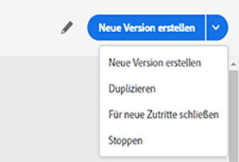

# Abbrechen einer Journey

Um eine **aktive** Journey abzubrechen, stehen Ihnen die Optionen **[!UICONTROL Stoppen]** und **[!UICONTROL Beenden]** zur Verfügung. Wenn Sie eine Journey beenden, wird **der Einstieg neuer Kunden in die Journey blockiert** und die bereits in der Journey befindlichen Kunden können diese bis zum Ende durchlaufen. Dies ist die empfohlene Art, eine Journey zu beenden, da sie für die Kunden das beste Erlebnis bietet. Wenn Sie hingegen eine Journey stoppen, wird die Reise der bereits in der Journey befindlichen Personen abgebrochen. Die Journey wird praktisch deaktiviert.

>[!NOTE]
>
>Beachten Sie, dass Sie eine beendete oder gestoppte Journey nicht fortsetzen können.

## Beenden einer Journey

Sie können eine Journey manuell beenden. In diesem Fall können sich Kunden, die sich bereits in der Journey befinden, ihren Pfad bis zum Ende verfolgen, neue Anwender können jedoch nicht in die Journey eintreten.

Eine beendete Journey-Version kann weder neu gestartet noch gelöscht werden. Stattdessen können Sie eine neue Version davon erstellen oder sie duplizieren.

Wenn Sie eine Journey stoppen möchten, klicken Sie auf **[!UICONTROL Beenden]**, während Sie die Maus über die jeweilige Journey in der Liste der Journeys bewegen.

Alternativ können Sie auch folgendermaßen vorgehen:

1. Klicken Sie auf der **[!UICONTROL Startseite]** auf die Journey, die Sie beenden möchten.
1. Klicken Sie oben rechts auf den Abwärtspfeil.

   

1. Klicken Sie auf **[!UICONTROL Beenden]**. Ein Dialogfeld wird angezeigt.
1. Klicken Sie zur Bestätigung auf **[!UICONTROL Beenden]**.

## Stoppen einer Journey

Sie können eine Journey stoppen, wenn ein unerwartetes Ereignis eintritt und die gesamte Verarbeitung der Journey unverzüglich abgebrochen werden muss.

Eine gestoppte Journey-Version kann nicht nochmals gestartet werden.

Ein unerwartetes Ereignis tritt z. B. ein, wenn ein Marketing-Experte erkennt, dass die Journey auf die falsche Audience ausgerichtet ist, oder wenn eine benutzerdefinierte Aktion, mit der Nachrichten gesendet werden sollen, nicht richtig funktioniert. Wenn Sie eine Journey stoppen möchten, klicken Sie auf **[!UICONTROL Stoppen]**, während Sie die Maus über die jeweilige Journey in der Liste der Journeys bewegen.

Alternativ können Sie auch folgendermaßen vorgehen:

1. Klicken Sie auf der **[!UICONTROL Startseite]** auf die Journey, die Sie stoppen möchten.
1. Klicken Sie oben rechts auf den Abwärtspfeil.

1. Klicken Sie auf **[!UICONTROL Stoppen]**. Ein Dialogfeld wird angezeigt.
1. Klicken Sie zur Bestätigung auf **[!UICONTROL Stoppen]**.
