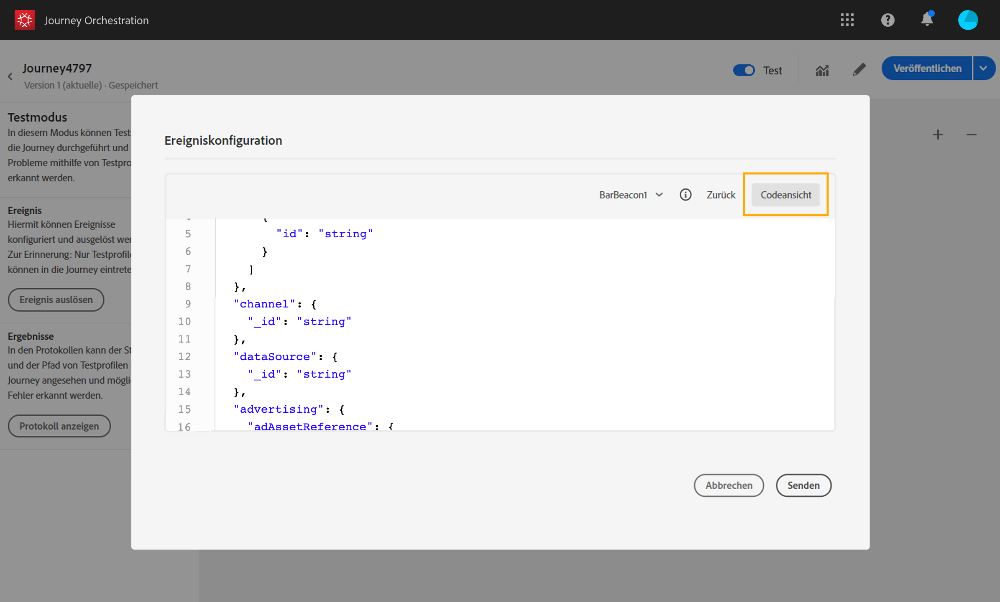

# Testen der Journey{#testing_the_journey}

Bevor Sie Ihre Journey testen können, müssen Sie alle eventuell vorhandenen Fehler beheben. Siehe [](../about/troubleshooting.md#section_h3q_kqk_fhb).

Sie können Ihre Journey vor der Veröffentlichung mit Testprofilen testen. Auf diese Weise können Sie analysieren, wie sich Kontakte in der Journey bewegen, und Fehler vor der Veröffentlichung beheben.

Gehen Sie wie folgt vor, um den Testmodus zu verwenden:

1. Bevor Sie Ihre Journey testen, überprüfen Sie, ob sie gültig ist und keine Fehler vorliegen. Fehlerbehaftete Journeys können nicht getestet werden. Siehe [](../about/troubleshooting.md#section_h3q_kqk_fhb). Bei Fehlern wird ein Warnsymbol angezeigt.

1. Um den Testmodus zu aktivieren, klicken Sie in der rechten oberen Ecke auf den Umschalter **[!UICONTROL Test]**.

   

1. Verwenden Sie den Parameter **[!UICONTROL Wartezeit im Test]** unten links, um die Dauer jeder Warteaktivität im Testmodus festzulegen. Die standardmäßige Dauer beträgt 10 Sekunden. Dadurch erhalten Sie die Testergebnisse schnell. Dieser Parameter wird nur angezeigt, wenn Sie Ihrer Journey mindestens eine Warteaktivität hinzugefügt haben.

   

1. Klicken Sie auf **[!UICONTROL Ereignis auslösen]**, um Ereignisse zu konfigurieren und an die Journey zu senden. Vergewissern Sie sich, dass Ereignisse gesendet werden, die im Zusammenhang mit Testprofilen stehen. Siehe [Auslösen Ihrer Ereignisse](#firing_events).

   

1. Nachdem die Ereignisse eingegangen sind, klicken Sie auf die Schaltfläche **[!UICONTROL Protokoll anzeigen]**, um das Testergebnis anzuzeigen und zu überprüfen. Siehe [Anzeigen der Protokolle](#viewing_logs).

   

1. Wenn ein Fehler auftritt, deaktivieren Sie den Testmodus, ändern Sie Ihre Journey und testen Sie sie erneut. Wenn der Test abgeschlossen ist, können Sie Ihre Journey veröffentlichen. Siehe [](../building-journeys/publishing-the-journey.md).

## Wichtige Hinweise           {#important_notes}

* Es wird eine Benutzeroberfläche bereitgestellt, über die Ereignisse für die getestete Journey ausgelöst werden können. Ereignisse können aber auch von Drittanbietersystemen wie Postman gesendet werden.
* Nur Kontakte, die im Echtzeit-Kundenprofil als „Testprofile“ gekennzeichnet sind, dürfen an der getesteten Journey teilnehmen. Siehe [](../building-journeys/testing-the-journey.md#create-test-profile).
* Der Testmodus ist nur in Entwurfs-Journeys verfügbar, die einen Namespace verwenden. Der Testmodus muss prüfen, ob eine Person, die die Journey betritt, ein Testprofil ist oder nicht, und muss daher in der Lage sein, Adobe Experience Platform zu erreichen.
* Die maximale Anzahl von Testprofilen, die während einer Testsitzung auf eine Journey zugreifen können, beträgt 100.
* Wenn Sie den Testmodus deaktivieren, werden alle Personen, die in der Vergangenheit an der Journey teilgenommen haben oder sich derzeit darin befinden, aus der Journey entfernt. Dabei werden auch die Berichte gelöscht.
* Sie können den Testmodus beliebig oft aktivieren/deaktivieren.
* Sie können Ihre Journey nicht ändern, wenn der Testmodus aktiviert ist. Im Testmodus können Sie die Journey direkt veröffentlichen, ohne den Testmodus zuvor deaktivieren zu müssen.

## Erstellen eines Testprofils{#create-test-profile}

Der Prozess zum Erstellen eines Testprofils entspricht dem Vorgang zum Erstellen eines Profils in Adobe Experience Platform. Er wird über API-Aufrufe ausgeführt. Weitere Informationen finden Sie auf dieser [Seite](https://docs.adobe.com/content/help/de-DE/experience-platform/profile/home.html)

Sie müssen ein Profilschema verwenden, das das Mixin für Profiltestdetails enthält. Die Markierung „testProfile“ ist Teil dieses Mixins.

Achten Sie beim Erstellen eines Profils darauf, diesen Wert zu übergeben: testprofile = true.

Beachten Sie, dass Sie auch ein vorhandenes Profil aktualisieren können, um die Markierung „testProfile“ in „true“ zu ändern.

Hier sehen Sie ein Beispiel für einen API-Aufruf zum Erstellen eines Testprofils:

```
curl -X POST \
'https://dcs.adobedc.net/collection/xxxxxxxxxxxxxx' \
-H 'Cache-Control: no-cache' \
-H 'Content-Type: application/json' \
-H 'Postman-Token: xxxxx' \
-H 'cache-control: no-cache' \
-H 'x-api-key: xxxxx' \
-H 'x-gw-ims-org-id: xxxxx' \
-d '{
"header": {
"msgType": "xdmEntityCreate",
"msgId": "xxxxx",
"msgVersion": "xxxxx",
"xactionid":"xxxxx",
"datasetId": "xxxxx",
"imsOrgId": "xxxxx",
"source": {
"name": "Postman"
},
"schemaRef": {
"id": "https://example.adobe.com/mobile/schemas/xxxxx",
"contentType": "application/vnd.adobe.xed-full+json;version=1"
}
},
"body": {
"xdmMeta": {
"schemaRef": {
"contentType": "application/vnd.adobe.xed-full+json;version=1"
}
},
"xdmEntity": {
"_id": "xxxxx",
"_mobile":{
"ECID": "xxxxx"
},
"testProfile":true
}
}
}'
```

## Auslösen Ihrer Ereignisse {#firing_events}

Mit der Schaltfläche **[!UICONTROL Ereignis auslösen]** können Sie ein Ereignis konfigurieren, das eine Person zum Zutritt zur Journey veranlasst.

>[!NOTE]
>
>Wenn Sie ein Ereignis im Testmodus auslösen, wird ein reales Ereignis generiert, d. h. es beeinflusst auch andere Journeys, die dieses Ereignis überwachen.

Als Voraussetzung müssen Sie wissen, welche Profile in Adobe Experience Platform als Testprofile gekennzeichnet sind. Der Testmodus lässt nur diese Profile in der Journey zu und das Ereignis muss eine ID enthalten. Die erwartete ID hängt von der Ereigniskonfiguration ab. Sie kann beispielsweise eine ECID sein.

Wenn Ihre Journey mehrere Ereignisse enthält, wählen Sie ein Ereignis aus der Dropdown-Liste aus. Konfigurieren Sie dann für jedes Ereignis die weitergeleiteten Felder und die Ausführung des Ereignisversands. Über die Benutzeroberfläche können Sie die richtigen Informationen in der Ereignis-Payload angeben und prüfen, ob der Informationstyp korrekt ist. Der Testmodus speichert die zuletzt in einer Testsitzung verwendeten Parameter zur späteren Verwendung.

>[!NOTE]
>
>Beachten Sie, dass der **[!UICONTROL TIMESTAMP]**


Über die Benutzeroberfläche können Sie einfache Ereignisparameter übergeben. Wenn Sie Sammlungen oder andere erweiterte Objekte in dem Ereignis verwenden möchten, können Sie auf **[!UICONTROL Codeansicht]** klicken, um den gesamten Code der Payload anzuzeigen und zu ändern. Beispielsweise können Sie die von einem technischen Anwender erstellten Ereignisinformationen kopieren und einfügen.



Ein technischer Anwender kann diese Benutzeroberfläche auch verwenden, um Payloads für Ereignisse zu erstellen und Ereignisse auszulösen, ohne ein Tool eines Drittanbieters verwenden zu müssen.

Wenn Sie auf die Schaltfläche **[!UICONTROL Senden]** klicken, beginnt der Test. Der Fortschritt des Kontakts in der Journey wird durch einen visuellen Verlauf dargestellt. Der Pfad wird immer grüner, je weiter sich der Kontakt in der Journey bewegt. Tritt ein Fehler auf, wird auf dem entsprechenden Schritt ein Warnsymbol angezeigt. Sie können den Cursor darauf platzieren, um weitere Informationen zum Fehler anzuzeigen und genaue Details aufzurufen (sofern verfügbar).


Wenn Sie im Bildschirm für die Ereigniskonfiguration ein anderes Profil auswählen und den Test erneut ausführen, wird der visuelle Verlauf geleert und stattdessen der Pfad des neuen Kontakts angezeigt.

Beim Öffnen einer Journey im Test ist der angezeigte Pfad der des zuletzt durchgeführten Tests

Der visuelle Fluss funktioniert unabhängig davon, ob das Ereignis über die Benutzeroberfläche oder extern ausgelöst wird (z. B. mit Postman).

## Anzeigen der Protokolle {#viewing_logs}

Mit der Schaltfläche **[!UICONTROL Protokoll anzeigen]** können Sie die Testergebnisse anzeigen. Auf dieser Seite werden die aktuellen Informationen der Journey im JSON-Format angezeigt. Mit einer Schaltfläche können Sie ganze Knoten kopieren. Sie müssen die Seite manuell aktualisieren, um die Testergebnisse der Journey zu aktualisieren.


>[!NOTE]
>
>In den Testprotokollen werden bei einem fehlerhaften Aufruf eines Drittanbietersystems (Datenquelle oder Aktion) der Fehlercode und die Fehlerantwort angezeigt.

Die Anzahl der Kontakte (technisch gesehen handelt es sich um Instanzen), die sich derzeit innerhalb der Journey befinden, wird angezeigt. Außerdem finden Sie hier nützliche Informationen zu jedem Kontakt:

* _ID_: die interne ID des Kontakts in der Journey. Diese kann zum Debugging verwendet werden.
* _currentstep_: der Schritt, in dem sich der Kontakt in der Journey befindet. Es wird empfohlen, Ihren Aktivitäten Titel zu geben, damit Sie sie leichter identifizieren können.
* _currentstep > phase_: der Status der Journey des Kontakts (Läuft, Beendet, Fehler, Zeitüberschreitung). Weitere Informationen finden Sie unten.
* _currentstep_ > _extraInfo_: Beschreibung des Fehlers und andere kontextbezogene Informationen.
* _currentstep_ > _fetchErrors_: Informationen zu Datenfehlern beim Abrufen, die während dieses Schritts aufgetreten sind.
* _externalKeys_: der Wert für die im Ereignis definierte Schlüsselformel.
* _enrichedData_: die Daten, die die Journey abgerufen hat, falls sie Datenquellen verwendet hat.
* _transitionHistory_: die Schritte, denen der betreffende Kontakt folgte. Bei Ereignissen wird die Payload angezeigt.
* _actionExecutionErrors_: Informationen zu den aufgetretenen Fehlern.

Hier eine Liste der verschiedenen Status der Journey eines Kontakts:

* _Läuft_: der Kontakt befindet sich derzeit in der Journey.
* _Beendet_: der Kontakt befindet sich am Ende der Journey.
* _Fehler_: der Kontakt wird aufgrund eines Fehlers in der Journey gestoppt.
* _Zeitüberschreitung_: der Kontakt wird aufgrund eines Schritts, der zu viel Zeit in Anspruch genommen hat, in der Journey gestoppt.
