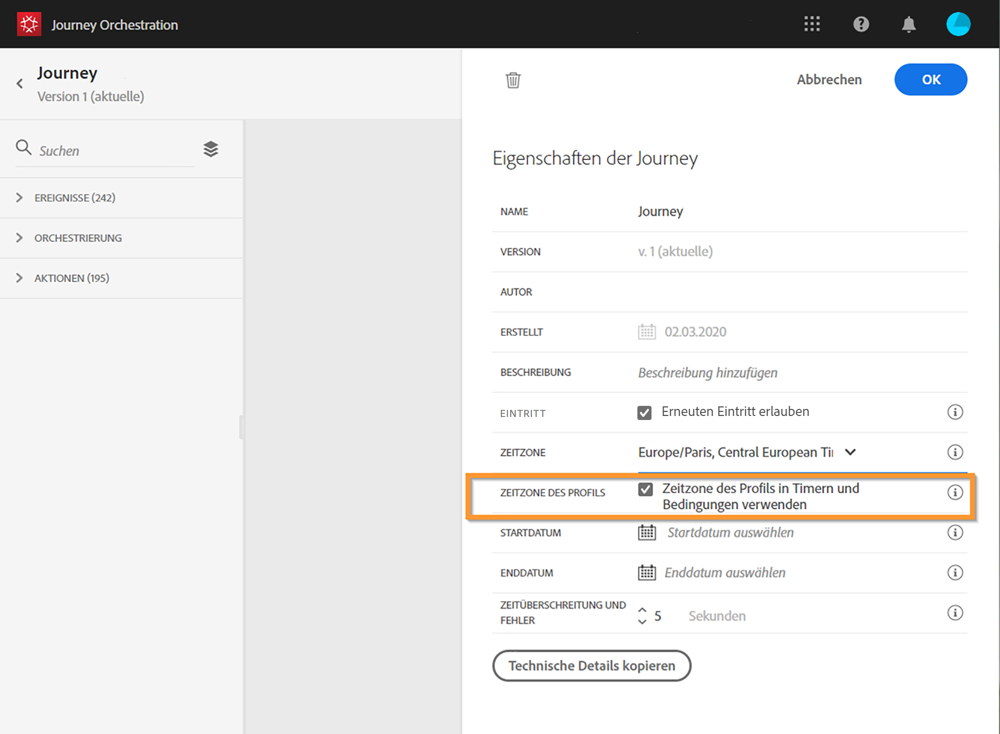
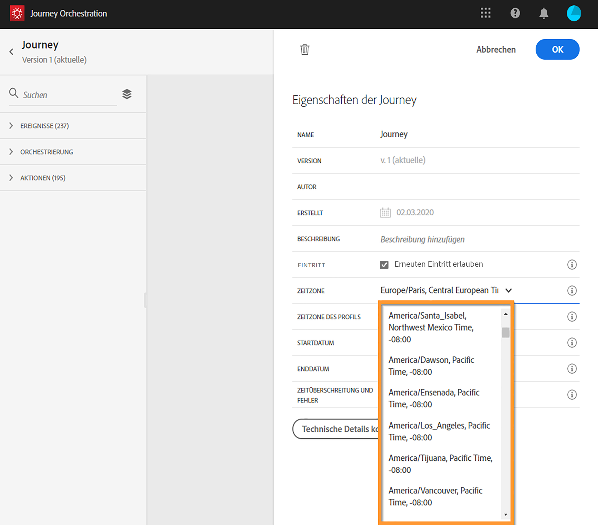

# Zeitzonen {#timezone_management}

Die Definition der Zeitzone ist in den folgenden Aktivitäten verfügbar:

* 
* 
* 
* 

Wenn das Einstiegsereignis der Reise einen Namespace hat, d. h. die Reise kann den Echtzeitkundenprofildienst der Datenplattform erreichen, wird die Zeitzone mit der im Profil des einzelnen, auf der Reise ablaufenden Benutzers festgelegten Zeitzone vordefiniert. Wenn das Profil des Benutzers keine Zeitzone enthält, wird die Zeitzone der Instanz verwendet. Wenden Sie sich an Ihren Administrator, um die Zeitzone der Instanz zu erfahren.

Die Zeitzone kann auch festgelegt werden. Löschen Sie die vordefinierte Zeitzone und wählen Sie eine aus der Dropdownliste aus. Wenn Sie eine feste Zeitzone verwenden, ist diese für alle Personen gleich, die die Reise beginnen.

Schließlich kann die Zeitzone für jede Person, die den Schritt betritt, dynamisch sein. In diesem Fall verwenden Sie den Ausdruckseditor, um auszuwählen, wo das System diese Informationen abrufen soll (sie können von einem Ereignis oder einer Datenquelle stammen). Näheres wird im Abschnitt  beschrieben.

Start- und Enddaten einer Reise können nicht mit einer bestimmten Zeitzone verknüpft werden. Sie werden automatisch der Zeitzone der Instanz zugeordnet.
