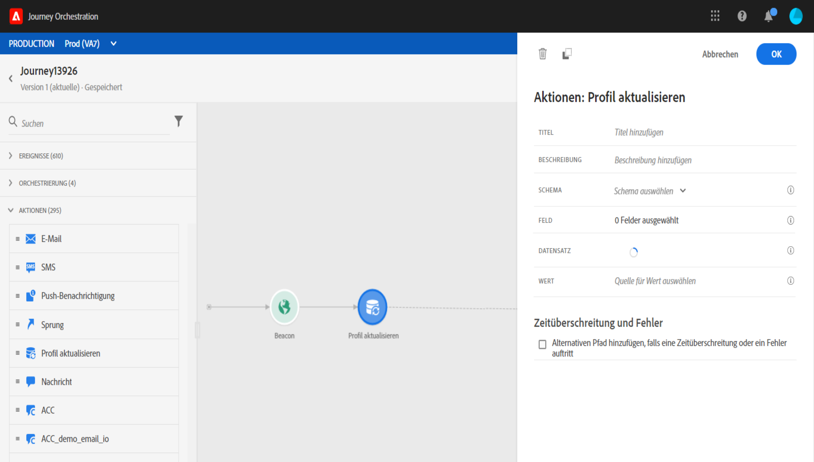
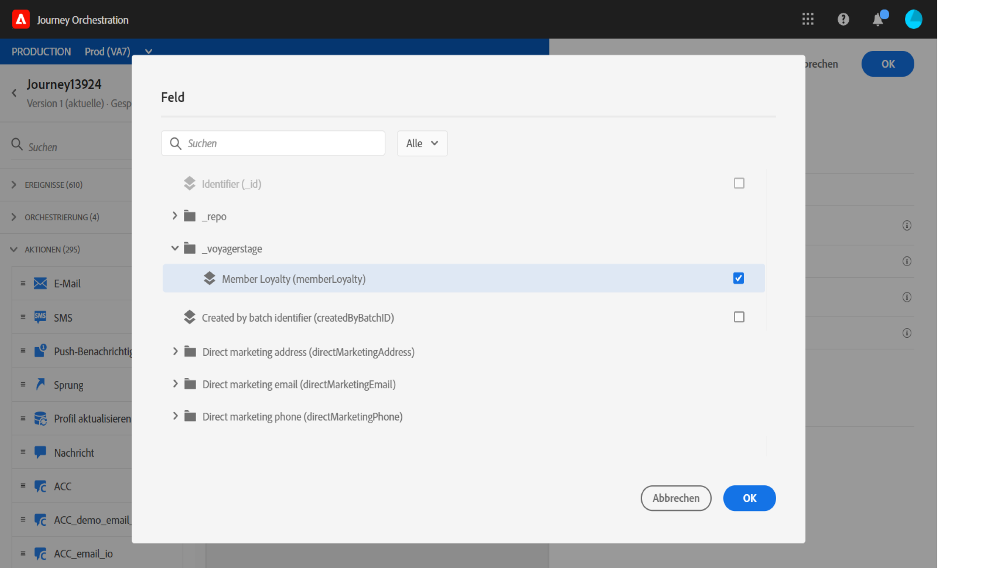
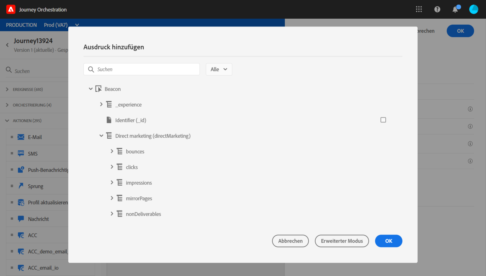
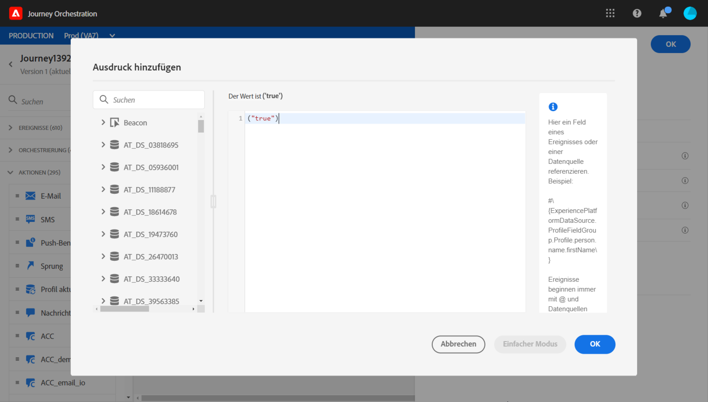
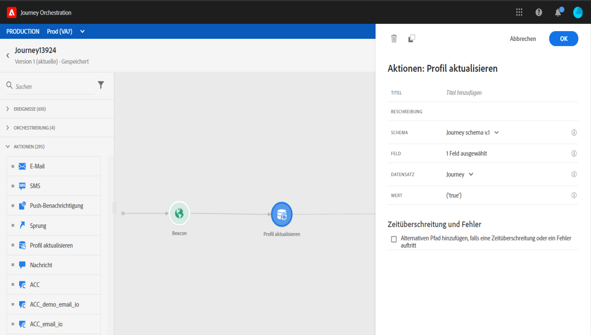

# Profil {#update-profile} aktualisieren

Mit der Aktivität **[!UICONTROL Profil aktualisieren]** können Sie ein vorhandenes Adobe Experience Platform-Profil mit Informationen aktualisieren, die aus dem Ereignis, einer Datenquelle oder einem bestimmten Wert stammen.

## Wichtige Hinweise     

* Die Aktion **Profil aktualisieren** kann nur in Journey verwendet werden, beginnend mit einem Ereignis mit einem Namensraum.
* Die Aktion aktualisiert nur die vorhandenen Felder, sie erstellt keine neuen Profil-Felder.
* Sie können die Aktion **Profil aktualisieren** nicht verwenden, um Erlebnis-Ereignis zu generieren, z. B. einen Kauf.
* Wie bei jeder anderen Aktion können Sie auch im Fehlerfall oder bei Zeitüberschreitung einen alternativen Pfad definieren und zwei Aktionen nicht parallel platzieren.
* Die an die Plattform gesendete Aktualisierungsanforderung erfolgt schnell, jedoch nicht sofort/innerhalb einer Sekunde. Es dauert normalerweise ein paar Sekunden, manchmal aber auch mehr ohne Garantie. Wenn eine Aktion beispielsweise &quot;field 1&quot;verwendet, die durch eine zuvor positionierte Aktualisierungsaktion aktualisiert wurde, sollten Sie nicht erwarten, dass &quot;field 1&quot;in der Profil-Aktion aktualisiert wird.
* Datenquellen haben eine Vorstellung von der Cachedauer auf Feldebene. Wenn Sie erwarten, dass Sie in einer Journey ein kürzlich aktualisiertes Profil-Feld nutzen, sollten Sie eine sehr kurze Cache-Dauer definieren.

## Verwenden des Testmodus {#using-the-test-mode}

Im Testmodus wird die Aktualisierung des Profils nicht simuliert. Die Aktualisierung wird am Test-Profil durchgeführt.

Nur Profil können im Testmodus in eine Journey wechseln. Sie können entweder ein neues Profil erstellen oder ein vorhandenes Profil in ein Test-Profil umwandeln. In Adobe Experience Platform können Sie die Attribute von Profilen über API-Aufrufe aktualisieren, jedoch nicht über die Oberfläche. Am einfachsten ist dies mit der Action-Aktivität **Profil aktualisieren** und dem booleschen Testfeld des Profils von &quot;false&quot;in &quot;true&quot;.

Weitere Informationen zum Testmodus finden Sie in diesem [Abschnitt](../building-journeys/testing-the-journey.md).

## Profil-Update verwenden

1. Entwerfen Sie Ihre Journey, indem Sie mit einem Ereignis beginnen. Siehe diesen [Abschnitt](../building-journeys/journey.md).

1. Legen Sie im Bereich **Aktion** der Palette die Aktivität **Profil** aktualisieren auf der Arbeitsfläche ab.

   

1. Wählen Sie ein Schema aus der Liste.

1. Klicken Sie auf **Felder**, um das Feld auszuwählen, das Sie aktualisieren möchten. Es kann nur ein Feld ausgewählt werden.

   

1. Wählen Sie einen Datensatz aus der Liste aus. Die Datensatzauswahl bestimmt, wo der neue Profil gespeichert wird.

1. Klicken Sie auf das Feld **Wert**, um den gewünschten Wert zu definieren:

   * Mit dem einfachen Ausdruck-Editor können Sie ein Feld aus einer Datenquelle oder aus dem eingehenden Ereignis auswählen.

      

   * Wenn Sie einen bestimmten Wert definieren oder erweiterte Funktionen nutzen möchten, klicken Sie auf **Erweiterter Modus**.

      

Das Profil **Aktualisieren** ist jetzt konfiguriert.

