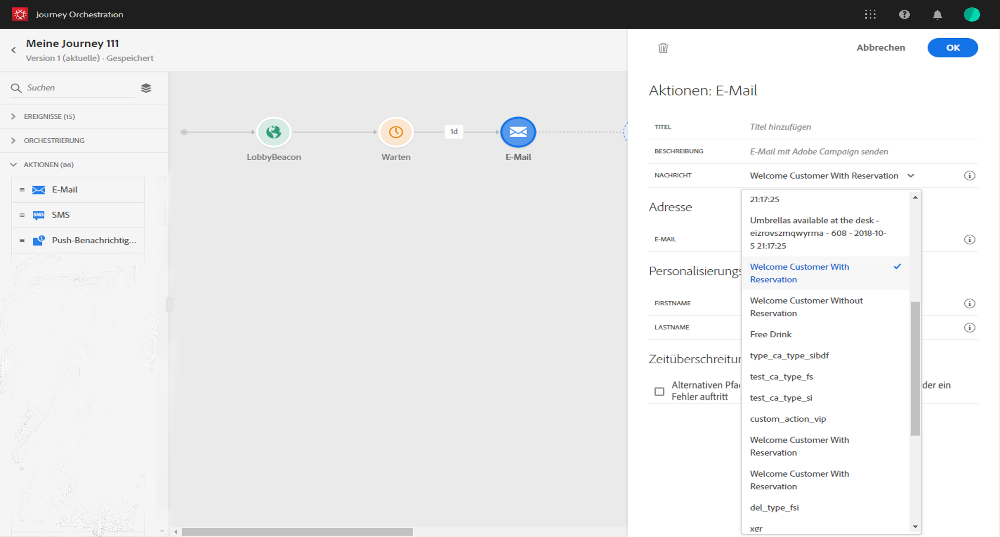
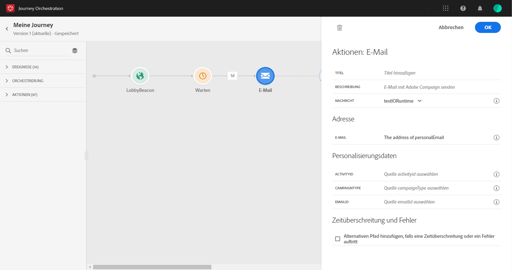
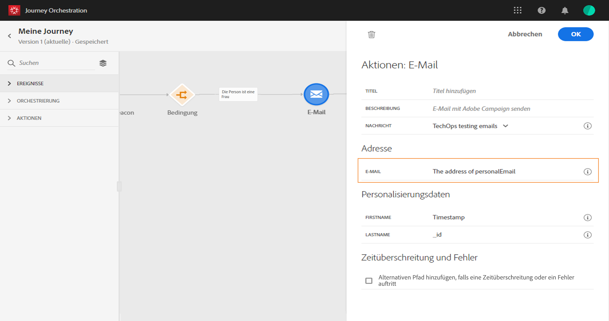
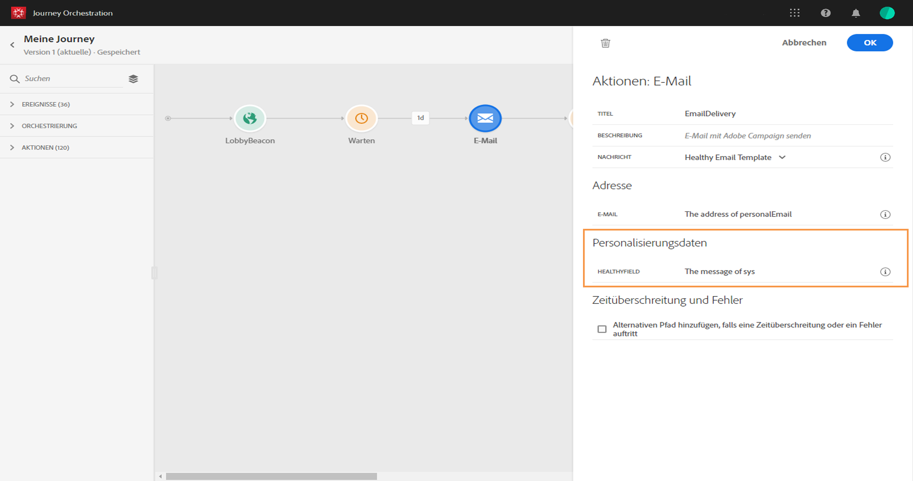
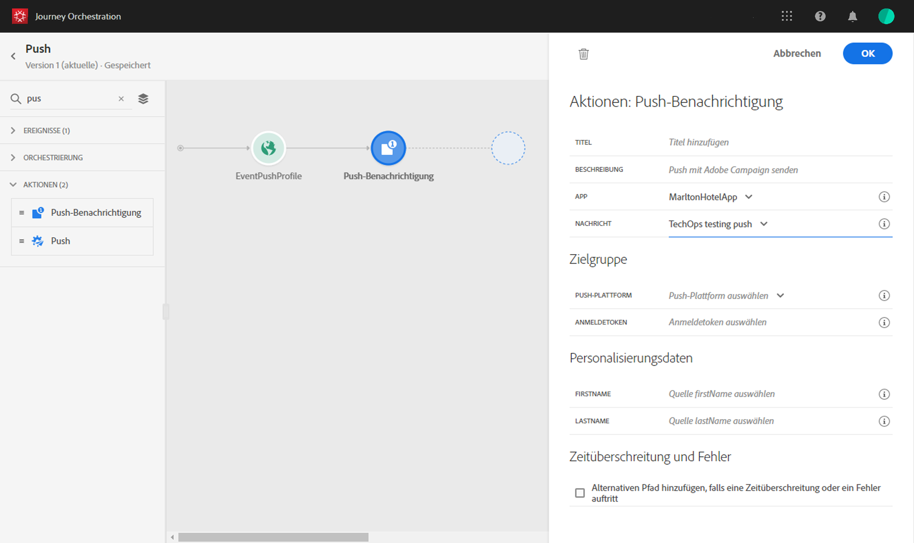

# Verwenden von Adobe Campaign-Aktionen {#using_campaign_action}

Wenn Sie über Adobe Campaign Standard verfügen, stehen die folgenden vordefinierten Aktionsaktivitäten zur Verfügung: **[!UICONTROL E-Mail]**, **[!UICONTROL Push]** und **[!UICONTROL SMS]**.

>[!NOTE]
>
>Dazu müssen Sie die integrierte Aktion konfigurieren. Siehe [](../action/working-with-adobe-campaign.md).

Für jeden dieser Kanäle wählen Sie eine Adobe Campaign Standard-**Transaktionsnachrichtenvorlage** aus. [!DNL Journey Orchestration] ist keine Lösung zum Senden von Nachrichten. Für die integrierten E-Mail-, SMS- und Push-Kanäle werden Transaktionsnachrichten verwendet, um den Nachrichtenversand auszuführen. Das bedeutet, dass Sie, wenn Sie eine bestimmte Nachrichtenvorlage in Ihren Journeys verwenden möchten, diese in Adobe Campaign Standard veröffentlichen müssen. Auf dieser [Seite](https://docs.adobe.com/content/help/de-DE/campaign-standard/using/communication-channels/transactional-messaging/about-transactional-messaging.html) erfahren Sie, wie Sie diese Funktion verwenden.

>[!NOTE]
>
>Die Transaktionsnachricht in Campaign Standard und das zugehörige Ereignis müssen veröffentlicht werden, damit sie in Journey Orchestration verwendet werden können. Wenn das Ereignis veröffentlicht wird, die Nachricht jedoch nicht, wird sie nicht in der Benutzeroberfläche von Journey Orchestration angezeigt. Wenn die Nachricht veröffentlicht wird, das zugehörige Ereignis jedoch nicht, wird sie in der Benutzeroberfläche von Journey Orchestration angezeigt, sie kann jedoch nicht verwendet werden.



Sie können eine ereignisbasierte (d. h. Echtzeit-) oder eine profilbasierte Transaktionsnachrichtenvorlage verwenden.

>[!NOTE]
>
>Wenn wir Echtzeit-Transaktionsnachrichten (rtEvent) senden oder Nachrichten über eine benutzerdefinierte Aktion mit einem Drittanbietersystem weiterleiten, ist eine spezifische Einrichtung für die Verwaltung von Ermüdung, Blockierungsliste oder Abmeldung erforderlich. Wenn beispielsweise ein &quot;unsubscribe&quot;-Attribut in der Adobe Experience Platform oder in einem Drittanbietersystem gespeichert wird, muss vor dem Senden der Nachricht eine Bedingung hinzugefügt werden, um diese Bedingung zu überprüfen.

Wenn Sie eine Vorlage auswählen, werden alle Felder, die in der Payload der Nachricht erwartet werden, im Konfigurationsbereich der Aktivität unter **[!UICONTROL Adresse]** und **[!UICONTROL Personalisierungsdaten]** angezeigt. Sie müssen jedes dieser Felder im Ereignis oder der Datenquelle dem zu verwendenden Feld zuordnen. Sie können auch den erweiterten Ausdruckseditor verwenden, um einen Wert manuell zu übergeben, Datenmanipulationen an abgerufenen Informationen vorzunehmen (z. B. eine Zeichenfolge in Großbuchstaben zu konvertieren) oder Funktionen wie „if, then, else“ zu verwenden. Siehe [](../expression/expressionadvanced.md).



## E-Mail und SMS {#section_asc_51g_nhb}

Für **[!UICONTROL E-Mail]** und **[!UICONTROL SMS]** sind die Parameter identisch.

>[!NOTE]
>
>Wenn Sie für E-Mails eine profilbasierte Transaktionsvorlage verwenden, wird der Abmeldungsmechanismus standardmäßig von Campaign Standard durchgeführt. Fügen Sie der Vorlage einfach einen Inhaltsblock für den **[!UICONTROL Link zum Abmelden]** hinzu ([weitere Informationen](https://docs.adobe.com/content/help/de-DE/campaign-standard/using/communication-channels/transactional-messaging/about-transactional-messaging.html)). Wenn Sie eine ereignisbasierte Vorlage (rtEvent) verwenden, müssen Sie der Nachricht einen Link hinzufügen, über den die E-Mail-Adresse der Person im URL-Parameter übergeben wird und auf eine Landingpage zum Abmelden verwiesen wird. Sie müssen diese Landingpage erstellen und sicherstellen, dass die Entscheidung der Person, sich abzumelden, an Adobe übermittelt wird.

Zuerst müssen Sie eine Transaktionsnachrichtenvorlage auswählen. Siehe [](../building-journeys/about-action-activities.md).

Es stehen zwei Kategorien zur Verfügung: **[!UICONTROL Adresse]** und **[!UICONTROL Personalisierungsdaten]**.

Über die Benutzeroberfläche können Sie einfach festlegen, wo die **[!UICONTROL Adresse]** oder die **[!UICONTROL Personalisierungsdaten]** abgerufen werden sollen. Sie können Ereignisse und Felder der verfügbaren Datenquellen durchsuchen. Sie können den erweiterten Ausdruckseditor auch für erweiterte Anwendungsfälle verwenden, z. B. für die Verwendung einer Datenquelle, die die Übermittlung von Parametern oder die Durchführung von Manipulationen erfordert. Siehe [](../expression/expressionadvanced.md).

**[!UICONTROL Adresse]**

>[!NOTE]
>
>Diese Kategorie ist nur sichtbar, wenn Sie eine ereignisbasierte Transaktionsnachricht auswählen. Bei profilbasierten Nachrichten wird das Feld **[!UICONTROL Adresse]** vom System automatisch aus Adobe Campaign Standard abgerufen.

Dies sind die Felder, die das System benötigt, um zu wissen, wohin die Nachricht gesendet werden soll. Bei einer E-Mail-Vorlage ist dies die E-Mail-Adresse. Bei einer SMS ist es die Mobiltelefonnummer.



**[!UICONTROL Personalisierungsdaten]**

>[!NOTE]
>
>Sie können keine Sammlungen in Personalisierungsdaten übergeben. Wenn die Transaktions-E-Mail oder -SMS Sammlungen erwartet, funktioniert dies nicht. Beachten Sie außerdem, dass die Personalisierungsdaten ein erwartetes Format haben (Beispiel: Zeichenfolge, Dezimalzahl usw.). Sie müssen darauf achten, dass diese erwarteten Formate eingehalten werden.

Dies sind die Felder, die von der Adobe Campaign Standard-Nachricht erwartet werden. Diese Felder können verwendet werden, um die Nachricht zu personalisieren, eine bedingte Formatierung anzuwenden oder eine bestimmte Nachrichtenvariante auszuwählen.



## Push-Benachrichtigung {#section_im3_hvf_nhb}

Vor der Verwendung der Push-Aktivität muss Ihre App mit Campaign Standard konfiguriert werden, um Push-Benachrichtigungen zu senden. Verwenden Sie diesen [Artikel](https://helpx.adobe.com/de/campaign/kb/integrate-mobile-sdk.html), um die erforderlichen Implementierungsschritte für Mobilgeräte auszuführen.

Wählen Sie zunächst eine App aus der Dropdown-Liste und eine Transaktionsnachricht aus. Siehe [](../building-journeys/about-action-activities.md).



Es stehen zwei Kategorien zur Verfügung: **[!UICONTROL Zielgruppe]** und **[!UICONTROL Personalisierungsdaten]**.

**[!UICONTROL Zielgruppe]**

>[!NOTE]
>
>Diese Kategorie ist nur sichtbar, wenn Sie eine ereignisbasierte Nachricht auswählen. Bei profibasierten Nachrichten werden die **[!UICONTROL Zielgruppenfelder]** automatisch vom System unter Verwendung der von Adobe Campaign Standard durchgeführten Abstimmung abgerufen.

In diesem Abschnitt müssen Sie die **[!UICONTROL Push-Plattform]** definieren. In der Dropdown-Liste können Sie **[!UICONTROL Apple Push Notification Server]** (iOS) oder **[!UICONTROL Firebase Cloud Messaging]** (Android) auswählen. Sie können alternativ ein bestimmtes Feld aus einem Ereignis oder einer Datenquelle auswählen oder einen erweiterten Ausdruck definieren.

Sie müssen auch das **[!UICONTROL Anmeldetoken]** definieren. Der Ausdruck hängt davon ab, wie das Token in der Ereignis-Payload oder in anderen [!DNL Journey Orchestration]-Informationen definiert wird. Es kann sich um ein einfaches Feld oder einen komplexeren Ausdruck handeln, wenn das Token beispielsweise in einer Sammlung definiert ist:

```
@{Event_push._experience.campaign.message.profileSnapshot.pushNotificationTokens.first().token}
```

**[!UICONTROL Personalisierungsdaten]**

>[!NOTE]
>
>Sie können keine Sammlungen in Personalisierungsdaten übergeben. Wenn die Transaktions-Push-Benachrichtigung Sammlungen erwartet, funktioniert dies nicht. Beachten Sie außerdem, dass die Personalisierungsdaten ein erwartetes Format haben (Beispiel: Zeichenfolge, Dezimalzahl usw.). Sie müssen darauf achten, dass diese erwarteten Formate eingehalten werden.

Dies sind die Felder, die von der in Ihrer Adobe Campaign Standard-Nachricht verwendeten Transaktionsvorlage erwartet werden. Sie können diese Felder verwenden, um Ihre Nachricht zu personalisieren, eine bedingte Formatierung anzuwenden oder eine bestimmte Nachrichtenvariante auszuwählen.
