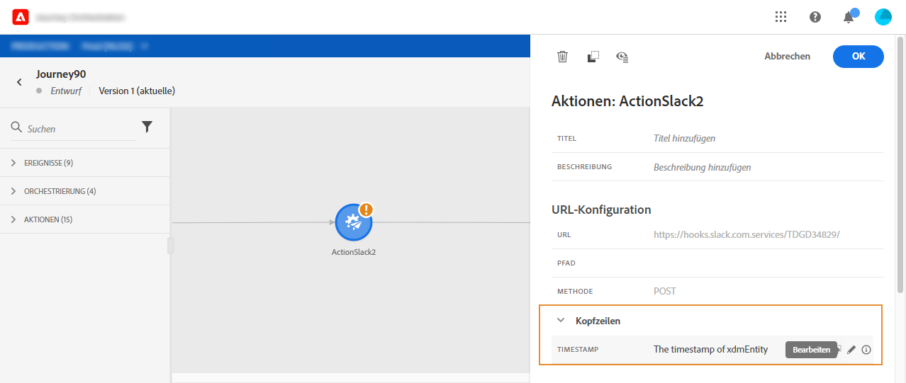

# Verwenden benutzerdefinierter Aktionen {#section_f2c_hbg_nhb}

>[!CAUTION]
>
>**Sie möchten mehr über Adobe Journey Optimizer erfahren**? Klicken Sie [hier](https://experienceleague.adobe.com/de/docs/journey-optimizer/using/ajo-home){target="_blank"}, um auf die Journey Optimizer-Dokumentation zuzugreifen.
>
>
>_Diese Dokumentation bezieht sich auf veraltete Journey Orchestration-Materialien, die durch Journey Optimizer ersetzt wurden. Wenden Sie sich an Ihr Accountteam, wenn Sie Fragen zu Ihrem Zugriff auf Journey Orchestration oder Journey Optimizer haben._

Im Konfigurationsbereich für die Aktivität werden die URL-Konfigurationsparameter und die Authentifizierungsparameter angezeigt, die für die benutzerdefinierte Aktion konfiguriert sind. [Weitere Informationen](../action/about-custom-action-configuration.md).

## URL-Konfiguration

### Dynamischer Pfad

Wenn die URL einen dynamischen Pfad enthält, geben Sie den Pfad im Feld **[!UICONTROL Pfad]** an.

>[!NOTE]
>
>Sie können den statischen Teil der URL nicht in der Journey, sondern müssen ihn in der globalen Konfiguration der benutzerdefinierten Aktion einrichten. [Weitere Informationen](../action/about-custom-action-configuration.md).

Verwenden Sie zum Verketten von Feldern und Nur-Text-Zeichenfolgen die Zeichenfolgen-Funktionen oder das Pluszeichen (+) im erweiterten Ausdruckseditor. Schließen Sie Nur-Text-Zeichenfolgen in einfachen Anführungszeichen (&#39;) oder in doppelten Anführungszeichen (&quot;) ein. [Weitere Informationen](../expression/expressionadvanced.md).

Die folgende Tabelle zeigt ein Beispiel für die Konfiguration:

| Feld | Wert |
| --- | --- |
| URL | `https://xxx.yyy.com:8080/somethingstatic/` |
| Pfad | `The id of marketingCampaign + '/messages'` |

Die verkettete URL sieht folgendermaßen aus:

`https://xxx.yyy.com:8080/somethingstatic/`\&lt;campaign ID\>`/messages`

### Header

Im Abschnitt **[!UICONTROL URL-Konfiguration]** werden die dynamischen Header-Felder, jedoch nicht die konstanten Header-Felder angezeigt. Dynamische Header-Felder sind HTTP-Header-Felder, deren Wert als Variable konfiguriert ist. [Weitere Informationen](../action/about-custom-action-configuration.md).

Geben Sie bei Bedarf den Wert der dynamischen Header-Felder an:

1. Wählen Sie in der Journey die benutzerdefinierte Aktion aus.
1. Klicken Sie im Abschnitt **[!UICONTROL URL-Konfiguration]** im Konfigurationsbereich auf das Stiftsymbol neben dem Header-Feld.

   

1. Wählen Sie ein Feld aus und klicken Sie auf **[!UICONTROL OK]**.

## Aktionsparameter

Im Abschnitt **[!UICONTROL Aktionsparameter]** sehen Sie die Nachrichtenparameter, die als _Variable_ definiert sind. Für diese Parameter können Sie festlegen, wo diese Informationen abgerufen werden sollen (Beispiel: Ereignisse, Datenquellen), Werte manuell übergeben oder den erweiterten Ausdruckseditor für erweiterte Anwendungsfälle verwenden. Erweiterte Anwendungsfälle können Datenmanipulationen und andere Funktionen sein. [Weitere Informationen](../expression/expressionadvanced.md).

**Verwandte Themen**

[Konfigurieren einer Aktion](../action/about-custom-action-configuration.md)
