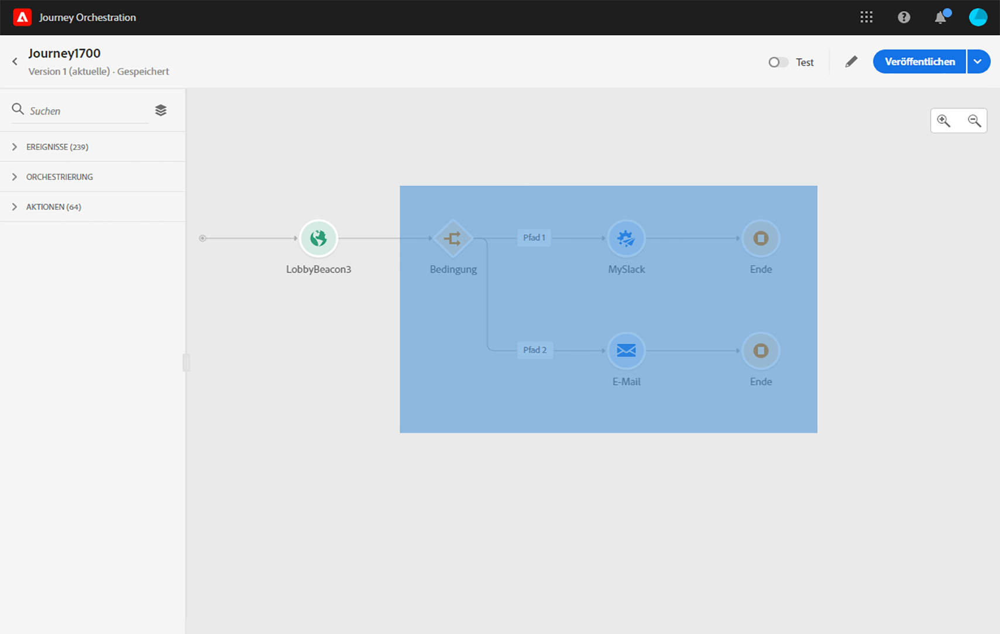
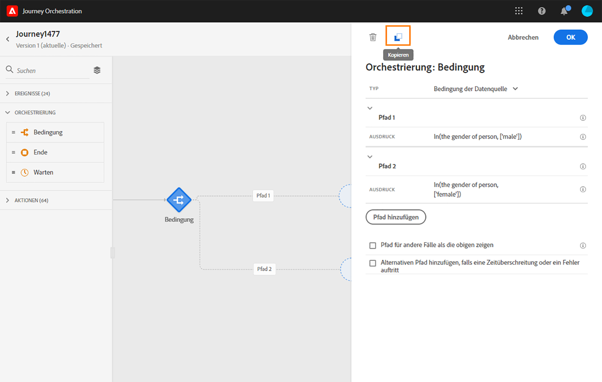
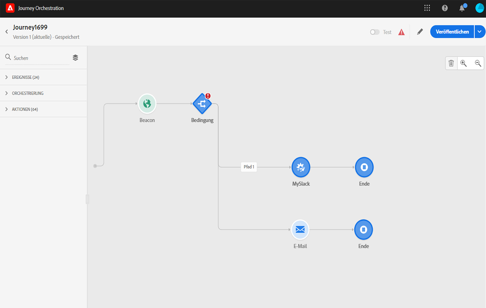

# Verwenden des Journey-Designers {#concept_m1g_5qt_52b}

Im Startseitenmenü der Journey können Sie die **Liste der Journeys** anzeigen. Erstellen Sie eine neue Journey oder klicken Sie auf eine bestehende, um die Benutzeroberfläche des **Journey-Designers** zu öffnen. Der Designer besteht aus den folgenden Zonen: Palette, Arbeitsfläche und Konfigurationsbereich für die Aktivität.

## Die Liste der Journeys {#journey_list}

Die **Liste der Journeys** ermöglicht es Ihnen, alle Ihre Journeys gleichzeitig anzuzeigen, deren Status zu sehen und grundlegende Aktionen durchzuführen. Sie können Ihre Journeys duplizieren, stoppen oder löschen. Je nach Journey stehen bestimmte Aktionen möglicherweise nicht zur Verfügung. Sie können beispielsweise eine geschlossene Reise weder löschen noch neu starten. Stattdessen können Sie eine neue Version davon erstellen, sie duplizieren oder stoppen. Sie können auch die Suchleiste verwenden, um nach einer Journey zu suchen.

Sie können auf die **[!UICONTROL Filter]** zugreifen, indem Sie auf das Filtersymbol links oben in der Liste klicken. Mit dem Filtermenü können Sie die angezeigten Journeys nach verschiedenen Kriterien filtern (Status, von Ihnen erstellte, in den letzten 30 Tagen geänderte, neueste Versionen usw.). Sie können auch festlegen, dass nur die Journeys angezeigt werden, die ein bestimmtes Ereignis, eine bestimmte Feldergruppe oder eine bestimmte Aktion verwenden. Die in der Liste angezeigten Spalten können konfiguriert werden. Alle Filter und Spalten werden pro Anwender gespeichert.

Alle Versionen Ihrer Journeys erscheinen in der Liste mit der Versionsnummer. Siehe .

>[!NOTE]
>
>Um die Arbeitsfläche einer Journey in einem anderen Browser-Tab zu öffnen, halten Sie die **Strg**- oder **Befehlstaste** gedrückt und klicken Sie auf die Journey.

## Die Palette {#palette}

Die **Palette** befindet sich auf der linken Bildschirmseite. Alle verfügbaren Aktivitäten sind in verschiedene Kategorien unterteilt: **[!UICONTROL Ereignisse]**, **[!UICONTROL Orchestrierung]** und **[!UICONTROL Aktionen]**. Sie können die verschiedenen Kategorien erweitern/reduzieren, indem Sie auf ihren Namen klicken. Um eine Aktivität in Ihrer Journey zu verwenden, ziehen Sie sie per Drag-and-Drop aus der Palette in Ihre Arbeitsfläche. Sie können auch auf eine Aktivität in der Palette doppelklicken, um sie im nächsten verfügbaren Schritt der Arbeitsfläche hinzuzufügen. Sie müssen jede in der Palette hinzugefügte Aktivität konfigurieren, bevor Sie die Journey veröffentlichen. Wenn Sie eine Aktivität auf der Arbeitsfläche ablegen und die Konfiguration nicht beenden, bleibt sie auf der Arbeitsfläche. Eine rote Warnung weist jedoch darauf hin, dass die Konfiguration für diese Aktivität nicht abgeschlossen ist.

>[!NOTE]
>
>Beachten Sie, dass beim Einrichten einer Journey Regeln gelten. Eine nicht zulässige Konfiguration wird verworfen. Beispielsweise können Sie keine Aktionen parallel platzieren, eine Aktivität nicht mit einem vorherigen Schritt verknüpfen, um eine Schleife zu erstellen, eine Journey nicht mit etwas anderem als einem Ereignis starten usw.

Mit dem Symbol **Deaktivierte Elemente einblenden** oben links können Sie nicht verfügbare Elemente in der Palette ein- oder ausblenden (z. B. Ereignisse, die einen anderen Namespace als den in Ihrer Journey verwenden). Standardmäßig werden nicht verfügbare Elemente ausgeblendet. Wenn Sie sie anzeigen lassen, werden sie grau dargestellt.

Wenn Sie das Feld **Suchen** verwenden, wird die Anzahl der Ergebnisse für jede Aktivitätskategorie auf der Arbeitsfläche angezeigt.

## Die Arbeitsfläche {#canvas}

Die **Arbeitsfläche** ist der zentrale Bereich im Journey-Designer. In diesem Bereich können Sie Ihre Aktivitäten ablegen und konfigurieren. Klicken Sie auf eine Aktivität auf der Arbeitsfläche, um sie zu konfigurieren. Dadurch wird der Konfigurationsbereich für die Aktivität auf der rechten Seite geöffnet. Mit den Schaltflächen „+“ und „-“ oben rechts können Sie ein- und auszoomen. Auf der Arbeitsfläche können Sie nach allen Aktivitäten einen nächsten Schritt hinzufügen, mit Ausnahme der **[!UICONTROL Endaktivitäten]** (siehe ).

## Der Konfigurationsbereich für die Aktivität {#configuration_pane}

Der **Konfigurationsbereich für die Aktivität** wird angezeigt, wenn Sie auf eine Aktivität in der Palette klicken. Füllen Sie die erforderlichen Felder aus. Klicken Sie auf das Symbol **[!UICONTROL Löschen]**, um die Aktivität zu löschen. Klicken Sie auf **[!UICONTROL Abbrechen]**, um die Änderungen abzubrechen, oder auf **[!UICONTROL OK]**, um zu bestätigen. Um Aktivitäten zu löschen, können Sie auch eine Aktivität (oder mehrere) auswählen und die Rücktaste drücken. Durch Drücken der Esc-Taste wird der Konfigurationsbereich für die Aktivität geschlossen.

Auf der Arbeitsfläche werden Ihre Aktions- und Ereignisaktivitäten durch ein Symbol mit dem Namen des Ereignisses oder der Aktion dargestellt. Im Konfigurationsbereich für die Aktivität können Sie das Feld **[!UICONTROL Titel]** verwenden, um dem Aktivitätsnamen ein Suffix hinzuzufügen. Diese Titel helfen Ihnen dabei, die Verwendung von Ereignissen und Aktionen in einen Zusammenhang zu stellen, insbesondere wenn Sie dasselbe Ereignis oder dieselbe Aktion mehrmals in Ihrer Journey verwenden. Sie können auch die Titel sehen, die Sie im Reporting für Journey Orchestration hinzugefügt haben.

## Die Aktionen in der oberen Leiste {#top_actions}

Abhängig vom Status der Journey können Sie mithilfe der Schaltflächen oben rechts verschiedene Aktionen für Ihre Journey ausführen: **[!UICONTROL Veröffentlichen]**, **[!UICONTROL Duplizieren]**, **[!UICONTROL Löschen]**, **[!UICONTROL Eigenschaften der Journey]**, **[!UICONTROL Test]**. Diese Schaltflächen werden angezeigt, wenn keine Aktivität ausgewählt ist. Einige Schaltflächen werden kontextuell angezeigt. Die Protokollschaltfläche für den Testmodus wird angezeigt, wenn der Testmodus aktiviert ist (siehe ). Die Schaltfläche &quot;Berichte&quot;wird angezeigt, wenn die Reise live, gestoppt oder geschlossen ist.

## Die Verwendung von Pfaden auf der Arbeitsfläche {#paths}

Mehrere Aktivitäten (**[!UICONTROL Bedingungs-]** oder **[!UICONTROL Aktionsaktivitäten]**) ermöglichen es Ihnen, eine Ausweichaktion für den Fall eines Fehlers oder einer Zeitüberschreitung zu definieren. Aktivieren Sie im Konfigurationsbereich für die Aktivität das Kontrollkästchen **[!UICONTROL Alternativen Pfad hinzufügen, falls eine Zeitüberschreitung oder ein Fehler auftritt]**. Nach der Aktivität wird ein anderer Pfad hinzugefügt. Die Dauer der Zeitüberschreitung wird in den Eigenschaften der Journey durch einen Administrator definiert (siehe ). Wenn beispielsweise der Versand einer E-Mail zu lange dauert oder ein Fehler auftritt, können Sie sich für den Versand einer SMS entscheiden.

Verschiedene Aktivitäten (Ereignis, Aktion, Warten) ermöglichen es Ihnen, nach der Aktivität mehrere Pfade hinzuzufügen. Setzen Sie dazu den Cursor auf die Aktivität und klicken Sie auf das „+“-Symbol. Nur Ereignis- und Warteaktivitäten können parallel festgelegt werden. Wenn mehrere Ereignisse parallel festgelegt werden, wird der Pfad des Ereignisses ausgewählt, das zuerst stattfindet.

Wir empfehlen, beim Überwachen eines Ereignisses nicht auf unbestimmte Zeit auf das Ereignis zu warten. Dies ist nicht obligatorisch, sondern nur eine Best Practice. Wenn Sie ein oder mehrere Ereignisse nur während einer bestimmten Zeit überwachen möchten, platzieren Sie ein oder mehrere Ereignisse und eine Warteaktivität parallel. Siehe .

Um den Pfad zu löschen, platzieren Sie den Cursor darauf und klicken Sie auf das Symbol **[!UICONTROL Pfad löschen]**.

Wenn zwei Aktivitäten auf der Arbeitsfläche getrennt werden, wird eine Warnung angezeigt. Platzieren Sie den Cursor auf das Warnsymbol, um die entsprechende Fehlermeldung anzuzeigen. Um das Problem zu beheben, verschieben Sie einfach die getrennte Aktivität und verbinden Sie sie mit der vorherigen Aktivität.

## Kopieren und Einfügen von Aktivitäten {#copy-paste}

Sie können eine oder mehrere Aktivitäten einer Reise kopieren und sie entweder auf derselben oder auf einer anderen Reise einfügen. Auf diese Weise sparen Sie Zeit, wenn Sie zahlreiche Aktivitäten wiederverwenden möchten, die bereits auf einer vorherigen Reise konfiguriert wurden.

**Wichtige Hinweise**

* Sie können die Datei über verschiedene Registerkarten und Browser hinweg kopieren und einfügen. Sie können nur Aktivitäten innerhalb derselben Instanz kopieren/einfügen.
* Sie können ein Ereignis nicht kopieren/einfügen, wenn die Zielreise über ein Ereignis verfügt, das einen anderen Namensraum verwendet.
* Eingefügte Aktivitäten können auf Daten verweisen, die auf der Zielreise nicht vorhanden sind, z. B. wenn Sie über verschiedene Sandboxen kopieren/einfügen. Überprüfen Sie immer nach Fehlern und nehmen Sie die erforderlichen Anpassungen vor.
* Beachten Sie, dass Sie eine Aktion nicht rückgängig machen können. Um eingefügte Aktivitäten zu löschen, müssen Sie sie auswählen und löschen. Wählen Sie daher vor dem Kopieren nur die gewünschten Aktivitäten aus.
* Sie können Aktivitäten von jeder Reise kopieren, auch solche, die schreibgeschützt sind.
* Sie können eine beliebige Aktivität auswählen, auch solche, die nicht verknüpft sind. Verknüpfte Aktivitäten bleiben nach dem Einfügen verknüpft.

Im Folgenden werden die Schritte zum Kopieren/Einfügen von Aktivitäten beschrieben:

1. Mach eine Reise auf.
1. Wählen Sie die Aktivitäten aus, die Sie kopieren möchten, indem Sie die Maus beim Klicken bewegen. Sie können auch auf jede Aktivität klicken und gleichzeitig die **Strg-/Befehlstaste** drücken. Verwenden Sie **Strg/Befehl + A** , wenn Sie alle Aktivitäten auswählen möchten.
   
1. Drücken Sie **Strg/Befehl + C**.
Wenn Sie nur eine Aktivität kopieren möchten, können Sie darauf klicken und das Symbol &quot; **Kopieren** &quot;oben links im Konfigurationsbereich der Aktivität verwenden.
   
1. Drücken Sie auf jeder Reise die **Strg-/Befehlstaste + V** , um die Aktivitäten ohne Verknüpfung mit einem vorhandenen Knoten einzufügen. Eingefügte Aktivitäten werden in derselben Reihenfolge angeordnet. Nach dem Einfügen bleiben die Aktivitäten ausgewählt, damit Sie sie einfach verschieben können. Sie können den Cursor auch auf einen leeren Platzhalter setzen und **Strg/Befehl + V**drücken. Eingefügte Aktivitäten werden mit dem Knoten verknüpft.
   

