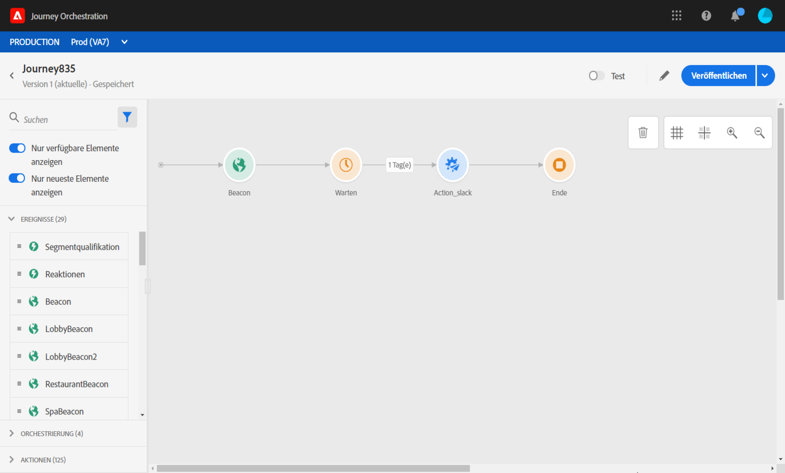

# Verwenden des Journey-Designers {#concept_m1g_5qt_52b}

Im Startseitenmenü der Journey können Sie die **Liste der Journeys** anzeigen. Erstellen Sie eine neue Journey oder klicken Sie auf eine bestehende, um die Benutzeroberfläche des **Journey-Designers** zu öffnen. Der Designer besteht aus den folgenden Zonen: Palette, Arbeitsfläche und Konfigurationsbereich für die Aktivität.

## Die Liste der Journeys {#journey_list}

Die **Liste der Journeys** ermöglicht es Ihnen, alle Ihre Journeys gleichzeitig anzuzeigen, deren Status zu sehen und grundlegende Aktionen durchzuführen. Sie können Ihre Journeys duplizieren, stoppen oder löschen. Je nach Journey stehen bestimmte Aktionen möglicherweise nicht zur Verfügung. Sie können beispielsweise eine abgeschlossene Reise nicht anhalten oder löschen. Sie können auch die Suchleiste verwenden, um nach einer Journey zu suchen.

The **[!UICONTROL Filters]** can be accessed by clicking on the filter icon on the top left of the list. Mit dem Filtermenü können Sie die angezeigten Journeys nach verschiedenen Kriterien filtern (Status, von Ihnen erstellte, in den letzten 30 Tagen geänderte, neueste Versionen usw.). Sie können auch festlegen, dass nur die Journeys angezeigt werden, die ein bestimmtes Ereignis, eine bestimmte Feldergruppe oder eine bestimmte Aktion verwenden. Die in der Liste angezeigten Spalten können konfiguriert werden. Alle Filter und Spalten werden pro Anwender gespeichert.

Alle Versionen Ihrer Journeys erscheinen in der Liste mit der Versionsnummer. Siehe .

>[!NOTE]
>
>Um die Arbeitsfläche einer Journey in einem anderen Browser-Tab zu öffnen, halten Sie die **Strg**- oder **Befehlstaste** gedrückt und klicken Sie auf die Journey.

## Die Palette {#palette}

Die **Palette** befindet sich auf der linken Bildschirmseite. All available activities are sorted into several categories: **[!UICONTROL Events]**, **[!UICONTROL Orchestration]** and **[!UICONTROL Actions]**. Sie können die verschiedenen Kategorien erweitern/reduzieren, indem Sie auf ihren Namen klicken. Um eine Aktivität in Ihrer Journey zu verwenden, ziehen Sie sie per Drag-and-Drop aus der Palette in Ihre Arbeitsfläche. Sie können auch auf eine Aktivität in der Palette doppelklicken, um sie im nächsten verfügbaren Schritt der Arbeitsfläche hinzuzufügen. Sie müssen jede in der Palette hinzugefügte Aktivität konfigurieren, bevor Sie die Journey veröffentlichen. Wenn Sie eine Aktivität auf der Arbeitsfläche ablegen und die Konfiguration nicht beenden, bleibt sie auf der Arbeitsfläche. Eine rote Warnung weist jedoch darauf hin, dass die Konfiguration für diese Aktivität nicht abgeschlossen ist.

>[!NOTE]
>
>Beachten Sie, dass beim Einrichten einer Journey Regeln gelten. Eine nicht zulässige Konfiguration wird verworfen. Beispielsweise können Sie keine Aktionen parallel platzieren, eine Aktivität nicht mit einem vorherigen Schritt verknüpfen, um eine Schleife zu erstellen, eine Journey nicht mit etwas anderem als einem Ereignis starten usw.

Mit dem Symbol &quot;Deaktivierte Elemente **** anzeigen&quot;in der oberen linken Ecke können Sie nicht verfügbare Elemente in der Palette ein- oder ausblenden, z. B. Ereignisse, die einen anderen Namespace verwenden als die während der Reise verwendeten. Standardmäßig werden nicht verfügbare Elemente ausgeblendet. Wenn Sie sie anzeigen möchten, erscheinen sie grau.

Wenn Sie das Feld **Suchen** verwenden, wird die Anzahl der Ergebnisse für jede Aktivitätskategorie auf der Arbeitsfläche angezeigt.

## Die Arbeitsfläche {#canvas}

Die **Arbeitsfläche** ist der zentrale Bereich im Journey-Designer. In diesem Bereich können Sie Ihre Aktivitäten ablegen und konfigurieren. Klicken Sie auf eine Aktivität auf der Arbeitsfläche, um sie zu konfigurieren. Dadurch wird der Konfigurationsbereich für die Aktivität auf der rechten Seite geöffnet. Mit den Schaltflächen „+“ und „-“ oben rechts können Sie ein- und auszoomen. In the canvas, all activities allow you to add a next step after them, except **[!UICONTROL End]** activities (see ).

## Der Konfigurationsbereich für die Aktivität {#configuration_pane}

Der **Konfigurationsbereich für die Aktivität** wird angezeigt, wenn Sie auf eine Aktivität in der Palette klicken. Füllen Sie die erforderlichen Felder aus. Click on the **[!UICONTROL Delete]** icon to delete the activity. Click on **[!UICONTROL Cancel]** to cancel the modifications or **[!UICONTROL Ok]** to confirm. Um Aktivitäten zu löschen, können Sie auch eine Aktivität (oder mehrere) auswählen und die Rücktaste drücken. Durch Drücken der Esc-Taste wird der Konfigurationsbereich für die Aktivität geschlossen.

Auf der Arbeitsfläche werden Ihre Aktions- und Ereignisaktivitäten durch ein Symbol mit dem Namen des Ereignisses oder der Aktion dargestellt. In the activity configuration pane, you can use the **[!UICONTROL Label]** field to add a suffix to the activity name. Diese Titel helfen Ihnen dabei, die Verwendung von Ereignissen und Aktionen in einen Zusammenhang zu stellen, insbesondere wenn Sie dasselbe Ereignis oder dieselbe Aktion mehrmals in Ihrer Journey verwenden. Sie können auch die Titel sehen, die Sie im Reporting für Journey Orchestration hinzugefügt haben.

## Die Aktionen in der oberen Leiste {#top_actions}

Depending on the journey&#39;s status, you can perform different actions on your journey using the buttons available in the top right corner: **[!UICONTROL Publish]**, **[!UICONTROL Duplicate]**, **[!UICONTROL Delete]**, **[!UICONTROL Journey properties]**, **[!UICONTROL Test]**. Diese Schaltflächen werden angezeigt, wenn keine Aktivität ausgewählt ist. Einige Schaltflächen werden kontextuell angezeigt. Die Protokollschaltfläche für den Testmodus wird angezeigt, wenn der Testmodus aktiviert ist (siehe ). Die Reporting-Schaltfläche wird angezeigt, wenn die Journey live, gestoppt oder beendet ist.

## Die Verwendung von Pfaden auf der Arbeitsfläche {#paths}

Several activities (**[!UICONTROL Condition]**, **[!UICONTROL Action]** activities) allow you to define a fallback action in case of an error or timeout. Aktivieren Sie im Bereich &quot;Aktivitätskonfiguration&quot;das Kontrollkästchen: **[!UICONTROL Add an alternative path in case of a timeout or an error]**. Nach der Aktivität wird ein anderer Pfad hinzugefügt. Die Dauer der Zeitüberschreitung wird in den Eigenschaften der Journey durch einen Administrator definiert (siehe ). Wenn beispielsweise der Versand einer E-Mail zu lange dauert oder ein Fehler auftritt, können Sie sich für den Versand einer SMS entscheiden.

Verschiedene Aktivitäten (Ereignis, Aktion, Warten) ermöglichen es Ihnen, nach der Aktivität mehrere Pfade hinzuzufügen. Setzen Sie dazu den Cursor auf die Aktivität und klicken Sie auf das „+“-Symbol. Nur Ereignis- und Warteaktivitäten können parallel festgelegt werden. Wenn mehrere Ereignisse parallel festgelegt werden, wird der Pfad des Ereignisses ausgewählt, das zuerst stattfindet.

Wir empfehlen, beim Überwachen eines Ereignisses nicht auf unbestimmte Zeit auf das Ereignis zu warten. Dies ist nicht obligatorisch, sondern nur eine Best Practice. Wenn Sie ein oder mehrere Ereignisse nur während einer bestimmten Zeit überwachen möchten, platzieren Sie ein oder mehrere Ereignisse und eine Warteaktivität parallel. Siehe .

To delete the path, place your cursor on it and click the **[!UICONTROL Delete arrow]** icon.

Wenn auf der Arbeitsfläche zwei Aktivitäten getrennt sind, wird eine Warnung angezeigt. Platzieren Sie den Cursor auf das Warnsymbol, um die Fehlermeldung anzuzeigen. Um das Problem zu beheben, verschieben Sie einfach die nicht verbundene Aktivität und stellen Sie eine Verbindung zur vorherigen Aktivität her.

