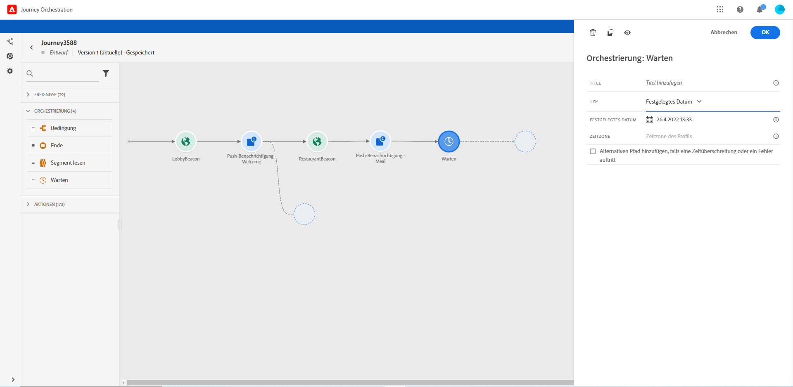

# Warteaktivität{#section_rlm_nft_dgb}

Wenn Sie warten möchten, bevor Sie die nächste Aktivität im Pfad ausführen, können Sie eine **[!UICONTROL Warteaktivität]** verwenden. Sie können den Zeitpunkt festlegen, zu dem die nächste Aktivität ausgeführt wird. Es stehen vier Optionen zur Verfügung:

* [Dauer](#duration)
* [Festgelegtes Datum](#fixed_date)
* [Benutzerdefiniert](#custom)

<!--* [Email send time optimization](#email_send_time_optimization)-->

## Informationen zur Warteaktivität{#about_wait}

Im Folgenden wird erläutert, wie die Wartezeiten priorisiert werden, wenn Sie mehrere Wartezeiten parallel verwenden. Wenn die Wartezeiten dieselbe Zeitkonfiguration und eine andere, aber überlappende Bedingung haben, wird die oben positionierte Wartezeit priorisiert. Die Bedingung der ersten Wartezeit ist zum Beispiel „ist eine Frau“ und die Bedingung der zweiten Wartezeit parallel dazu „ist ein VIP“. Die erste Warteaktivität wird priorisiert.

Beachten Sie auch, dass bei zwei parallelen Wartezeiten die zuerst auftretende unabhängig von ihrer vertikalen Position priorisiert wird. Wenn beispielsweise eine Wartezeit von 1 Stunde höher und eine Wartezeit von 30 Minuten niedriger positioniert ist, wird nach 30 Minuten die Wartezeit von 30 Minuten verarbeitet.

Sie können eine Bedingung definieren, wenn Sie die Wartezeit auf eine bestimmte Population beschränken möchten.

>[!NOTE]
>
>Die maximale Wartezeit beträgt 30 Tage.
>
>Im Testmodus können Sie mit dem Parameter **[!UICONTROL Wartezeit im Test]** die Dauer jeder Warteaktivität festlegen. Die Standardzeit beträgt 10 Sekunden. Dadurch erhalten Sie die Testergebnisse schnell. Siehe [](../building-journeys/testing-the-journey.md)

## Wartezeit mit Dauer{#duration}

Wählen Sie die Dauer der Wartezeit vor der Ausführung der nächsten Aktivität aus.


## Wartezeit mit festgelegtem Datum{#fixed_date}

Wählen Sie das Datum für die Ausführung der nächsten Aktivität aus.



## Benutzerdefinierte Wartezeit{#custom}

Mit dieser Option können Sie ein benutzerdefiniertes Datum definieren, z. B. den 12. Juli 2020 um 17 Uhr, wobei Sie einen erweiterten Ausdruck verwenden, der auf einem von einem Ereignis oder einer Datenquelle stammenden Feld basiert. Sie können keine benutzerdefinierte Dauer (z. B. 7 Tage) festlegen. Der Ausdruck im Ausdruckseditor sollte ein „dateTimeOnly“-Format aufweisen. Siehe [](../expression/expressionadvanced.md). Weitere Informationen zum „dateTimeOnly“-Format finden Sie unter [](../expression/data-types.md).

>[!NOTE]
>
>Sie können einen „dateTimeOnly“-Ausdruck nutzen oder eine Funktion zur Konvertierung in ein „dateTimeOnly“-Format verwenden. For example: ```toDateTimeOnly(@{Event.offerOpened.activity.endTime})```, the field in the event being of the form 2016-08-12T09:46:06Z.
>
>Die Angabe der **Zeitzone** ist für die Eigenschaften Ihrer Journey erforderlich. Aus diesem Grund ist es heute nicht möglich, von der Oberfläche direkt auf eine Zeitstempelmischzeit nach ISO-8601 und einen Zeitzonenversatz (z. B. 2016-08-12T09:46:06.982-05) zu verweisen. Siehe [](../building-journeys/timezone-management.md).


<!--## Email send time optimization{#email_send_time_optimization}

>[!CAUTION]
>
>The email send time optimization capability is only available to customers who use the [Adobe Experience Platform Data Connector](https://docs.adobe.com/content/help/en/campaign-standard/using/developing/mapping-campaign-and-aep-data/aep-about-data-connector.html).

This type of wait uses a score calculated in the Adobe Experience Platform. The score calculates the propensity to click or open an email in the future based on past behavior. Note that the algorithm calculating the score needs a certain amount of data to work. As a result, when it does not have enough data, the default wait time will apply. At publication time, you’ll be notified that the default time applies.

>[!NOTE]
>
>The first event of your journey must have a namespace.
>
>This capability is only available after an **[!UICONTROL Email]** activity. You need to have Adobe Campaign Standard.

1. In the **[!UICONTROL Amount of time]** field, define the number of hours to consider to optimize email sending.
1. In the **[!UICONTROL Optimization type]** field, choose if the optimization should increase clicks or opens.
1. In the **[!UICONTROL Default time]** field, define the default time to wait if the predictive send time score is not available.

    >[!NOTE]
    >
    >Note that the send time score can be unavailable because there is not enough data to perform the calculation. In this case, you will be informed, at publication time, that the default time applies.

-->
