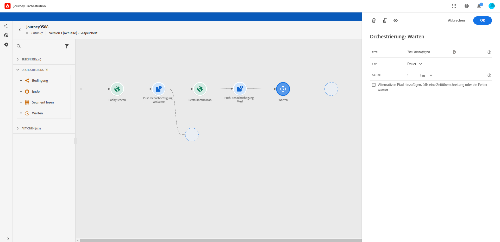

# Aktivität warten{#section_rlm_nft_dgb}

Wenn Sie warten möchten, bevor Sie die nächste Aktivität im Pfad ausführen, können Sie eine **[!UICONTROL Wait]**-Aktivität verwenden. Sie können den Zeitpunkt festlegen, zu dem die nächste Aktivität ausgeführt wird. Es stehen vier Optionen zur Verfügung:

* [Dauer](#duration)
* [Festes Datum](#fixed_date)
* [Benutzerdefiniert](#custom)
* [Optimierung der E-Mail-Sendezeit](#email_send_time_optimization)

## Aktivitäten zum Warten{#about_wait}

So werden Wartezeiten priorisiert, wenn Sie mehrere Wartezeiten parallel verwenden. Wenn sie dieselbe Zeitkonfiguration und eine andere, aber überlappende Bedingung haben, wird die oben positionierte Wartezeit priorisiert. Zum Beispiel ist die Bedingung der ersten Wartezeit &quot;eine Frau zu sein&quot; und die Bedingung der zweiten Wartezeit parallel ist &quot;ein VIP&quot;. Die erste Warteaktivität wird priorisiert

Beachten Sie auch, dass bei zwei unterschiedlichen Wartezeiten, die parallel erfolgen, die erste Wartezeit unabhängig von ihrer vertikalen Position priorisiert wird. Wenn beispielsweise eine Wartezeit von 1 Stunde über und eine Wartezeit von 30 Minuten unter dem Wert 30 Minuten liegt, wird die Wartezeit von 30 Minuten verarbeitet.

Sie können eine Bedingung definieren, wenn Sie die Wartezeit auf eine bestimmte Population beschränken möchten.

>[!NOTE]
>
>Die maximale Wartezeit beträgt 30 Tage.
>
>Im Testmodus werden alle Warteaktivitäten automatisch auf 5 Sekunden eingestellt. So können Sie schnell auf die Testergebnisse zugreifen.

## Warten der Dauer{#duration}

Wählen Sie die Wartezeit vor der Ausführung der nächsten Aktivität aus.

## Feste Datumswartung{#fixed_date}

Wählen Sie das Datum für die Ausführung der nächsten Aktivität aus. Wenn Sie ein festes Datum definieren, müssen Sie eine Zeitzone angeben. Näheres wird im Abschnitt  beschrieben.

## Benutzerdefinierte Wartezeit{#custom}

Mit dieser Option können Sie ein benutzerdefiniertes Datum definieren, z. B. den 12. Juli 2020 um 17 Uhr, wobei Sie einen erweiterten Ausdruck verwenden, der auf einem Feld basiert, das von einem Ereignis oder einer Datenquelle stammt. Sie können keine benutzerdefinierte Dauer festlegen, z. B. 7 Tage. Der Ausdruck im Ausdruckseditor sollte das Format dateTimeOnly bereitstellen. Näheres wird im Abschnitt  beschrieben. Weitere Informationen zum Format dateTimeOnly finden Sie unter 

>[!NOTE]
>
>Sie können einen dateTimeOnly-Ausdruck verwenden oder eine Funktion verwenden, um eine Konvertierung in dateTimeOnly durchzuführen. Beispiel: toDateTimeOnly(@{Event.offerOpen.activity.endTime}), das Feld im Ereignis im Format 2016-08-12T09:46:06.
>
>Die **Zeitzone** wird an einer anderen Stelle im benutzerdefinierten Wartekonfigurationsbereich erwartet. Aus diesem Grund ist es heute nicht möglich, direkt von der Schnittstelle auf einen vollständigen Zeitstempelvergleich nach ISO-8601 zu zeigen, z. B. 2016-08-12T09:46:06.982-05. Näheres wird im Abschnitt  beschrieben.

## Email send time optimization{#email_send_time_optimization}

>[!CAUTION]
>
>Die Funktion zur Optimierung der E-Mail-Sendezeit steht nur Kunden zur Verfügung, die die Adobe Campaign Standard Data Service-Funktion verwenden.

Dieser Warentyp verwendet einen Wert, der in der Plattform berechnet wird. Das Ergebnis berechnet die Neigung, in Zukunft basierend auf dem bisherigen Verhalten auf eine E-Mail zu klicken oder sie zu öffnen. Beachten Sie, dass der Algorithmus, der das Ergebnis berechnet, eine bestimmte Datenmenge benötigt, um zu funktionieren. Wenn nicht genügend Daten vorhanden sind, wird die Standardwartezeit angewendet. Zum Zeitpunkt der Veröffentlichung wird Ihnen mitgeteilt, dass die Standardzeit gilt.

>[!NOTE]
>
>Das erste Ereignis Ihrer Reise muss über einen Namespace verfügen.
>
>Diese Funktion steht erst nach einer **[!UICONTROL E-Mail]**-Aktivität zur Verfügung. Sie benötigen Adobe Campaign Standard.

1. Legen Sie im Feld **[!UICONTROL Zeitraum]**die Anzahl der Stunden fest, die Sie zur Optimierung des E-Mail-Versands berücksichtigen sollten.
1. Wählen Sie im Feld **[!UICONTROL Optimierungstyp]**aus, ob die Optimierung die Klicks erhöhen oder öffnen soll.
1. Legen Sie im Feld **Standardzeit** die Standardwartezeit fest, wenn das prognostizierende Sendungszeitergebnis nicht verfügbar ist.

   >[!NOTE]
   >
   >Beachten Sie, dass das Sende-Time-Ergebnis nicht verfügbar sein kann, da nicht genügend Daten vorhanden sind, um die Berechnung durchzuführen. In diesem Fall werden Sie zum Zeitpunkt der Veröffentlichung darüber informiert, dass die Standardzeit gilt.

