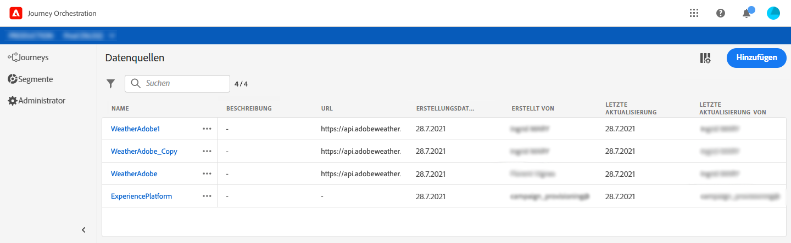

# Informationen zu Datenquellen {#concept_s1s_dqt_52b}

>[!CONTEXTUALHELP]
>id="jo_datasources"
>title="Informationen zu Datenquellen"
>abstract="Die Konfiguration von Datenquellen wird immer von einem technischen Anwender durchgeführt. Mit der Datenquellenkonfiguration können Sie eine Verbindung zu einem System definieren, um zusätzliche Informationen abzurufen, die in Ihren Journeys verwendet werden. Damit können Sie Bedingungen definieren, Parameter- und Personalisierungsdaten in Aktionen verwenden sowie die Wartezeit und die Zeitzone definieren."

Mit der Datenquellenkonfiguration können Sie eine Verbindung zu einem System definieren, um zusätzliche Informationen abzurufen, die in Ihren Journeys verwendet werden, zum Beispiel für:

* [Definition von Bedingungen](../building-journeys/condition-activity.md)
* Parameter- und Personalisierungsdaten in [Aktionen](../action/action.md)
* [Definition benutzerdefinierter Wartezeiten](../building-journeys/wait-activity.md#custom)
* [Definition benutzerdefinierter Zeitzonen](../building-journeys/timezone-management.md)

Diese Konfiguration ist nicht erforderlich, wenn Ihre Journeys nur lokale Daten aus einer Ereignis-Payload nutzen. Wenn Ihre Journey beispielsweise aus einem Ereignis und einer E-Mail-Aktivität besteht, die nur Daten aus dem Ereignis verwendet, müssen Sie keine Datenquelle konfigurieren.

Es gibt zwei Arten von Datenquellen:

* Die vorkonfigurierte Datenquelle von Experience Platform, die die Verbindung zum Echtzeit-Kundenprofildienst definiert. Dies ist eine integrierte Datenquelle. Siehe .
* Die externen Datenquellen, mit denen Sie eine Verbindung zu externen Systemen definieren können. Diese können Sie erstellen. Siehe .

Für jede Datenquelle definieren Sie die Informationen, die mit Feldergruppen abgerufen werden sollen. Feldergruppen sind Gruppen von Feldern, die aus einer Datenquelle abgerufen werden können. Siehe .

Weitere Informationen zum Konfigurieren einer Experience Platform-Datenquelle und einer externen Datenquelle sowie zum Suchen und Verwenden von Daten in einer Journey finden Sie in diesem [Anleitungsvideo](https://docs.adobe.com/content/help/en/platform-learn/tutorials/journey-orchestration/configure-data-sources.html).

Im Folgenden finden Sie die wichtigsten Schritte zur Konfiguration der Datenquelle:

>[!NOTE]
>
>Die Konfiguration von Datenquellen wird immer von einem **technischen Anwender** durchgeführt.

1. Klicken Sie oben im Menü auf den Tab **[!UICONTROL Datenquellen]**.

   Die Liste der Datenquellen wird angezeigt. Weitere Informationen zur Benutzeroberfläche finden Sie unter .

   

1. Anschließend können Sie der integrierten Datenquelle entweder Feldergruppen hinzufügen (siehe ) oder eine neue externe Datenquelle erstellen (siehe ) und damit verbundene Feldergruppen erstellen (siehe ).

   

1. Klicken Sie auf **[!UICONTROL Speichern]**.

   Die Datenquelle ist jetzt konfiguriert und kann in Ihren Journeys verwendet werden.
