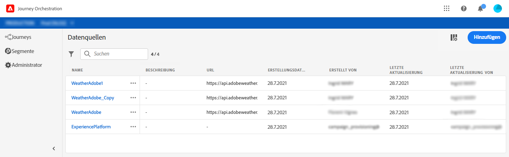
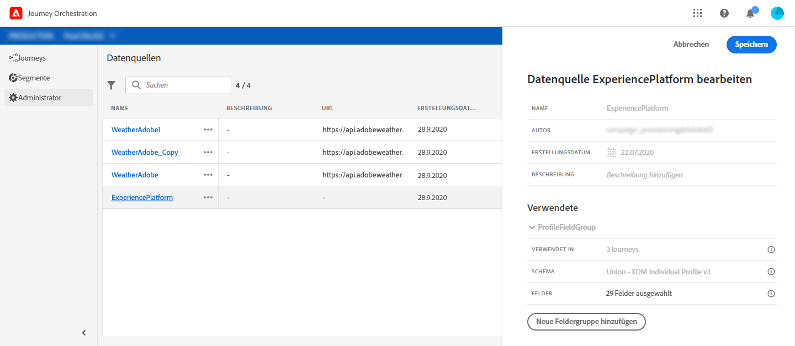

# Informationen zu Datenquellen {#concept_s1s_dqt_52b}

>[!CAUTION]
>
>**Sie möchten mehr über Adobe Journey Optimizer erfahren**? Klicken Sie [hier](https://experienceleague.adobe.com/de/docs/journey-optimizer/using/ajo-home){target="_blank"}, um auf die Journey Optimizer-Dokumentation zuzugreifen.
>
>
>_Diese Dokumentation bezieht sich auf veraltete Journey Orchestration-Materialien, die durch Journey Optimizer ersetzt wurden. Wenden Sie sich an Ihr Accountteam, wenn Sie Fragen zu Ihrem Zugriff auf Journey Orchestration oder Journey Optimizer haben._

>[!CONTEXTUALHELP]
>id="jo_datasources"
>title="Informationen zu Datenquellen"
>abstract="Mit der Konfiguration von Datenquellen können Sie eine Verbindung zu einem System definieren, um zusätzliche Informationen zur Verwendung in Ihren Journeys abzurufen."

Mit der Datenquellenkonfiguration können Sie eine Verbindung zu einem System definieren, um zusätzliche Informationen abzurufen, die in Ihren Journeys verwendet werden, zum Beispiel für:

* [Definition von Bedingungen](../building-journeys/condition-activity.md)
* Parameter- und Personalisierungsdaten in [Aktionen](../action/action.md)
* [Definition benutzerdefinierter Wartezeiten](../building-journeys/wait-activity.md#custom)
* [Definition von Zeitzonen](../building-journeys/timezone-management.md)

Diese Konfiguration ist nicht erforderlich, wenn Ihre Journeys nur lokale Daten aus einer Ereignis-Payload nutzen. Wenn Ihre Journey beispielsweise aus einem Ereignis und einer E-Mail-Aktivität besteht, die nur Daten aus dem Ereignis verwendet, müssen Sie keine Datenquelle konfigurieren.

Es gibt zwei Arten von Datenquellen:

* Die vorkonfigurierte Datenquelle von Adobe Experience Platform, die die Verbindung zum Echtzeit-Kundenprofildienst definiert. Dies ist eine integrierte Datenquelle. Weitere Informationen finden Sie auf [dieser Seite](../datasource/adobe-experience-platform-data-source.md).
* Die externen Datenquellen, mit denen Sie eine Verbindung zu externen Systemen definieren können. Diese können Sie erstellen. Weitere Informationen finden Sie auf [dieser Seite](../datasource/external-data-sources.md).

Für jede Datenquelle definieren Sie die Informationen, die mit Feldergruppen abgerufen werden sollen. Feldergruppen sind Gruppen von Feldern, die aus einer Datenquelle abgerufen werden können. Weitere Informationen finden Sie auf [dieser Seite](../datasource/field-groups.md).

Im Folgenden finden Sie die wichtigsten Schritte zur Konfiguration der Datenquelle:

>[!NOTE]
>
>Die Konfiguration von Datenquellen wird immer von einem **technischen Anwender** durchgeführt.

1. Wählen Sie im Menübereich **[!UICONTROL Admin]** aus. Klicken Sie im Abschnitt **[!UICONTROL Datenquellen]** auf **[!UICONTROL Verwalten]**.

   Die Liste der Datenquellen wird angezeigt. Weitere Informationen zur Schnittstelle finden Sie auf [dieser Seite](../about/user-interface.md).

   

1. Anschließend können Sie der integrierten Datenquelle entweder Feldergruppen hinzufügen (siehe [diese Seite](../datasource/adobe-experience-platform-data-source.md)) oder eine neue Datenquelle (siehe [diese Seite](../datasource/external-data-sources.md)) und die assoziierten Feldergruppen (siehe [diese Seite](../datasource/field-groups.md)) hinzufügen.

   

1. Klicken Sie auf **[!UICONTROL Speichern]**.

   Die Datenquelle ist jetzt konfiguriert und kann in Ihren Journeys verwendet werden.
