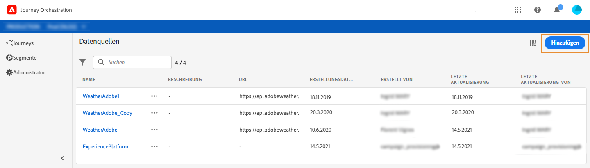
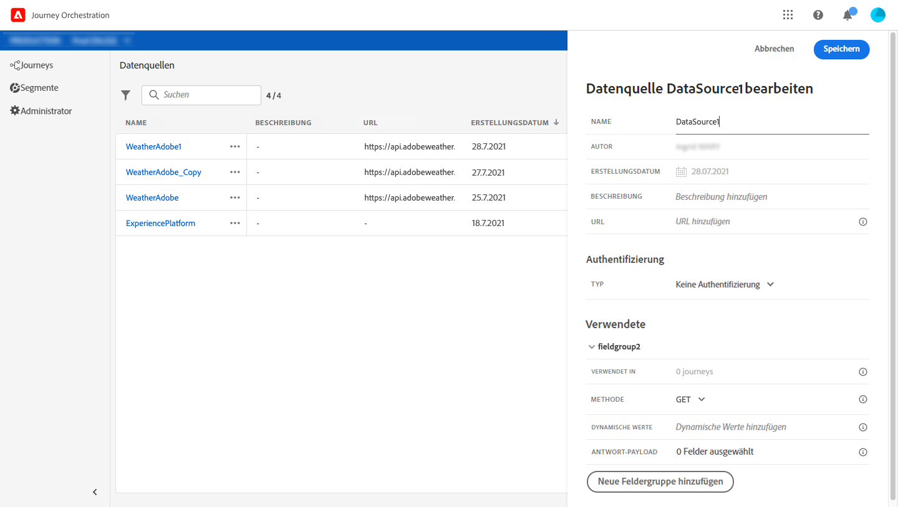
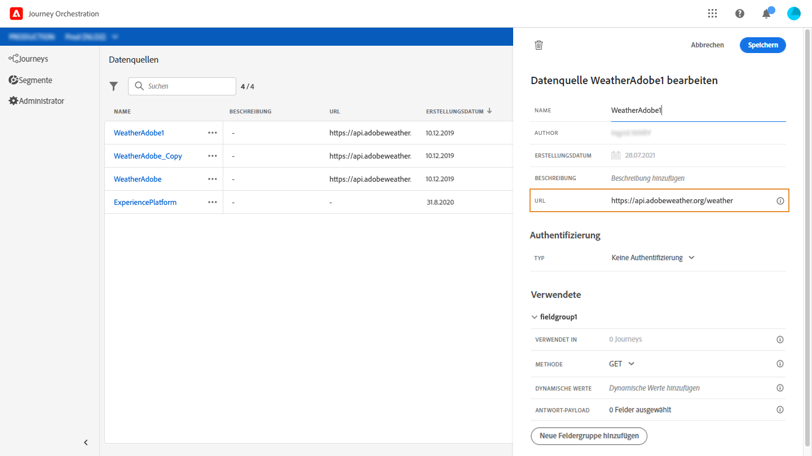
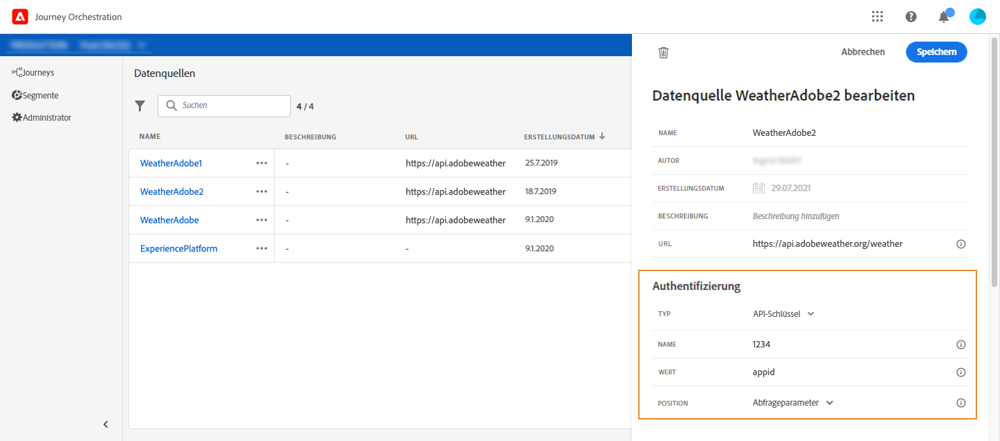
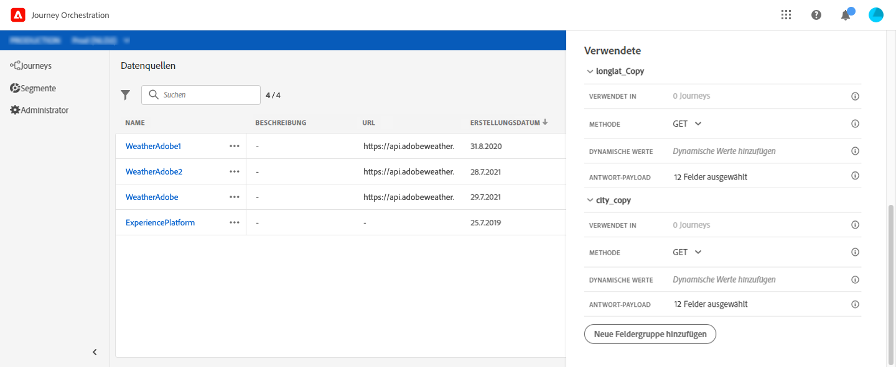
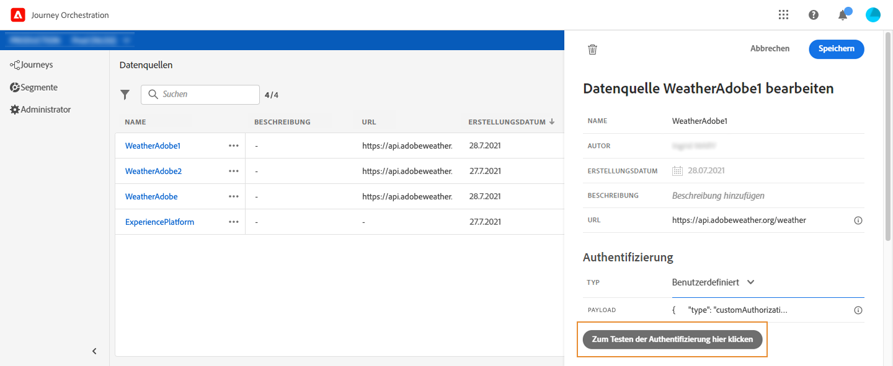
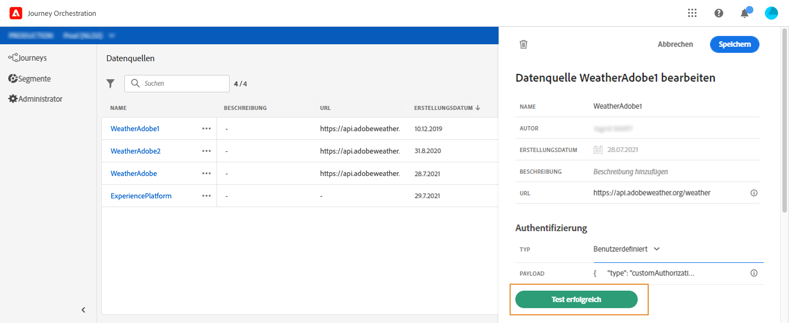

# Externe Datenquellen {#concept_t2s_kqt_52b}

Mit externen Datenquellen können Sie eine Verbindung zu Drittanbietersystemen herstellen, z. B. wenn Sie ein Hotelbuchungssystem verwenden, um zu überprüfen, ob die Person ein Zimmer gebucht hat. Anders als bei der integrierten Experience Platform-Datenquelle können Sie beliebig viele externe Datenquellen erstellen.

REST-APIs, die POST oder GET verwenden und JSON zurückgeben, werden unterstützt. API-Schlüssel, einfache und benutzerdefinierte Authentifizierungsmodi werden unterstützt.

Nehmen wir das Beispiel eines Wetter-API-Dienstes, mit dem das Verhalten einer Journey anhand von Echtzeit-Wetterdaten angepasst werden soll.

Im Folgenden finden Sie zwei Beispiele für den API-Aufruf:

* _https://api.adobeweather.org/weather?city=London,uk&amp;appid=1234_
* _https://api.adobeweather.org/weather?lat=35&amp;lon=139&amp;appid=1234_

Der Aufruf besteht aus einer Haupt-URL (_https://api.adobeweather.org/weather_), zwei Parametersätzen („city“ für die Stadt und „lat/long“ für Breiten- und Längengrad) und dem API-Schlüssel (appid).

Im Folgenden werden die wichtigsten Schritte zum Erstellen und Konfigurieren einer neuen externen Datenquelle beschrieben:

1. From the list of data sources, Click **[!UICONTROL Add]** to create a new external data source.

   

   Dadurch wird der Konfigurationsbereich für die Datenquellen auf der rechten Seite des Bildschirms geöffnet.

   

1. Geben Sie einen Namen für Ihre Datenquelle ein.

   >[!NOTE]
   >
   >Verwenden Sie keine Leerzeichen oder Sonderzeichen. Verwenden Sie nicht mehr als 30 Zeichen.

1. Fügen Sie Ihrer Datenquelle eine Beschreibung hinzu. Dieser Schritt ist optional.
1. Fügen Sie die URL des externen Dienstes hinzu. In unserem Beispiel: _https://api.adobeweather.org/weather_.

   >[!CAUTION]
   >
   >Aus Sicherheitsgründen wird die Verwendung von HTTPS dringend empfohlen. Beachten Sie außerdem, dass die Verwendung nicht öffentlich zugänglicher Adobe-Adressen und die Verwendung von IP-Adressen nicht zulässig sind.

   

1. Konfigurieren Sie die Authentifizierung je nach Konfiguration des externen Dienstes: **[!UICONTROL No authentication]**, **[!UICONTROL Basic]**, **[!UICONTROL Custom]** oder **[!UICONTROL API key]**. Weitere Informationen zum benutzerdefinierten Authentifizierungsmodus finden Sie unter [](../datasource/external-data-sources.md#section_wjp_nl5_nhb). In unserem Beispiel wählen wir:


   * **[!UICONTROL Type]**: &quot;API-Schlüssel&quot;
   * **[!UICONTROL Value]**: &quot;1234&quot;(dies ist der Wert unseres API-Schlüssels)
   * **[!UICONTROL Name]**: „appid“ (dies ist der Name des API-Schlüsselparameters)
   * **[!UICONTROL Location]**: &quot;Abfrage parameter&quot;(der API-Schlüssel befindet sich in der URL)
   

1. Hinzufügen Sie eine neue Feldgruppe für jeden API-Parameter durch Klicken auf **[!UICONTROL Add a New Field Group]**. Verwenden Sie keine Leerzeichen oder Sonderzeichen im Namen der Feldergruppe. In unserem Beispiel müssen wir zwei Feldergruppen erstellen, eine für jeden Parametersatz („city“ und „lang/lat“).

Für den Parametersatz „long/lat“ erstellen wir eine Feldergruppe mit den folgenden Informationen:

* **[!UICONTROL Used in]**: zeigt die Anzahl der Reisen an, die eine Feldgruppe verwenden. You can click the **[!UICONTROL View journeys]** icon to display the list of journeys using this field group.
* **[!UICONTROL Method]**: wählen Sie die POST- oder GET-Methode. In unserem Fall wählen wir die GET-Methode.
* **[!UICONTROL Cache duration]**: in unserem Fall möchten wir, dass das Wetter 10 Minuten lang zwischengespeichert wird.
* **[!UICONTROL Response Payload]**: Klicken Sie in das **[!UICONTROL Payload]** Feld und fügen Sie ein Beispiel der vom Aufruf zurückgegebenen Nutzlast ein. Für unser Beispiel haben wir eine Payload verwendet, die auf einer Wetter-API-Website gefunden wurde. Überprüfen Sie, ob die Feldtypen korrekt sind. Jedes Mal, wenn die API aufgerufen wird, ruft das System alle im Payload-Beispiel enthaltenen Felder ab. Note that you can click on **[!UICONTROL Paste a new payload]** if you want to change the payload currently passed.
* **[!UICONTROL Dynamic Values]**: Geben Sie die verschiedenen Parameter getrennt durch ein Koma ein, &quot;long,lat&quot; in unserem Beispiel. Da die Parameterwerte vom Ausführungskontext abhängen, werden sie in den Journeys definiert. Siehe [](../expression/expressionadvanced.md).
* **[!UICONTROL Sent Payload]**: Dieses Feld wird nicht in unserem Beispiel angezeigt. Es ist nur verfügbar, wenn Sie die POST-Methode auswählen. Fügen Sie die Payload ein, die an das Drittanbietersystem gesendet wird.

In case of a GET call requiring parameter(s), you enter the parameter(s) in the **[!UICONTROL Parameters]** field and they are automatically added at the end of the call. Bei einem POST-Aufruf müssen Sie:

* die beim Aufruf zu übergebenden im Feld **[!UICONTROL Parameter]** Parameter auflisten (im Beispiel unten: „identifier“).
* diese auch mit exakt derselben Syntax im Hauptteil der gesendeten Payload angeben. Dazu müssen Sie Folgendes hinzufügen: „param“: „Name Ihres Parameters“ (im folgenden Beispiel: „identifier“). Folgen Sie der Syntax unten:

   ```
   {"id":{"param":"identifier"}}
   ```



Klicks **[!UICONTROL Save]**.

Die Datenquelle ist jetzt konfiguriert und kann in Ihren Journeys verwendet werden, z. B. in Ihren Bedingungen oder zur Personalisierung einer E-Mail. Wenn die Temperatur über 30° C liegt, können Sie sich entscheiden, eine bestimmte Mitteilung zu senden.

## Benutzerdefinierter Authentifizierungsmodus{#section_wjp_nl5_nhb}

>[!CONTEXTUALHELP]
>id=&quot;jo_authentication_payload&quot;
>title=&quot;Informationen zur benutzerdefinierten Authentifizierung&quot;
>abstract=&quot;Der benutzerdefinierte Authentifizierungsmodus wird für die komplexe Authentifizierung verwendet, um API-Umbruchprotokolle wie OAuth2 aufzurufen. Die Aktionsausführung erfolgt in zwei Schritten. Zunächst wird ein Aufruf an den Endpunkt ausgeführt, um das Zugriffstoken zu generieren. Dann wird das Zugriffstoken in die HTTP-Anforderung der Aktion eingefügt.&quot;

Dieser Authentifizierungsmodus wird für die komplexe Authentifizierung verwendet, die häufig zum Aufrufen von API-Wrapping-Protokollen wie OAuth2 verwendet wird, um ein Zugriffstoken abzurufen, das in die eigentliche HTTP-Anfrage für die Aktion eingefügt werden soll.

Wenn Sie die benutzerdefinierte Authentifizierung konfigurieren, können Sie auf die Schaltfläche unten klicken, um zu prüfen, ob die Payload der benutzerdefinierten Authentifizierung korrekt konfiguriert ist.



Ist der Test erfolgreich, wird die Schaltfläche grün.



Bei dieser Authentifizierung erfolgt die Aktionsausführung in zwei Schritten:

1. Rufen Sie den Endpunkt auf, um das Zugriffstoken zu generieren.
1. Rufen Sie die REST-API auf, indem Sie das Zugriffstoken ordnungsgemäß einfügen.

Diese Authentifizierung besteht aus zwei Teilen.

Die Definition des Endpunkts, der aufgerufen werden soll, um das Zugriffstoken zu generieren:

* endpoint: URL zum Generieren des Endpunkts
* Methode der HTTP-Anfrage am Endpunkt (GET oder POST)
* headers: Schlüssel/Wert-Paare, die bei Bedarf als Kopfzeilen in diesen Aufruf eingefügt werden sollen
* body: beschreibt den Hauptteil des Aufrufs, wenn die Methode POST ist. Für den Hauptteil unterstützen wir eine begrenzte Struktur, die in bodyParams definiert ist (Schlüssel/Wert-Paare). Der bodyType beschreibt Format und Kodierung des Hauptteils (body) im Aufruf:
   * &#39;form&#39;: bedeutet, dass der Inhaltstyp application/x-www-form-urlencoded (Zeichensatz UTF-8) lautet und die Schlüssel/Wert-Paare wie folgt serialisiert werden: Schlüssel1=Wert1&amp;Schlüssel2=Wert2&amp; ...
   * &#39;json&#39;: bedeutet, dass der Inhaltstyp application/json (Zeichensatz UTF-8) ist und die Schlüssel/Wert-Paare wie folgt als JSON-Objekt serialisiert werden: _{ &quot;Schlüssel1&quot;: &quot;Wert1&quot;, &quot;Schlüssel2&quot;: &quot;Wert2&quot;, ...}_

Die Definition der Art und Weise, wie das Zugriffstoken in die HTTP-Anfrage der Aktion eingefügt werden muss:

* authorizationType: definiert, wie das generierte Zugriffstoken in den HTTP-Aufruf für die Aktion eingefügt werden muss. Die möglichen Werte sind:

   * bearer: gibt an, dass das Zugriffstoken in die Autorisierungskopfzeile eingefügt werden muss, z. B.: _Autorisierung: bearer &lt;Zugriffstoken>_
   * header: gibt an, dass das Zugriffstoken als Kopfzeile eingefügt werden muss, der Kopfzeilenname wird von der Eigenschaft tokenTarget definiert. Wenn tokenTarget beispielsweise myHeader ist, wird das Zugriffstoken als Kopfzeile wie folgt eingefügt: _myHeader: &lt;Zugriffstoken>_
   * queryParam: gibt an, dass das Zugriffstoken als queryParam eingefügt werden muss, der queryParam-Name wird von der Eigenschaft tokenTarget definiert. Wenn tokenTarget beispielsweise myQueryParam ist, lautet die URL des Aktionsaufrufs wie folgt: _&lt;URL>?myQueryParam=&lt;Zugriffstoken>_

* tokenInResponse: zeigt an, wie das Zugriffstoken aus dem Authentifizierungsaufruf extrahiert wird. Diese Eigenschaft kann Folgendes sein:
   * &#39;response&#39;: gibt an, dass die HTTP-Antwort das Zugriffstoken ist
   * ein Selektor in einem json (vorausgesetzt, dass die Antwort ein json ist, werden andere Formate wie XML nicht unterstützt). Das Format dieses Selektors ist _json://&lt;Pfad zur Zugriffstoken-Eigenschaft>_. Beispiel: Wenn die Antwort des Aufrufs: _{ &quot;access_token&quot;: &quot;theToken&quot;, &quot;timestamp&quot;: 12323445656 }_ ist, dann ist tokenInResponse: _json: //access_token_

Das Format dieser Authentifizierung ist:

```
{
    "type": "customAuthorization",
    "authorizationType": "<value in 'bearer', 'header' or 'queryParam'>",
    (optional, mandatory if authorizationType is 'header' or 'queryParam') "tokenTarget": "<name of the header or queryParam if the authorizationType is 'header' or 'queryParam'>",
    "endpoint": "<URL of the authentication endpoint>",
    "method": "<HTTP method to call the authentication endpoint, in 'GET' or 'POST'>",
    (optional) "headers": {
        "<header name>": "<header value>",
        ...
    },
    (optional, mandatory if method is 'POST') "body": {
        "bodyType": "<'form'or 'json'>,
        "bodyParams": {
            "param1": value1,
            ...

        }
    },
    "tokenInResponse": "<'response' or json selector in format 'json://<field path to access token>'"
}
```
