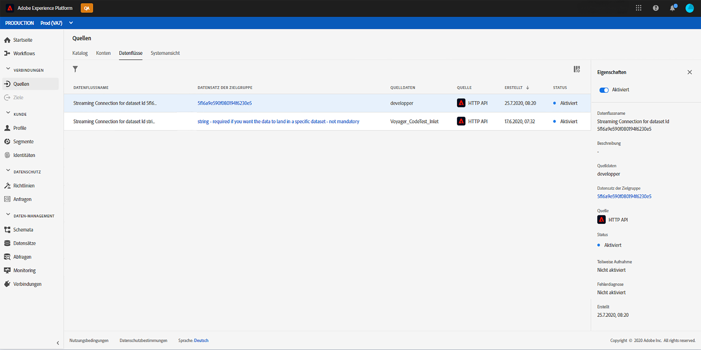

# Nutzung von Adobe Analytics-Daten{#analytics-data}

>[!CAUTION]
>
>**Sie möchten mehr über Adobe Journey Optimizer erfahren**? Klicken Sie [hier](https://experienceleague.adobe.com/de/docs/journey-optimizer/using/ajo-home){target="_blank"}, um auf die Journey Optimizer-Dokumentation zuzugreifen.
>
>
>_Diese Dokumentation bezieht sich auf veraltete Journey Orchestration-Materialien, die durch Journey Optimizer ersetzt wurden. Wenden Sie sich an Ihr Accountteam, wenn Sie Fragen zu Ihrem Zugriff auf Journey Orchestration oder Journey Optimizer haben._

>[!NOTE]
>
>Dieser Abschnitt gilt nur für regelbasierte Ereignisse und Kunden, die mit Adobe Analytics-Daten arbeiten müssen.

Sie können alle verhaltensbezogenen Ereignisdaten, die Sie in Adobe Analytics bereits erfassen und an Platform streamen, zum Auslösen von Journeys und zur Automatisierung von Erlebnissen für Ihre Kunden nutzen.

Voraussetzung hierfür ist, dass Sie in Adobe Experience Platform die Report Suite aktivieren, die Sie nutzen möchten:

1. Wählen Sie in Adobe Experience Platform **[!UICONTROL Quellen]** und anschließend im **[!UICONTROL Daten hinzufügen]** im Adobe Analytics-Bereich. Daraufhin wird die Liste der in Adobe Analytics verfügbaren Report Suites angezeigt.

1. Wählen Sie die zu aktivierende Report Suite aus, klicken Sie auf **[!UICONTROL Weiter]** und dann auf **[!UICONTROL Fertigstellen]**.

1. Geben Sie die Daten-ID der Quelle für Ihren dem Alpha-Programm zugehörigen Kontaktpunkt frei.

Dadurch wird der Analytics-Quell-Connector für diese Report Suite aktiviert. Sobald die Daten eingehen, werden sie in ein Erlebnisereignis umgewandelt und an Adobe Experience Platform gesendet.

Weitere Informationen zum Quell-Connector von Adobe Analytics finden Sie in der [Dokumentation](https://experienceleague.adobe.com/docs/experience-platform/sources/connectors/adobe-applications/analytics.html?lang=de) und im [Tutorial](https://experienceleague.adobe.com/docs/experience-platform/sources/ui-tutorials/create/adobe-applications/analytics.html?lang=de).
