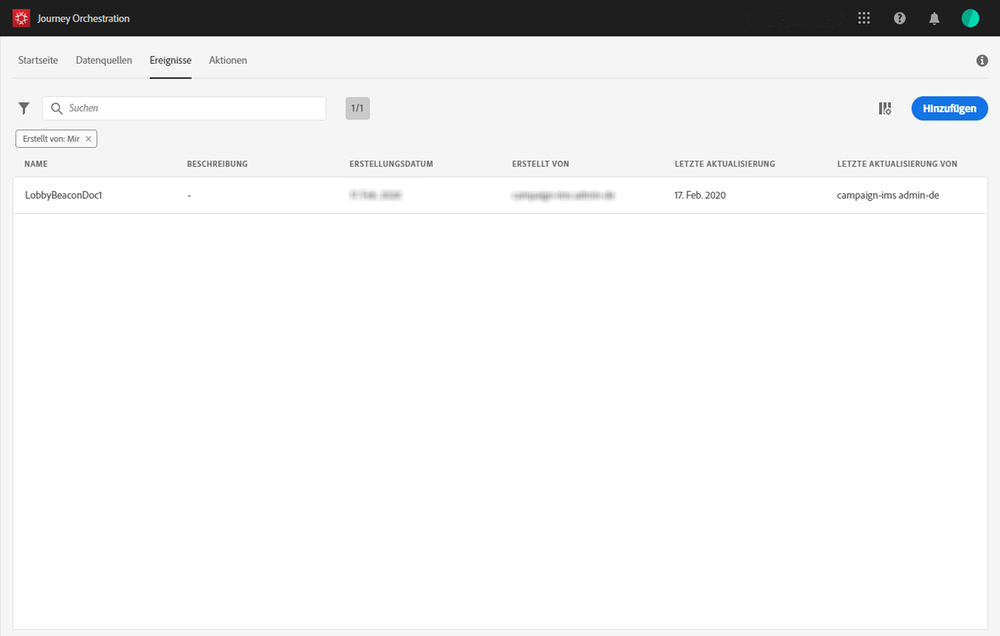
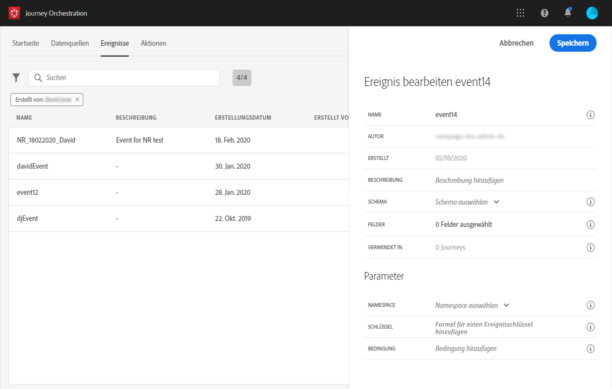
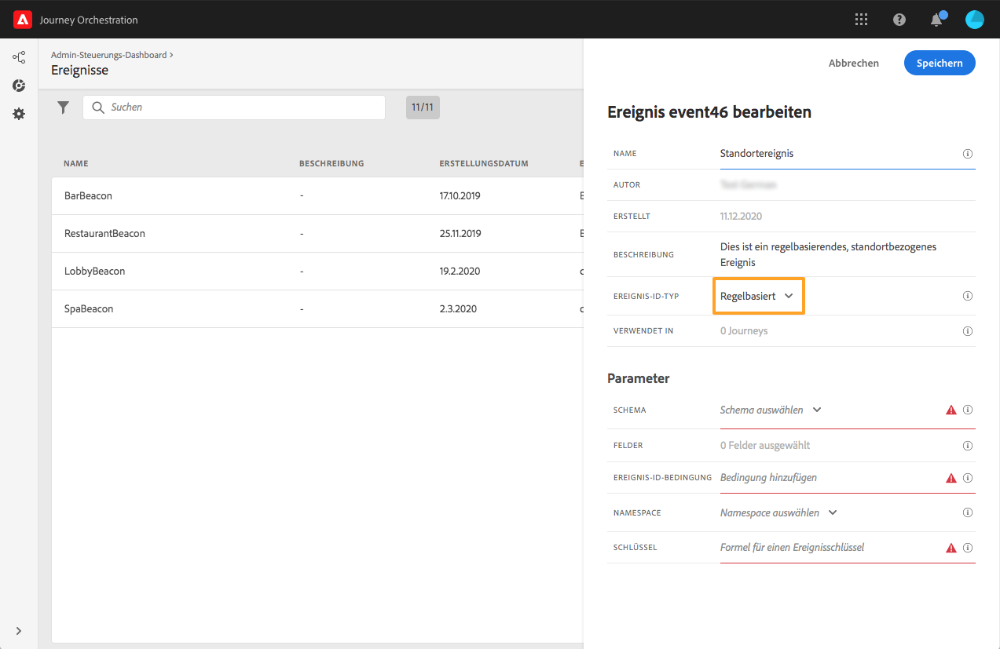

# Erstellen eines neuen Ereignisses {#section_tbk_5qt_pgb}

Im Folgenden finden Sie die wichtigsten Schritte zum Konfigurieren eines neuen Ereignisses:

1. Klicken Sie oben im Menü auf den Tab **[!UICONTROL Ereignisse]**. Die Liste der Ereignisse wird angezeigt. Weitere Informationen zur Benutzeroberfläche finden Sie auf [dieser Seite](../about/user-interface.md).

   

1. Klicken Sie auf **[!UICONTROL Hinzufügen]**, um ein neues Ereignis zu erstellen. Der Bereich für die Ereigniskonfiguration wird auf der rechten Seite des Bildschirms geöffnet. Geben Sie einen Namen für Ihr Ereignis ein. Sie können auch eine Beschreibung hinzufügen.

   

   >[!NOTE]
   >
   >Verwenden Sie keine Leerzeichen oder Sonderzeichen. Verwenden Sie nicht mehr als 30 Zeichen.

1. Wählen Sie im Feld **[!UICONTROL Ereignis-ID-Typ]** den zu verwendenden Ereignistyp aus.

   

   * **Regelbasierte** Ereignisse: dieser Ereignistyp generiert keine eventID. Im Feld **Ereignis-ID-Bedingung** definieren Sie einfach eine Regel, die vom System verwendet wird, um die relevanten Ereignisse zu identifizieren, die Ihre Journeys auslösen werden. Diese Regel kann auf einem beliebigen Feld basieren, das in der Ereignis-Payload verfügbar ist, z. B. dem Standort des Profils oder der Anzahl der Artikel, die dem Warenkorb des Profils hinzugefügt wurden.

   * **Systemgenerierte** Ereignisse: dieser Typ erfordert eine eventID. Dieses eventID-Feld wird beim Erstellen des Ereignisses automatisch generiert und der Payload-Vorschau hinzugefügt. Das System, das das Ereignis per Push sendet, sollte keine ID generieren, sondern die ID übergeben, die in der Payload-Vorschau verfügbar ist. Siehe [diesen Abschnitt](../event/previewing-the-payload.md).
   >[!NOTE]
   >
   >Weitere Informationen zu Ereignistypen finden Sie in [diesem Abschnitt](../event/about-events.md).
1. Die Anzahl der Journeys, die dieses Ereignis verwenden, wird im Feld **[!UICONTROL Verwendet in]** angezeigt. Sie können auf **[!UICONTROL Customer Journeys anzeigen]** klicken, um die Liste der Journeys mit diesem Ereignis anzuzeigen.
1. Definieren Sie das Schema und die Payload-Felder: Hier wählen Sie die Ereignisinformationen aus (normalerweise als Payload bezeichnet), die von [!DNL Journey Orchestration] erwartet werden. Anschließend können Sie diese Informationen in Ihrer Journey verwenden. Weitere Informationen finden Sie auf [dieser Seite](../event/defining-the-payload-fields.md).
   >[!NOTE]
   >
   >Wenn Sie den **[!UICONTROL systemgenerierten]** Typ auswählen, sind nur Schemata mit dem eventID-Typ „mixin“ verfügbar. Wenn Sie den **[!UICONTROL regelbasierten]** Typ auswählen, sind nur Erlebnisereignisschemata verfügbar.

1. Klicken Sie bei regelbasierten Ereignissen in das Feld **[!UICONTROL Ereignis-ID-Bedingung]**. Mit dem einfachen Ausdruckseditor definieren Sie eine Bedingung, anhand derer das System die Ereignisse identifiziert, die Ihre Journey auslösen.
   

   In unserem Beispiel haben wir eine Bedingung basierend auf der Stadt des Profils verwendet. Dies bedeutet, dass das System jedes Mal, wenn es ein Ereignis empfängt, das dieser Bedingung entspricht (Feld **[!UICONTROL Stadt]** und Wert **[!UICONTROL Paris]**), dieses an Journey Orchestration weiterleitet.

1. Fügen Sie einen Namespace hinzu. Dieser Schritt ist optional, wird jedoch empfohlen, da das Hinzufügen eines Namespace es Ihnen ermöglicht, die im Echtzeit-Kundenprofildienst gespeicherten Informationen zu nutzen. Er definiert den Typ des Schlüssels, den das Ereignis hat. Weitere Informationen finden Sie auf [dieser Seite](../event/selecting-the-namespace.md).
1. Definieren Sie den Schlüssel: Wählen Sie ein Feld aus Ihren Payload-Feldern aus oder definieren Sie eine Formel, um die mit dem Ereignis verbundene Person zu identifizieren. Dieser Schlüssel wird automatisch eingerichtet (kann aber weiterhin bearbeitet werden), wenn Sie einen Namespace auswählen. [!DNL Journey Orchestration] wählt den Schlüssel aus, der dem Namespace entsprechen soll (wenn Sie beispielsweise einen E-Mail-Namespace auswählen, wird der E-Mail-Schlüssel ausgewählt). Weitere Informationen finden Sie auf [dieser Seite](../event/defining-the-event-key.md).
1. Bei systemgenerierten Ereignissen können Sie eine Bedingung hinzufügen. Dieser Schritt ist optional. Dadurch kann das System nur die Ereignisse verarbeiten, die die Bedingung erfüllen. Die Bedingung kann nur auf den im Ereignis enthaltenen Informationen basieren. Weitere Informationen finden Sie auf [dieser Seite](../event/adding-a-condition.md).
1. Klicken Sie auf **[!UICONTROL Speichern]**.

   

   Das Ereignis ist jetzt konfiguriert und kann in einer Journey abgelegt werden. Für den Empfang von Ereignissen sind zusätzliche Konfigurationsschritte erforderlich. Weitere Informationen finden Sie auf [dieser Seite](../event/additional-steps-to-send-events-to-journey-orchestration.md).
