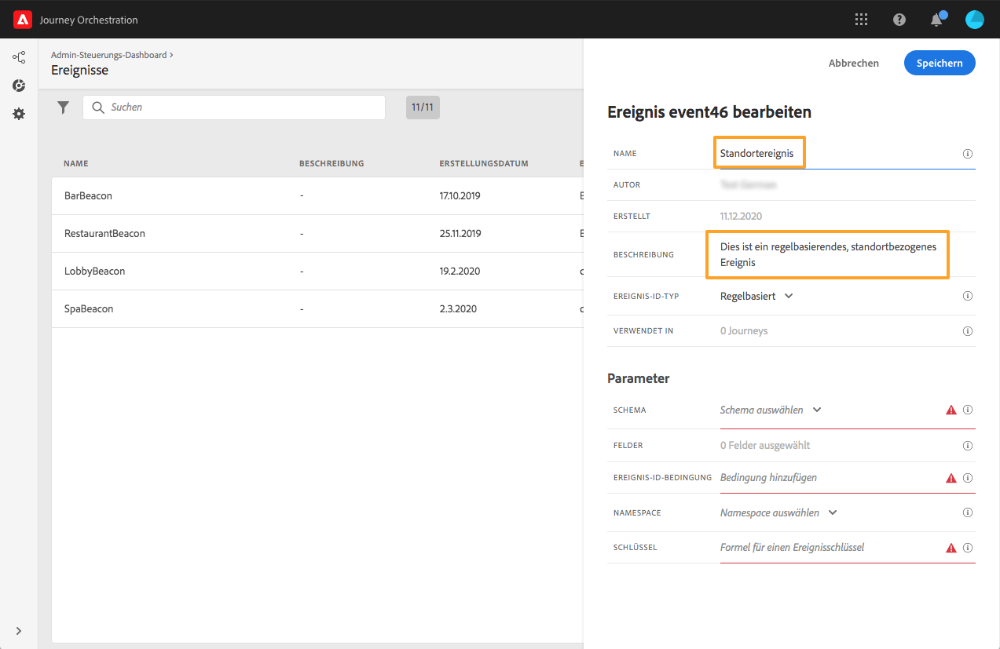

# Informationen zu Ereignissen {#concept_gfj_fqt_52b}

>[!CONTEXTUALHELP]
>id="jo_events"
>title="Informationen zu Ereignissen"
>abstract="Ein Ereignis ist mit einer Person verbunden. Es bezieht sich auf das Verhalten einer Person (z. B. eine Person hat ein Produkt gekauft, einen Shop besucht, eine Website verlassen usw.) oder auf etwas, das mit einer Person in Verbindung steht (z. B. eine Person hat 10.000 Treuepunkte erreicht). Diese Ereignisse werden von Journey Orchestration in Journeys überwacht, um die besten nächsten Aktionen zu orchestrieren."

Ein Ereignis ist mit einer Person verbunden. Es bezieht sich auf das Verhalten einer Person (z. B. eine Person hat ein Produkt gekauft, einen Shop besucht, eine Website verlassen usw.) oder auf etwas, das mit einer Person in Verbindung steht (z. B. eine Person hat 10.000 Treuepunkte erreicht). Diese Ereignisse werden von Journey Orchestration in Journeys überwacht, um die besten nächsten Aktionen zu orchestrieren.

Diese Konfiguration wird immer von einem **technischen Anwender** durchgeführt und ist **obligatorisch**, da Journey Orchestration dazu bestimmt ist, Ereignisse zu überwachen.

Mit der Ereigniskonfiguration können Sie festlegen, welche Informationen Journey Orchestration als Ereignisse erhält. Sie können mehrere Ereignisse (in verschiedenen Schritten der Journey) verwenden und mehrere Journeys können dasselbe Ereignis verwenden.

Wenn Sie ein Ereignis bearbeiten, das in einer Entwurfs- oder Live-Journey verwendet wird, können Sie nur den Namen oder die Beschreibung ändern oder Payload-Felder hinzufügen. Die Bearbeitungsmöglichkeiten von Entwurfs- oder Live-Journeys sind stark beschränkt, damit Unterbrechungen von Journeys vermieden werden.

## Allgemeine Funktionsweise {#section_r1f_xqt_pgb}

Ereignisse sind POST-API-Aufrufe. Ereignisse werden über Streaming-Aufnahme-APIs an die Adobe Experience Cloud-Datenplattform gesendet. Das URL-Ziel von Ereignissen, die über Transaktionsnachrichten-APIs gesendet werden, wird als „Inlet“ bezeichnet. Die Payload der Ereignisse verwendet die XDM-Formatierung.

Die Payload enthält Informationen, die von Streaming-Aufnahme-APIs benötigt werden, um zu funktionieren (in der Kopfzeile), Informationen, die Journey Orchestration benötigt, um zu funktionieren (die Ereignis-ID, Teil des Payload-Hauptteils), und Informationen, die in Journeys verwendet werden (im Hauptteil, z. B. der Betrag eines Transaktionsabbruchs). Es gibt zwei Modi für die Streaming-Aufnahme: authentifiziert und nicht authentifiziert. Weitere Informationen zu Streaming-Aufnahme-APIs finden Sie unter [diesem Link](https://docs.adobe.com/content/help/en/experience-platform/xdm/api/getting-started.html).

Nach dem Eingang über Streaming-Aufnahme-APIs fließen Ereignisse in einen internen Dienst, die sogenannte Pipeline, und dann in die Datenplattform. Wenn für das Ereignisschema die Markierung „Echtzeit-Kundenprofildienst“ aktiviert ist und es über eine Datensatz-ID verfügt, die ebenfalls die Markierung „Echtzeit-Kundenprofil“ hat, fließt das Ereignis in den Echtzeit-Kundenprofildienst.

Die Pipeline filtert Ereignisse mit einer Payload, die eventIDs von Journey Orchestration enthalten (siehe den Ereigniserstellungsprozess unten), die von Journey Orchestration bereitgestellt werden und in der Ereignis-Payload enthalten sind. Diese Ereignisse werden von Journey Orchestration überwacht und die entsprechende Journey wird ausgelöst.

## Erstellen eines neuen Ereignisses {#section_tbk_5qt_pgb}

Im Folgenden finden Sie die wichtigsten Schritte zum Konfigurieren eines neuen Ereignisses:

1. Klicken Sie oben im Menü auf den Tab **[!UICONTROL Ereignisse]**. Die Liste der Ereignisse wird angezeigt. Weitere Informationen zur Benutzeroberfläche finden Sie unter .

   

1. Klicken Sie auf **[!UICONTROL Hinzufügen]**, um ein neues Ereignis zu erstellen. Der Bereich für die Ereigniskonfiguration wird auf der rechten Seite des Bildschirms geöffnet.

   

1. Geben Sie einen Namen für Ihr Ereignis ein.

   >[!NOTE]
   >
   >Verwenden Sie keine Leerzeichen oder Sonderzeichen. Verwenden Sie nicht mehr als 30 Zeichen.

1. Fügen Sie Ihrem Ereignis eine Beschreibung hinzu. Dieser Schritt ist optional.
1. Definieren Sie das Schema und die Payload-Felder: Hier wählen Sie die Ereignisinformationen aus (normalerweise als Payload bezeichnet), die von Journey Orchestration erwartet werden. Anschließend können Sie diese Informationen in Ihrer Journey verwenden. Siehe .
1. Die Anzahl der Journeys, die dieses Ereignis verwenden, wird im Feld **[!UICONTROL Verwendet in]** angezeigt. Sie können auf **[!UICONTROL Customer Journeys anzeigen]** klicken, um die Liste der Journeys mit diesem Ereignis anzuzeigen.
1. Fügen Sie einen Namespace hinzu. Dieser Schritt ist optional, wird jedoch empfohlen, da das Hinzufügen eines Namespace es Ihnen ermöglicht, die im Echtzeit-Kundenprofildienst gespeicherten Informationen zu nutzen. Er definiert den Typ des Schlüssels, den das Ereignis hat. Siehe .
1. Definieren Sie den Schlüssel: Wählen Sie ein Feld aus Ihren Payload-Feldern aus oder definieren Sie eine Formel, um die mit dem Ereignis verbundene Person zu identifizieren. Dieser Schlüssel wird automatisch eingerichtet (kann aber weiterhin bearbeitet werden), wenn Sie einen Namespace auswählen. Journey Orchestration wählt den Schlüssel aus, der dem Namespace entsprechen soll (wenn Sie beispielsweise einen E-Mail-Namespace auswählen, wird der E-Mail-Schlüssel ausgewählt). Siehe .
1. Fügen Sie eine Bedingung hinzu. Dieser Schritt ist optional. Dadurch kann das System nur die Ereignisse verarbeiten, die die Bedingung erfüllen. Die Bedingung kann nur auf den im Ereignis enthaltenen Informationen basieren. Siehe .
1. Klicken Sie auf **[!UICONTROL Speichern]**.

   

   Das Ereignis ist jetzt konfiguriert und kann in einer Journey abgelegt werden. Für den Empfang von Ereignissen sind zusätzliche Konfigurationsschritte erforderlich. Siehe .
