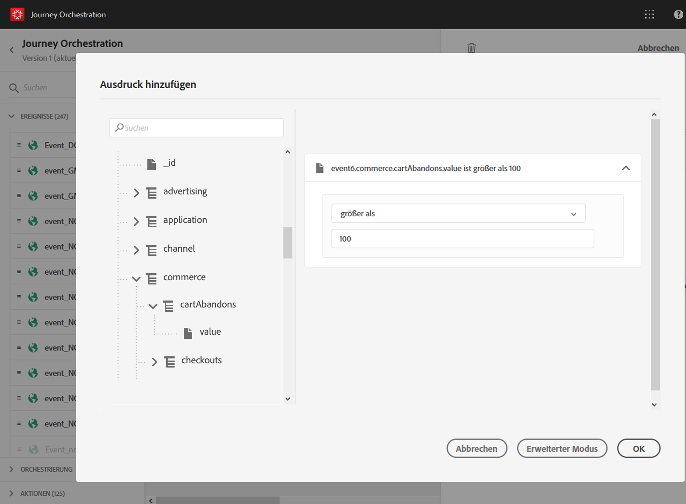

# Hinzufügen einer Bedingung {#concept_rbg_gqt_52b}

Mit der Ereignisbedingung kann das System die Verarbeitung von Ereignissen filtern. Wenn die Bedingung wahr ist, wird das Ereignis verarbeitet. Wenn die Bedingung nicht wahr ist, wird das Ereignis ignoriert.

Die Bedingung für Ereignisse kann nur auf Daten basieren, die in der Ereignis-Payload übergeben werden. Die auf Ereignisebene definierte Bedingung kann von einem Marketing-Experten auf der Arbeitsfläche nicht geändert werden. Der Zweck besteht darin, diese Bedingung zu härten, wenn dieses Ereignis verwendet wird. Wenn Sie beispielsweise nicht möchten, dass Marketing-Experten bei zu geringem Warenkorbwert Transaktionsabbruchsereignisse verwenden, können Sie eine Bedingung für das Ereignisfeld „Warenkorbwert“ erstellen und einen Wert über 100 US-Dollar festlegen.

Sie können den einfachen Ausdruckseditor oder den erweiterten Ausdruckseditor verwenden, um Bedingungen für Ereignisse einzurichten. Siehe .

Sie können beispielsweise eine Bedingung definieren, die nur die Ereignisse eines bestimmten Ereignistyps verarbeitet und die anderen Typen ignoriert. Wenn es sich bei Ihrem Ereignis um einen Transaktionsabbruch handelt und die Payload das Feld für den Warenkorbwert enthält, können Sie eine Ereignisbedingung definieren, um die Ereignisse nur dann zu verarbeiten, wenn der Wert des Warenkorbs größer als 100 US-Dollar ist.

