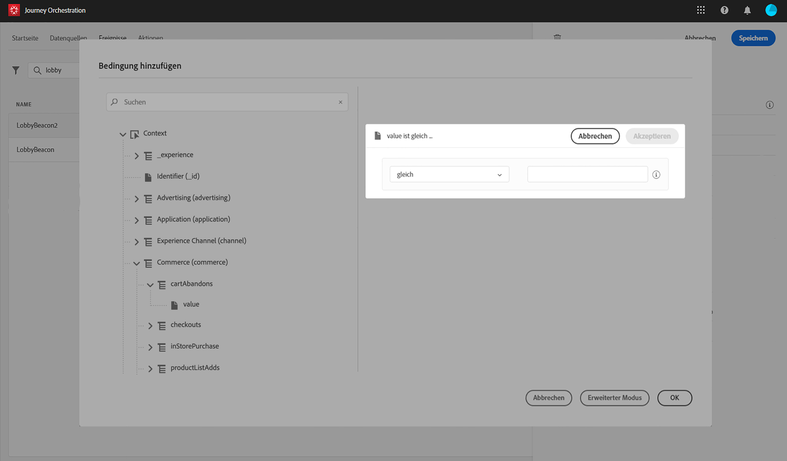

# Hinzufügen einer Bedingung {#concept_rbg_gqt_52b}

Mit der Ereignisbedingung kann das System die Verarbeitung von Ereignissen filtern. Wenn die Bedingung &quot;true&quot;ist, wird das Ereignis verarbeitet. Wenn die Bedingung nicht wahr ist, wird das Ereignis ignoriert.

Die Bedingung für Ereignisse kann nur auf Daten basieren, die in der Ereignisnutzlast übergeben werden. Die auf Ereignisebene definierte Bedingung kann von einem Marketingspezialisten auf der Arbeitsfläche nicht geändert werden. Der Zweck besteht darin, diese Bedingung zu härten, wenn dieses Ereignis verwendet wird. Wenn Sie beispielsweise nie möchten, dass Marketingexperten Warenkorbereignisse verwenden, wenn der Warenkorbwert zu klein ist, können Sie eine Bedingung für das Ereignisfeld &quot;Warenkorbwert&quot;erstellen und einen Wert über 100 Dollar festlegen.

Sie können den einfachen Ausdruckseditor oder den erweiterten Ausdruckseditor verwenden, um Bedingungen für Ereignisse einzurichten. Näheres wird im Abschnitt  beschrieben.

Sie können beispielsweise eine Bedingung definieren, die nur die Ereignisse eines bestimmten Ereignistyps verarbeitet und die anderen Typen ignoriert. Wenn es sich bei Ihrem Ereignis um einen Warenkorbabbruch handelt und die Nutzlast das Feld für den Wert des Einkaufswagens enthält, können Sie eine Ereignisbedingung definieren, um die Ereignisse nur dann zu verarbeiten, wenn der Wert des Einkaufswagens größer als 100 Dollar ist.

