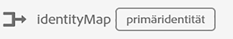
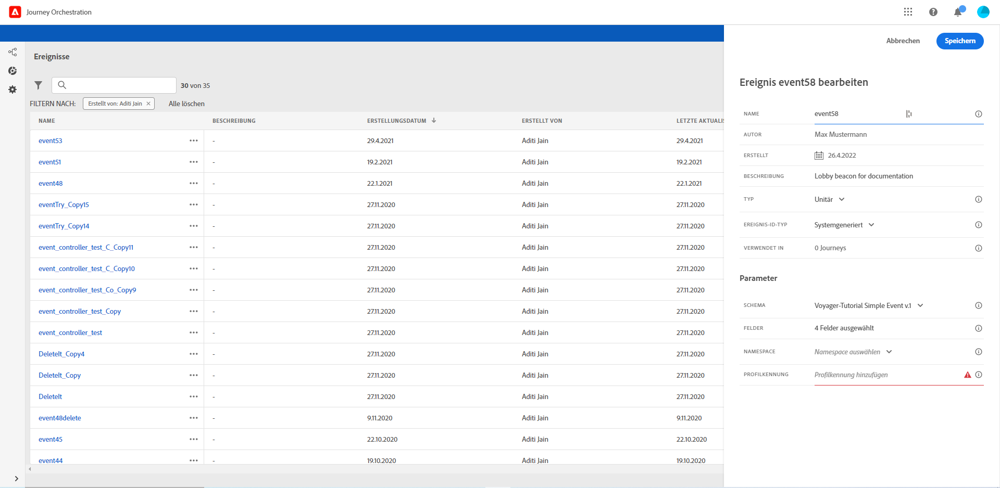
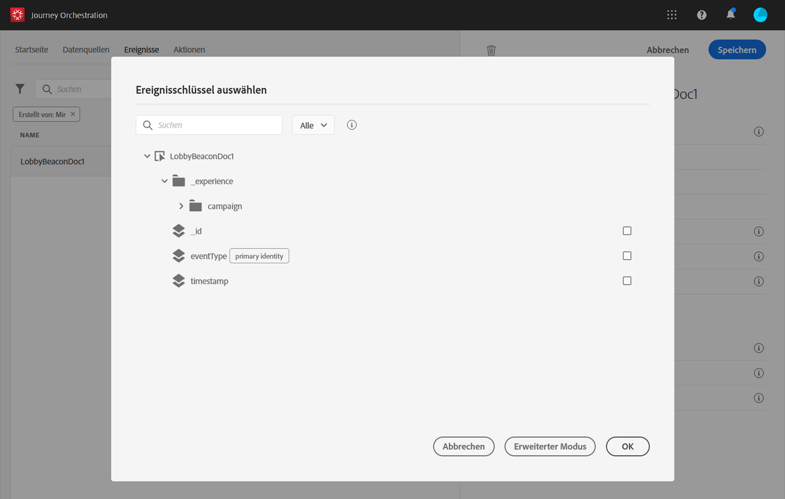

# Definieren des Ereignisschlüssels {#concept_ond_hqt_52b}

Der Schlüssel ist das Feld oder die Feldkombination, die Teil der Ereignis-Payload-Daten ist und es dem System ermöglicht, die mit dem Ereignis verbundene Person zu identifizieren. Der Schlüssel kann beispielsweise die Experience Cloud-ID, eine CRM-ID oder eine E-Mail-Adresse sein.

Wenn Sie Daten nutzen möchten, die in der Echtzeit-Kundenprofildatenbank gespeichert sind, müssen Sie als Ereignisschlüssel die Informationen auswählen, die Sie im [Echtzeit-Kundenprofildienst](https://docs.adobe.com/content/help/de-DE/experience-platform/profile/home.html) als Profilidentität definiert haben.

Dadurch kann das System die Abstimmung zwischen dem Ereignis und dem Profil des Kontakts durchführen. Wenn Sie ein Schema mit einer Primäridentität auswählen, werden die Felder **[!UICONTROL Schlüssel]** und **[!UICONTROL Namespace]** vorbelegt. Wenn keine Identität definiert ist, wählen Sie _identityMap > id_ als Primärschlüssel aus. Wählen Sie anschließend einen Namespace aus und der Schlüssel wird (unter dem Feld **[!UICONTROL Namespace]**) mit _identityMap > id_ vorbelegt.

Bei der Auswahl von Feldern werden Primäridentitätsfelder mit Tags versehen.

Wenn Sie einen anderen Schlüssel verwenden müssen, z. B. eine CRM-ID oder eine E-Mail-Adresse, müssen Sie ihn manuell hinzufügen:

1. Klicken Sie in das Feld **[!UICONTROL Schlüssel]** oder auf das Bleistiftsymbol.

   

1. Wählen Sie das als Schlüssel ausgewählte Feld in der Liste der Payload-Felder aus. Sie können auch zum erweiterten Ausdruckseditor wechseln, um komplexere Schlüssel zu erstellen (z. B. eine Verkettung zweier Ereignisfelder). Siehe unten in diesem Abschnitt.

   

Wenn das Ereignis eingeht, kann das System mit dem Wert des Schlüssels die mit dem Ereignis verbundene Person identifizieren. Mit dem Schlüssel, der einem Namespace zugeordnet ist (siehe [diese Seite](../event/selecting-the-namespace.md)), können Abfragen auf Adobe Experience Platform durchgeführt werden. Weitere Informationen finden Sie auf [dieser Seite](../building-journeys/about-orchestration-activities.md).
Der Schlüssel wird auch verwendet, um zu überprüfen, ob sich eine Person in einer Journey befindet. Eine Person kann nicht an zwei verschiedenen Stellen in derselben Journey sein. Das System lässt daher nicht zu, dass sich derselbe Schlüssel, z. B. der Schlüssel CRMID=3224, an verschiedenen Stellen in derselben Journey befindet.

Sie haben auch Zugriff auf die erweiterten Ausdrucksfunktionen (**[!UICONTROL erweiterter Modus]**), wenn Sie zusätzliche Manipulationen durchführen möchten. Mit diesen Funktionen können Sie die Werte bearbeiten, die für bestimmte Abfragen wie das Ändern von Formaten verwendet werden, indem Sie Feldverkettungen durchführen, wobei nur ein Teil eines Felds (z. B. die 10 ersten Zeichen) berücksichtigt wird. Weitere Informationen finden Sie auf [dieser Seite](../expression/expressionadvanced.md).
