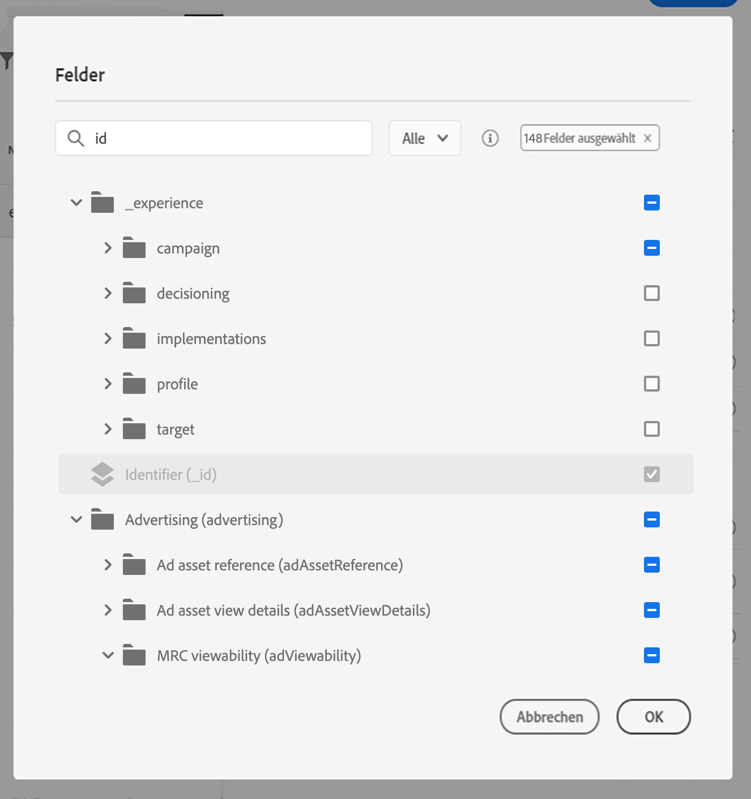

# Definieren des Ereignisschlüssels {#concept_ond_hqt_52b}

Der Schlüssel ist das Feld oder die Kombination von Feldern ist Teil der Ereignisnutzdaten und ermöglicht dem System die Identifizierung der Person, die mit dem Ereignis verbunden ist. Der Schlüssel kann beispielsweise die Experience Cloud ID, eine CRM-ID oder eine E-Mail-Adresse sein.

Wenn Sie Daten nutzen möchten, die in der Echtzeit-Kundenprofildatenbank gespeichert sind, müssen Sie als Ereignisschlüssel die Informationen auswählen, die Sie im [Echtzeit-Kundenprofildienst](https://www.adobe.io/apis/cloudplatform/dataservices/profile-identity-segmentation/profile-identity-segmentation-services.html#!api-specification/markdown/narrative/technical_overview/unified_profile_architectural_overview/unified_profile_architectural_overview.md)als Profilidentität definiert haben.

Dadurch kann das System die Abstimmung zwischen dem Ereignis und dem Profil des Einzelnen durchführen. Wenn Sie ein Schema mit einer primären Identität auswählen, werden die Felder **[!UICONTROL Schlüssel]**und**[!UICONTROL  Namespace]** vorausgefüllt. Wenn keine Identität definiert ist, wählen Sie _identityMap > id_ als Primärschlüssel. Dann müssen Sie einen Namespace auswählen, und der Schlüssel wird vorausgefüllt (unter dem Feld **[!UICONTROL Namespace]**) mit _identityMap > id_.

Wenn Sie einen anderen Schlüssel verwenden müssen, z. B. eine CRM-ID oder eine E-Mail-Adresse, müssen Sie ihn manuell hinzufügen:

1. Klicken Sie in das Feld **[!UICONTROL Schlüssel]**oder auf das Stiftsymbol.

   

1. Wählen Sie das als Schlüssel ausgewählte Feld in der Liste der Nutzdatenfelder aus. Sie können auch zum erweiterten Ausdruckseditor wechseln, um komplexere Schlüssel zu erstellen (z. B. eine Verkettung zweier Ereignisfelder). Siehe unten, in diesem Abschnitt.

   

Wenn das Ereignis eingeht, kann das System mit dem Wert des Schlüssels die mit dem Ereignis verbundene Person identifizieren. In Verbindung mit einem Namespace (siehe ) kann der Schlüssel für Abfragen auf der Adobe Experience Platform verwendet werden. Näheres wird im Abschnitt  beschrieben.
Der Schlüssel wird auch verwendet, um zu überprüfen, ob sich eine Person auf einer Reise befindet. Tatsächlich kann eine Person nicht an zwei verschiedenen Orten auf derselben Reise sein. Das System lässt daher nicht zu, dass sich derselbe Schlüssel, z. B. der Schlüssel CRMID=3224, an verschiedenen Orten auf derselben Reise befinden kann.

Sie haben auch Zugriff auf die erweiterten Ausdrucksfunktionen (**[!UICONTROL Erweiterter Modus]**), wenn Sie weitere Manipulationen durchführen möchten. Mit diesen Funktionen können Sie die Werte bearbeiten, die für bestimmte Abfragen wie das Ändern von Formaten verwendet werden, indem Sie Feldverkettungen durchführen, wobei nur ein Teil eines Felds (z. B. die 10 ersten Zeichen) berücksichtigt wird. Näheres wird im Abschnittbeschrieben.
