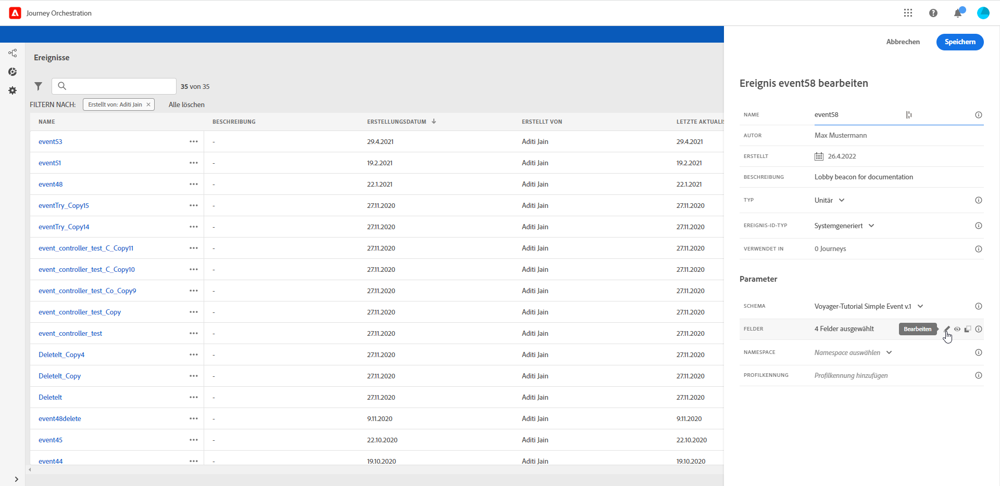
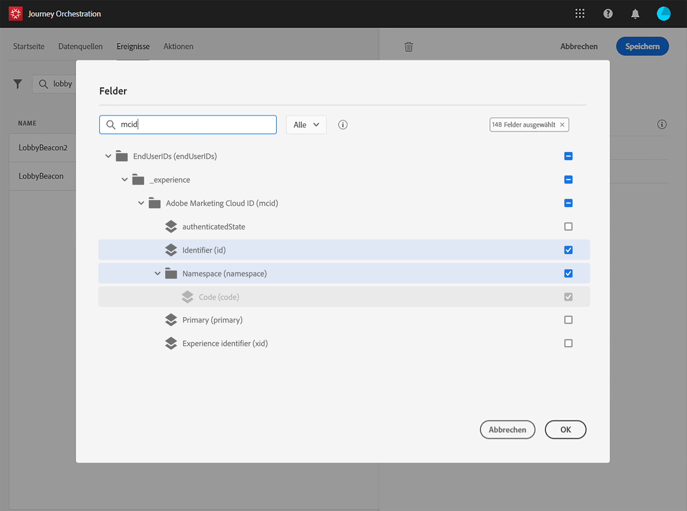
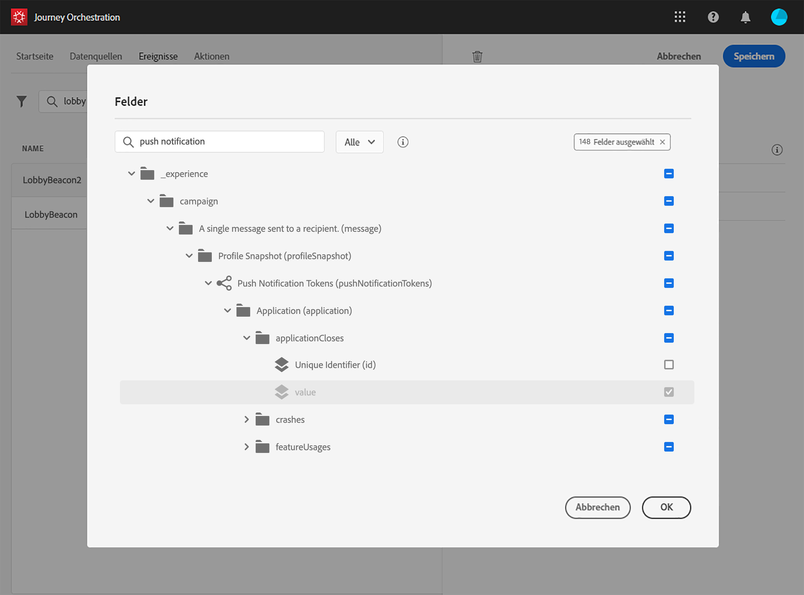
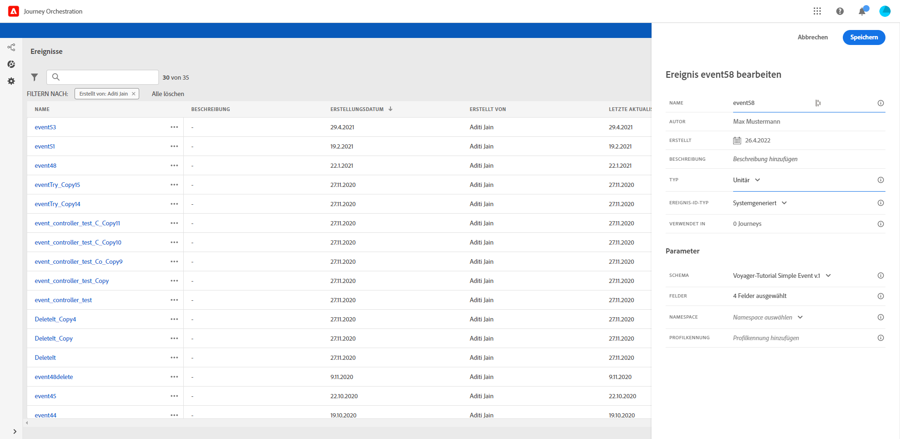

# Definieren der Payload-Felder {#concept_yrw_3qt_52b}

Mit der Payload-Definition können Sie die Informationen auswählen, die das System vom Ereignis in Ihrer Journey erwartet, sowie den Schlüssel zum Identifizieren der mit dem Ereignis verbundenen Person. Die Payload basiert auf der Experience Cloud-XDM-Felddefinition. For more information on XDM, refer to [this page](https://docs.adobe.com/content/help/de-DE/experience-platform/xdm/home.html).

1. Wählen Sie ein XDM-Schema aus der Liste aus und klicken Sie auf das Feld **[!UICONTROL Payload]** oder das Symbol **[!UICONTROL Bearbeiten]**.

   

   Alle im Schema definierten Felder werden angezeigt. Die Liste der Felder variiert von Schema zu Schema. Sie können nach einem bestimmten Feld suchen oder die Filter verwenden, um alle Knoten und Felder oder nur die ausgewählten Felder anzuzeigen. Gemäß der Schemadefinition können einige Felder obligatorisch und vorausgewählt sein. Sie können die Auswahl nicht aufheben.

   >[!NOTE]
   >
   >Vergewissern Sie sich, dass Sie das Mixin „orchestration“ zum XDM-Schema hinzugefügt haben. Dadurch wird sichergestellt, dass Ihr Schema alle erforderlichen Informationen für die Zusammenarbeit mit [!DNL Journey Orchestration] enthält.

   

1. Wählen Sie die Felder aus, die Sie vom Ereignis erwarten. Dies sind die Felder, die der Business-Anwender in der Journey nutzen wird. They must also include the key that will be used to identify the person associated to the event (see [this page](../event/defining-the-event-key.md)).

   

   >[!NOTE]
   >
   >For system-generated events, the **[!UICONTROL eventID]** field is automatically added in the list of fields selected so that [!DNL Journey Orchestration] can identify the event. Das System, das das Ereignis per Push sendet, sollte keine ID generieren, sondern die ID verwenden, die in der Payload-Vorschau verfügbar ist. Weiterführende Informationen finden Sie auf [dieser Seite](../event/previewing-the-payload.md).

1. Wenn Sie die erforderlichen Felder ausgewählt haben, klicken Sie auf **[!UICONTROL Speichern]** oder drücken Sie die **[!UICONTROL Eingabetaste]**.

   

   Die Anzahl der ausgewählten Felder wird im Feld **[!UICONTROL Payload]** angezeigt.

   
