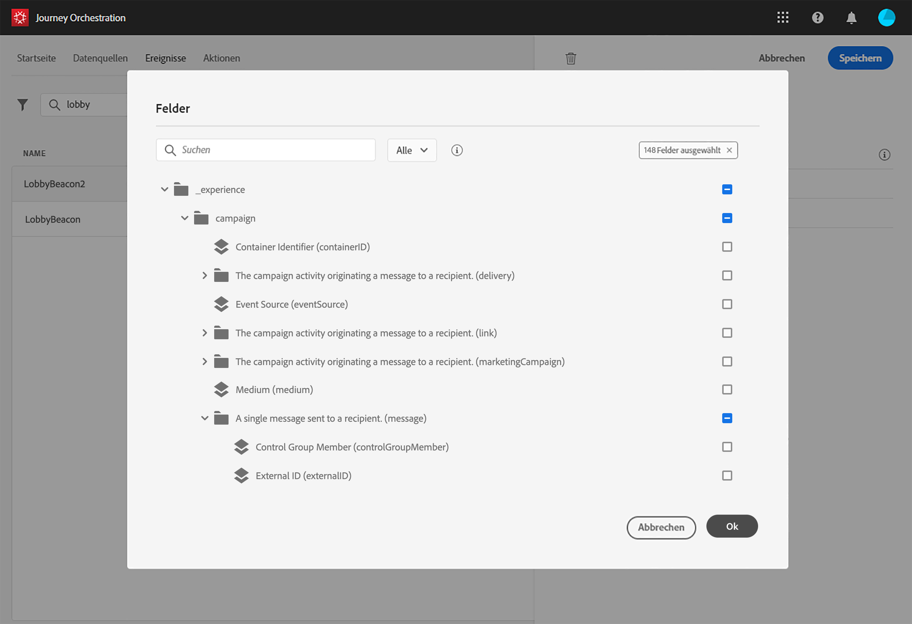

# Definieren der Payload-Felder {#concept_yrw_3qt_52b}

>[!CAUTION]
>
>**Sie möchten mehr über Adobe Journey Optimizer erfahren**? Klicken Sie [hier](https://experienceleague.adobe.com/de/docs/journey-optimizer/using/ajo-home){target="_blank"}, um auf die Journey Optimizer-Dokumentation zuzugreifen.
>
>
>_Diese Dokumentation bezieht sich auf veraltete Journey Orchestration-Materialien, die durch Journey Optimizer ersetzt wurden. Wenden Sie sich an Ihr Accountteam, wenn Sie Fragen zu Ihrem Zugriff auf Journey Orchestration oder Journey Optimizer haben._

Mit der Payload-Definition können Sie die Informationen auswählen, die das System vom Ereignis in Ihrer Journey erwartet, sowie den Schlüssel zum Identifizieren der mit dem Ereignis verbundenen Person. Die Payload basiert auf der Experience Cloud-XDM-Felddefinition. Weitere Informationen zu XDM finden Sie auf [dieser Seite](https://experienceleague.adobe.com/docs/experience-platform/xdm/home.html?lang=de).

1. Wählen Sie ein XDM-Schema aus der Liste aus und klicken Sie auf das Feld **[!UICONTROL Payload]** oder das Symbol **[!UICONTROL Bearbeiten]**.

   

   Alle im Schema definierten Felder werden angezeigt. Die Liste der Felder variiert von Schema zu Schema. Sie können nach einem bestimmten Feld suchen oder die Filter verwenden, um alle Knoten und Felder oder nur die ausgewählten Felder anzuzeigen. Gemäß der Schemadefinition können einige Felder obligatorisch und vorausgewählt sein. Sie können die Auswahl nicht aufheben. Alle Felder, die für den korrekten Empfang des Ereignisses durch Journey Orchestration Pflichtfelder sind, sind standardmäßig ausgewählt.

   >[!NOTE]
   >
   >Vergewissern Sie sich, dass Sie das Mixin „orchestration“ zum XDM-Schema hinzugefügt haben. Dadurch wird sichergestellt, dass Ihr Schema alle erforderlichen Informationen für die Zusammenarbeit mit [!DNL Journey Orchestration] enthält.

   

1. Wählen Sie die Felder aus, die Sie vom Ereignis erwarten. Dies sind die Felder, die der Business-Anwender in der Journey nutzen wird. Sie müssen auch den Schlüssel enthalten, mit dem die mit dem Ereignis verbundene Person identifiziert werden kann (siehe [diese Seite](../event/defining-the-event-key.md)).

   

   >[!NOTE]
   >
   >Das Feld **[!UICONTROL eventID]** wird automatisch in die Liste der ausgewählten Felder eingefügt, damit [!DNL Journey Orchestration] das Ereignis identifizieren kann. Das System, das das Ereignis per Push sendet, sollte keine ID generieren, sondern die ID verwenden, die in der Payload-Vorschau verfügbar ist. Weitere Informationen finden Sie auf [dieser Seite](../event/previewing-the-payload.md).

1. Wenn Sie die erforderlichen Felder ausgewählt haben, klicken Sie auf **[!UICONTROL Speichern]** oder drücken Sie die **[!UICONTROL Eingabetaste]**.

   

   Die Anzahl der ausgewählten Felder wird im Feld **[!UICONTROL Payload]** angezeigt.

   
