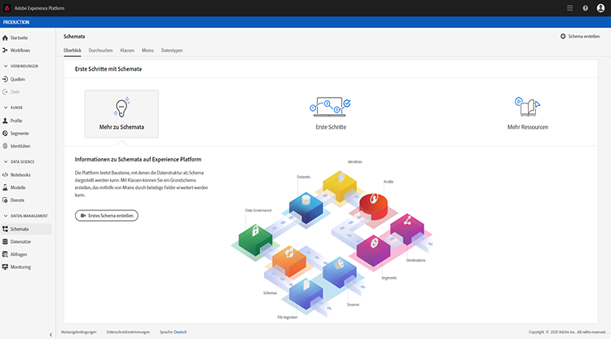
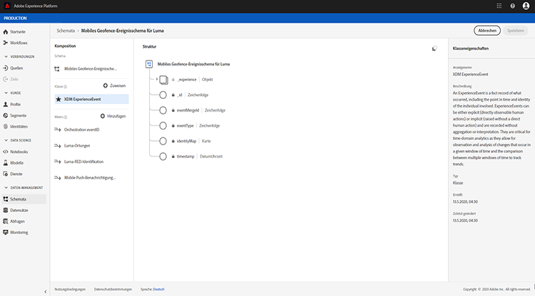
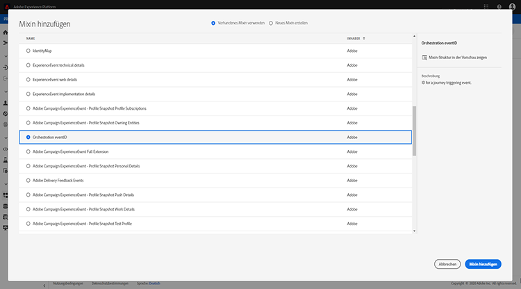
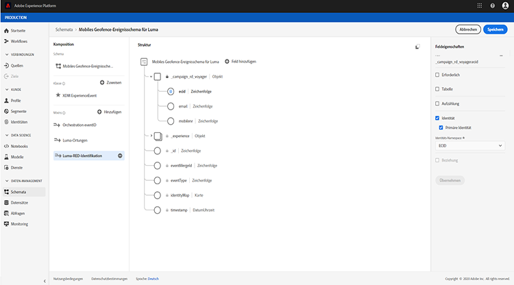
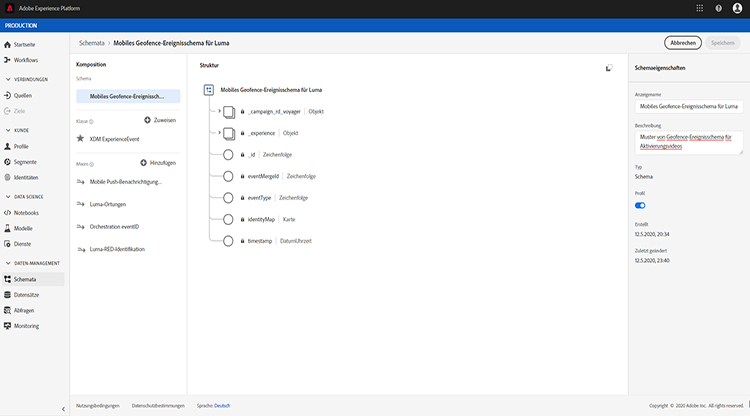
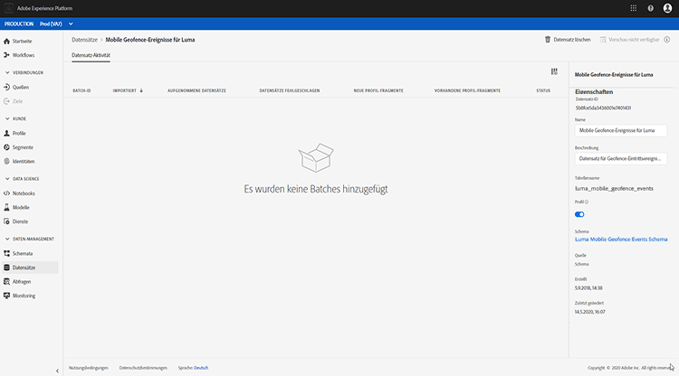
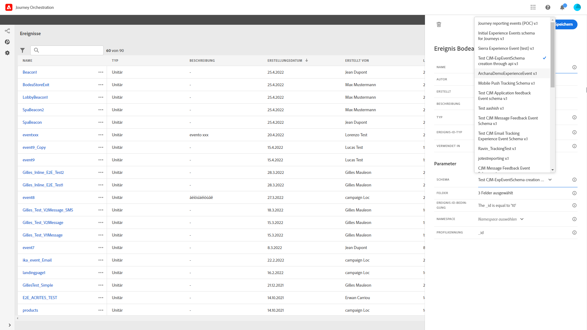

# Informationen zu ExperienceEvent-Schemas für Ereignisse zur Reiseorganisation

Journey Orchestration Ereignisses sind XDM Experience Ereignisses, die über Streaming Ingestion an die Adobe Experience Platform gesendet werden.

Eine wichtige Voraussetzung für das Einrichten von Ereignissen für die Reiseorganisation ist, dass Sie mit dem Erlebnisdatenmodell (XDM) der Plattform vertraut sind und wie Sie XDM Experience Ereignis-Schema zusammenstellen sowie wie Sie XDM-formatierte Daten an die Plattform streamen können.

## Anforderungen an das Schema von Ereignissen für die Reiseorganisation

Der erste Schritt beim Einrichten eines Ereignisses für die Reiseorganisation besteht darin, sicherzustellen, dass ein XDM-Schema zur Darstellung des Ereignisses definiert ist und ein Datensatz erstellt wurde, um Instanzen des Ereignisses auf der Plattform aufzuzeichnen. Ein Datensatz für Ihre Ereignis ist nicht unbedingt erforderlich, aber das Senden der Ereignis an einen bestimmten Datensatz ermöglicht es Ihnen, den Benutzerverlauf für die spätere Referenz und Analyse beizubehalten. Daher ist es immer eine gute Idee, einen Datensatz zu erstellen. Wenn Sie noch kein geeignetes Schema und einen entsprechenden Datensatz für Ihr Ereignis haben, können beide Aufgaben über die Plattform-Weboberfläche vorgenommen werden.

Für jedes XDM-Schema, das für Ereignisse der Journey Orchestration verwendet wird, gelten folgende Anforderungen:

* Das Schema muss der XDM ExperienceEvent-Klasse angehören.

* Das Schema muss das Mixin Orchestration eventID enthalten. Die Reiseorganisation verwendet dieses Feld, um Ereignis zu identifizieren, die auf Reisen verwendet werden.

* Deklarieren Sie ein Identitätsfeld zur Identifizierung des Objekts des Ereignisses. Wenn keine Identität angegeben ist, kann eine Identitätskarte verwendet werden. Dies wird nicht empfohlen.

* Wenn Sie möchten, dass diese Daten später auf einer Reise zur Verfügung stehen, markieren Sie das Schema und den Datensatz zum Profil.

* Sie können Datenfelder einschließen, um andere Kontextdaten zu erfassen, die Sie in das Ereignis einschließen möchten, z. B. Informationen zum Benutzer, zum Gerät, von dem das Ereignis generiert wurde, zum Speicherort oder andere aussagekräftige Umstände in Zusammenhang mit dem Ereignis.

