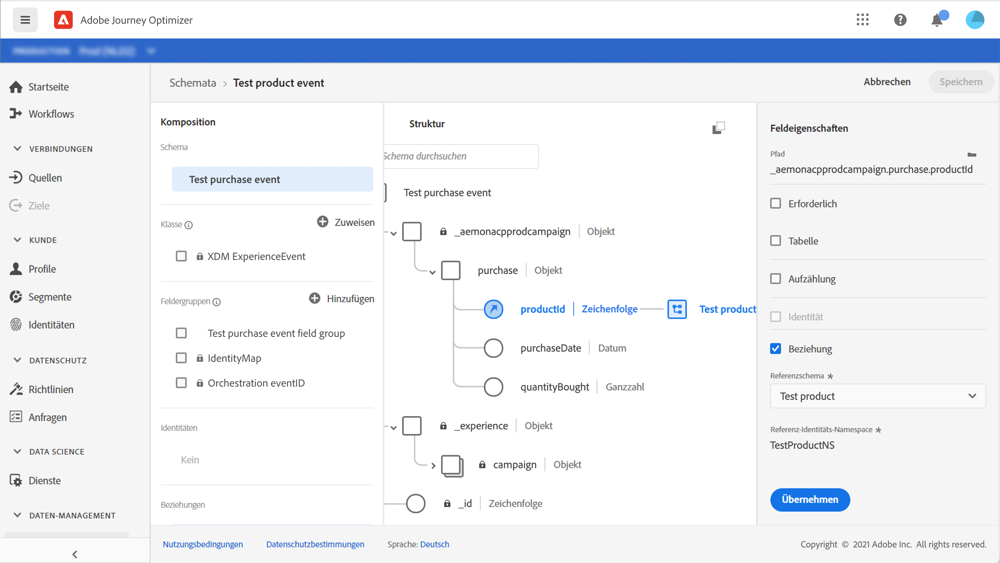

# Informationen zu ExperienceEvent-Schemas für [!DNL Journey Orchestration]-Ereignisse

[!DNL Journey Orchestration]-Ereignisse sind XDM-Erlebnisereignisse, die über die Streaming-Aufnahme an Adobe Experience Platform gesendet werden.

Eine wichtige Voraussetzung für das Einrichten von [!DNL Journey Orchestration]-Ereignissen ist daher, dass Sie mit dem Experience-Datenmodell (oder XDM) von Adobe Experience Platform und dem Erstellen von XDM-Erlebnisereignisschemata sowie dem Streamen von XDM-formatierten Daten an Adobe Experience Platform vertraut sind.

## Schemaanforderungen an [!DNL Journey Orchestration]-Ereignisse

Der erste Schritt beim Einrichten eines Ereignisses für [!DNL Journey Orchestration] besteht darin sicherzustellen, dass Sie ein XDM-Schema zur Darstellung des Ereignisses definiert und einen Datensatz erstellt haben, um Instanzen des Ereignisses in Adobe Experience Platform zu erfassen. Es ist nicht unbedingt erforderlich, einen Datensatz für Ihre Ereignisse zu haben. Wenn Sie die Ereignisse jedoch an einen bestimmten Datensatz senden, können Sie den Ereignisverlauf der Benutzer zur späteren Bezugnahme und Analyse aufbewahren. Dies ist daher immer empfehlenswert. Wenn Sie noch kein geeignetes Schema oder keinen geeigneten Datensatz für Ihr Ereignis haben, können Sie beide über die Web-Oberfläche von Adobe Experience Platform erstellen.

Jedes XDM-Schema, das für [!DNL Journey Orchestration]-Ereignisse verwendet wird, sollte die folgenden Anforderungen erfüllen:

* Das Schema muss der ExperienceEvent-XDM-Klasse angehören.

   

* Bei vom System erstellten Ereignissen muss das Schema das eventID-Orchestrierungs-Mixin enthalten. [!DNL Journey Orchestration] verwendet dieses Feld, um Ereignisse zu identifizieren, die in Journeys verwendet werden.

   

* Deklarieren Sie ein Identitätsfeld zur Identifizierung des Themas des Ereignisses. Wenn keine Identität angegeben ist, kann eine Identitätszuordnung (identityMap) verwendet werden. Dies wird nicht empfohlen.

   

* Damit diese Daten später in einer Journey zur Suche verfügbar sind, markieren Sie das Schema und den Datensatz für das Profil.

   

   

* Sie können auch Datenfelder einschließen, um andere Kontextdaten zu erfassen, die Sie in das Ereignis aufnehmen möchten, z. B. Informationen zum Benutzer, zum Gerät, von dem das Ereignis generiert wurde, zum Ort oder andere aussagekräftige Umstände in Zusammenhang mit dem Ereignis.

   

   

## Verwenden von Schemabeziehungen{#leverage_schema_relationships}

Mit Adobe Experience Platform können Sie Beziehungen zwischen Schemas definieren, um einen Datensatz als Lookup-Tabelle für einen anderen zu verwenden.

Nehmen wir an, Ihr Marken-Datenmodell verfügt über ein Schema zur Erfassung von Käufen. Zusätzlich verfügen Sie über ein Schema für den Produktkatalog. Sie können die Produkt-ID im Kaufschema erfassen und eine Beziehung verwenden, um weitere Produktdetails im Produktkatalog nachzuschlagen. So können Sie beispielsweise ein Segment für alle Kunden erstellen, die einen Laptop gekauft haben, ohne explizit alle Laptop-IDs auflisten oder alle Produktdetails in Transaktionssystemen erfassen zu müssen.

Um eine Beziehung zu definieren, benötigen Sie ein spezielles Feld im Quellschema, in diesem Fall das Feld „Produkt-ID“ im Kaufschema. Dieses Feld muss auf das Produkt-ID-Feld im Zielschema verweisen. Die Quell- und Zieltabellen müssen für Profile aktiviert sein, und im Zielschema muss dieses gemeinsame Feld als seine primäre Identität definiert sein.

Im Folgenden finden Sie das für das Profil aktivierte Produktkatalog-Schema, dessen Produkt-ID als primäre Identität definiert ist.

Im Folgenden finden Sie das Kaufschema mit der über das Feld „Produkt-ID“ definierten Beziehung.

>[!NOTE]
>
>Weitere Informationen zu Schemabeziehungen finden Sie in der [Dokumentation zu Experience Platform](https://experienceleague.adobe.com/docs/platform-learn/tutorials/schemas/configure-relationships-between-schemas.html?lang=de).

In Journey Orchestration können Sie dann alle Felder aus den verknüpften Tabellen nutzen:

* beim Konfigurieren eines unitären Ereignisses, [weitere Informationen](../event/experience-event-schema.md#unitary_event_configuration)
* bei Verwendung von Bedingungen in einer Journey, [weitere Informationen](../event/experience-event-schema.md#journey_conditions_using_event_context)
* in der Personalisierung benutzerdefinierter Aktionen, [weitere Informationen](../event/experience-event-schema.md#custom_action_personalization_with_journey_event_context)

### Konfiguration unitärer Ereignisse{#unitary_event_configuration}

Die verknüpften Schemafelder sind bei der Konfiguration unitärer Ereignisse verfügbar:

* beim Durchsuchen der Ereignisschemafelder im Bildschirm zur Ereigniskonfiguration.
* beim Definieren einer Bedingung für systemgenerierte Ereignisse.

Die verknüpften Felder sind nicht verfügbar:

* in der Ereignisschlüsselformel
* in einer Ereignis-ID-Bedingung (regelbasierte Ereignisse)

Informationen zum Konfigurieren eines unitären Ereignisses finden Sie auf dieser [Seite](../event/about-creating.md).

### Journey-Bedingungen unter Verwendung des Ereigniskontexts{#journey_conditions_using_event_context}

Sie können Daten aus einer Lookup-Tabelle verwenden, die mit einem Ereignis verknüpft ist, das in einer Journey zur Bedingungserstellung (Ausdruckseditor) verwendet wird.

Fügen Sie eine Bedingung in eine Journey ein, bearbeiten Sie den Ausdruck und erweitern Sie den Ereignisknoten im Ausdruckseditor.

Informationen zum Definieren von Journey-Bedingungen finden Sie auf dieser [Seite](../building-journeys/condition-activity.md).

### Aktionspersonalisierung mit Journey-Ereigniskontext{#custom_action_personalization_with_journey_event_context}

Die verknüpften Felder sind bei der Konfiguration der Aktionsparameter einer Journey-Aktionsaktivität verfügbar.

Informationen zur Verwendung benutzerdefinierter Aktionen finden Sie auf dieser [Seite](../building-journeys/using-custom-actions.md).

