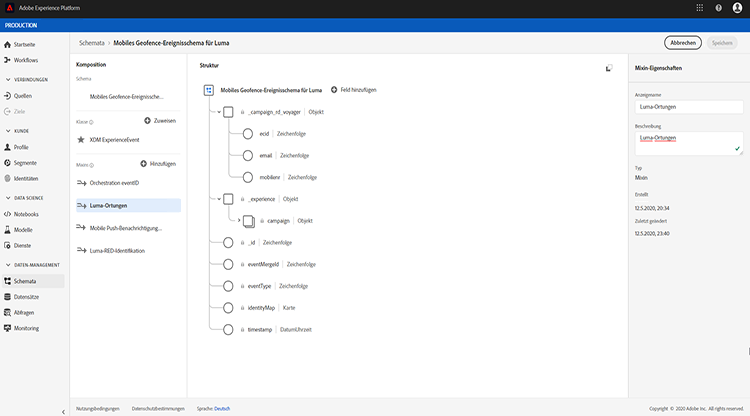

# Informationen zu ExperienceEvent-Schemata für [!DNL Journey Orchestration]-Ereignisse

[!DNL Journey Orchestration]-Ereignisse sind XDM-Erlebnisereignisse, die über die Streaming-Aufnahme an Adobe Experience Platform gesendet werden.

As such, an important prerequisite for setting up events for [!DNL Journey Orchestration] is that you are familiar with the Adobe Experience Platform’s Experience Data Model (or XDM) and how to compose XDM Experience Event schemas, as well as how to stream XDM-formatted data to the Adobe Experience Platform.

## Schemaanforderungen an [!DNL Journey Orchestration]-Ereignisse

The first step in setting up an event for [!DNL Journey Orchestration] is to ensure that you have an XDM schema defined to represent the event, and a dataset created to record instances of the event on the Adobe Experience Platform. Es ist nicht unbedingt erforderlich, einen Datensatz für Ihre Ereignisse zu haben. Wenn Sie die Ereignisse jedoch an einen bestimmten Datensatz senden, können Sie den Ereignisverlauf der Benutzer zur späteren Bezugnahme und Analyse aufbewahren. Dies ist daher immer eine gute Idee. Wenn Sie noch nicht über ein geeignetes Schema und einen entsprechenden Datensatz für Ihr Ereignis verfügen, können beide Aufgaben in der Adobe Experience Platform-Weboberfläche vorgenommen werden.

Jedes XDM-Schema, das für [!DNL Journey Orchestration]-Ereignisse verwendet wird, sollte die folgenden Anforderungen erfüllen:

* Das Schema muss der XDM-ExperienceEvent-Klasse angehören.

* Das Schema muss das Orchestration eventID-Mixin enthalten. [!DNL Journey Orchestration] verwendet dieses Feld, um Ereignisse zu identifizieren, die in Journeys verwendet werden.

* Deklarieren Sie ein Identitätsfeld zur Identifizierung des Themas des Ereignisses. Wenn keine Identität angegeben ist, kann eine Identitätszuordnung (identityMap) verwendet werden. Dies wird nicht empfohlen.

* Damit diese Daten später in einer Journey zur Suche verfügbar sind, markieren Sie das Schema und den Datensatz für das Profil.

* Sie können auch Datenfelder einschließen, um andere Kontextdaten zu erfassen, die Sie in das Ereignis aufnehmen möchten, z. B. Informationen zum Benutzer, zum Gerät, von dem das Ereignis generiert wurde, zum Ort oder andere aussagekräftige Umstände in Zusammenhang mit dem Ereignis.

