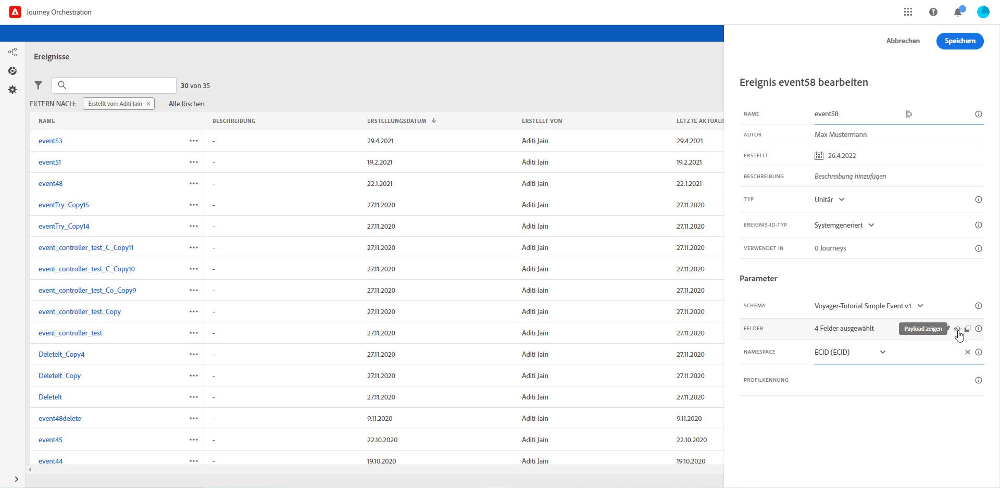
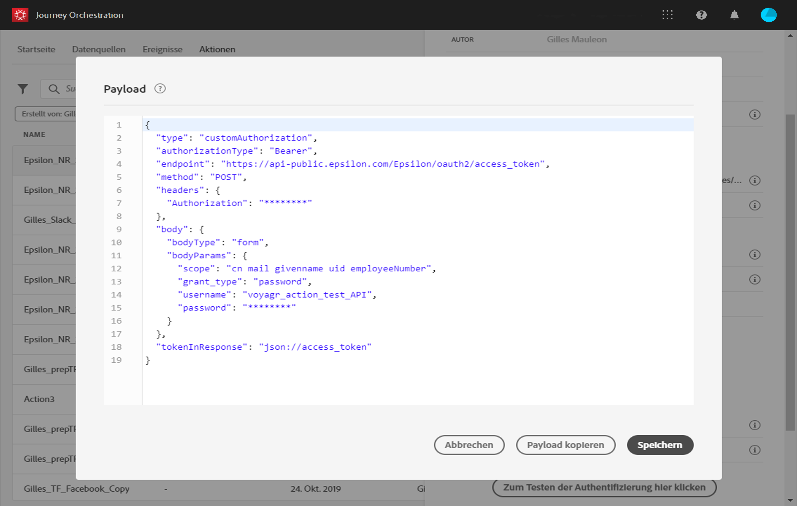

# Vorschau der Nutzlast {#concept_jgf_4yk_4fb}

Mit der Payload-Vorschau können Sie die Payload-Definition überprüfen.

>[!NOTE]
>
>Wenn Sie ein Ereignis erstellen, speichern Sie vor dem Anzeigen der Nutzdatenvorschau das Ereignis und öffnen Sie es erneut. Dieser Schritt ist erforderlich, um eine Ereignis-ID in der Nutzlast zu generieren.

1. Klicken Sie auf das Symbol **[!UICONTROL Nutzlast]**anzeigen, um eine Vorschau der vom System erwarteten Nutzlast anzuzeigen.

   

   Sie können bemerken, dass die ausgewählten Felder angezeigt werden.

   

1. Überprüfen Sie die Vorschau, um die Payload-Definition zu validieren.

1. Anschließend können Sie die Nutzlastvorschau für die Person freigeben, die für das Senden des Ereignisses verantwortlich ist. Diese Nutzlast kann ihm dabei helfen, die Einrichtung einer Veranstaltung zu gestalten, die zu einem Reiseorchester gedrängt wird. Näheres wird im Abschnitt  beschrieben.
