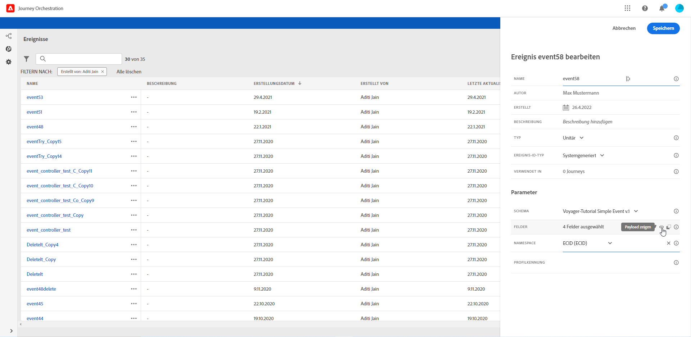
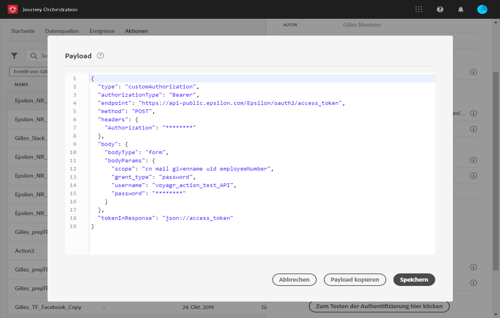

# Anzeigen der Payload-Vorschau {#concept_jgf_4yk_4fb}

>[!CAUTION]
>
>**Sie möchten mehr über Adobe Journey Optimizer erfahren**? Klicken Sie [hier](https://experienceleague.adobe.com/de/docs/journey-optimizer/using/ajo-home){target="_blank"}, um auf die Journey Optimizer-Dokumentation zuzugreifen.
>
>
>_Diese Dokumentation bezieht sich auf veraltete Journey Orchestration-Materialien, die durch Journey Optimizer ersetzt wurden. Wenden Sie sich an Ihr Accountteam, wenn Sie Fragen zu Ihrem Zugriff auf Journey Orchestration oder Journey Optimizer haben._

Mit der Payload-Vorschau können Sie die Payload-Definition validieren.

>[!NOTE]
>
>Bei vom System erstellten Ereignissen: Wenn Sie ein Ereignis erstellen, speichern und öffnen Sie es erneut, bevor Sie die Payload-Vorschau anzeigen. Dieser Schritt ist erforderlich, um eine Ereignis-ID in der Payload zu generieren.

1. Klicken Sie auf das Symbol **[!UICONTROL Payload zeigen]**, um eine Vorschau der vom System erwarteten Payload anzuzeigen.

   

   Sie können sehen, dass die ausgewählten Felder angezeigt werden.

   

1. Überprüfen Sie die Vorschau, um die Payload-Definition zu validieren.

1. Anschließend können Sie die Payload-Vorschau für die Person freigeben, die für das Senden des Ereignisses verantwortlich ist. Diese Payload kann ihr beim Entwurf eines Ereignisses helfen, das an [!DNL Journey Orchestration] gesendet wird. Weitere Informationen finden Sie auf [dieser Seite](../event/additional-steps-to-send-events-to-journey-orchestration.md).
