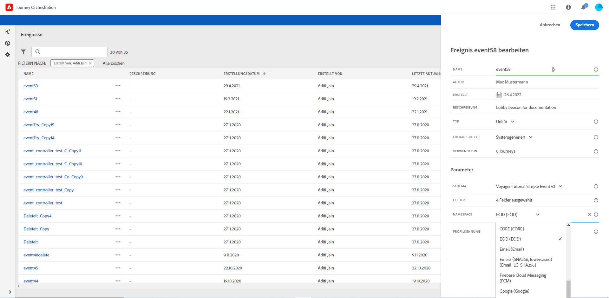

# Auswählen des Namespace {#concept_ckb_3qt_52b}

>[!CAUTION]
>
>**Sie möchten mehr über Adobe Journey Optimizer erfahren**? Klicken Sie [hier](https://experienceleague.adobe.com/de/docs/journey-optimizer/using/ajo-home){target="_blank"}, um auf die Journey Optimizer-Dokumentation zuzugreifen.
>
>
>_Diese Dokumentation bezieht sich auf veraltete Journey Orchestration-Materialien, die durch Journey Optimizer ersetzt wurden. Wenden Sie sich an Ihr Accountteam, wenn Sie Fragen zu Ihrem Zugriff auf Journey Orchestration oder Journey Optimizer haben._

Mit dem Namespace können Sie den Typ des Schlüssels definieren, mit dem die mit dem Ereignis verbundene Person identifiziert wird. Die Konfiguration ist optional. Sie ist erforderlich, wenn Sie in Ihren Journeys zusätzliche Informationen aus dem [Echtzeit-Kundenprofil](https://experienceleague.adobe.com/docs/experience-platform/profile/home.html?lang=de) abrufen möchten. Der Namespace muss nicht definiert werden, wenn Sie nur Daten aus einem Drittanbietersystem über eine benutzerdefinierte Datenquelle verwenden.

Sie können entweder einen der vordefinierten Namespace verwenden oder mit dem Identity-Namespace-Dienst einen neuen erstellen. Mehr dazu erfahren Sie auf [dieser Seite](https://experienceleague.adobe.com/docs/experience-platform/identity/home.html?lang=de).

Wenn Sie ein Schema mit einer Primäridentität auswählen, werden die Felder **[!UICONTROL Schlüssel]** und **[!UICONTROL Namespace]** vorbelegt. Wenn keine Identität definiert ist, wählen Sie _identityMap > id_ als Primärschlüssel aus. Wählen Sie anschließend einen Namespace aus und der Schlüssel wird (unter dem Feld **[!UICONTROL Namespace]**) mit _identityMap > id_ vorbelegt.

Bei der Auswahl von Feldern werden Primäridentitätsfelder mit Tags versehen.

Wählen Sie einen Namespace aus der Dropdown-Liste aus.

Pro Journey ist nur ein Namespace zulässig. Wenn Sie mehrere Ereignisse in derselben Journey verwenden, müssen diese denselben Namespace verwenden. Weitere Informationen finden Sie auf [dieser Seite](../building-journeys/journey.md).
