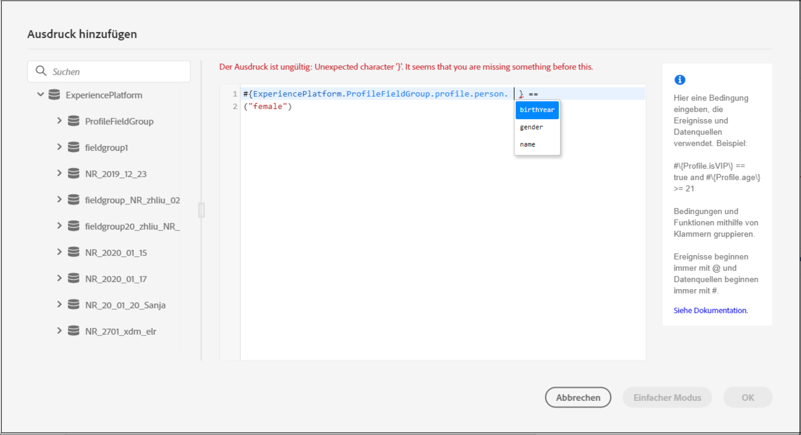

# Informationen zum erweiterten Ausdruckseditor {#concept_uyj_trt_52b}

Mit dem erweiterten Ausdruckseditor können Sie in verschiedenen Bildschirmen der Oberfläche erweiterte Ausdrücke erstellen, z. B. beim Definieren einer Bedingung der Datenquelle.
Der Editor steht auch immer dann zur Verfügung, wenn Sie Aktionsparameter definieren müssen, die eine bestimmte Datenbearbeitung erfordern. Sie können Daten aus den Ereignissen oder zusätzliche Informationen nutzen, die aus der Datenquelle abgerufen wurden. Bei einer Journey ist die angezeigte Liste der Ereignisfelder kontextbezogen und variiert je nach den Ereignissen, die in der Journey hinzugefügt werden.

Der erweiterte Ausdruckseditor bietet eine Reihe integrierter Funktionen und Operatoren, mit denen Sie Werte bearbeiten und einen Ausdruck definieren können, der Ihren Anforderungen entspricht. Mit dem erweiterten Ausdruckseditor können Sie auch die Werte des Parameters für die externe Datenquelle definieren sowie Zuordnungsfelder und Sammlungen (z. B. Erlebnisereignisse) bearbeiten.

_Die Benutzeroberfläche des erweiterten Ausdruckseditors_

Der erweiterte Ausdruckseditor kann für folgende Aufgaben verwendet werden:

* Erstellen von [erweiterten Bedingungen](../building-journeys/condition-activity.md#about_condition) für Datenquellen und Ereignisinformationen
* Definieren von benutzerdefinierten [Warteaktivitäten](../building-journeys/wait-activity.md#custom)
* Definieren der Zuordnung von Aktionsparametern

Wenn möglich, können Sie mit der Schaltfläche **[!UICONTROL Erweiterter Modus]**/**[!UICONTROL Einfacher Modus]** zwischen den beiden Modi wechseln. Der einfache Modus wird [hier](../building-journeys/condition-activity.md#about_condition) beschrieben.

>[!NOTE]
>
>Bedingungen können im einfachen oder erweiterten Ausdruckseditor definiert werden. Sie geben stets einen booleschen Typ zurück.
>
>Aktionsparameter können durch Auswahl von Feldern oder über den erweiterten Ausdruckseditor definiert werden. Sie geben je nach Ausdruck einen bestimmten Datentyp zurück.

## Zugreifen auf den erweiterten Ausdruckseditor {#section_fdz_4nj_cjb}

Sie können den erweiterten Ausdruckseditor auf verschiedene Weise aufrufen:

* Wenn Sie eine Bedingung der Datenquelle erstellen, können Sie den erweiterten Ausdruckseditor nutzen, indem Sie auf **[!UICONTROL Erweiterter Modus]** klicken.

   

* Wenn Sie einen benutzerdefinierten Timer erstellen, wird der erweiterte Editor direkt angezeigt.
* Wenn Sie Aktionsparameter zuordnen, klicken Sie auf **[!UICONTROL Erweiterter Modus]**.

## Kennenlernen der Benutzeroberfläche{#section_otq_tnj_cjb}

In diesem Bildschirm können Sie Ihren Ausdruck manuell schreiben.

Im linken Bildschirmbereich werden die verfügbaren Felder und Funktionen angezeigt:

* **[!UICONTROL Ereignisse]**: Wählen Sie eines der Felder aus, die vom eingehenden Ereignis empfangen wurden. Die angezeigte Liste der Ereignisfelder ist kontextbasiert und variiert je nach Ereignissen, die in der Journey hinzugefügt werden. [Mehr dazu](../event/about-events.md)
* **[!UICONTROL Segmente]**: Wenn Sie ein  **[!UICONTROL Segmentqualifizierungsereignis]** abgelegt haben, wählen Sie das Segment aus, das Sie in Ihrem Ausdruck verwenden möchten. [Mehr dazu](../segment/using-a-segment.md)
* **[!UICONTROL Datenquellen]**: Wählen Sie aus der Liste der Felder, die in den Feldergruppen Ihrer Datenquellen verfügbar sind. [Mehr dazu](../datasource/about-data-sources.md)
* **[!UICONTROL Journey-Eigenschaften]**: In diesem Abschnitt werden die Fachgebiete im Zusammenhang mit der Journey für ein bestimmtes Profil zusammengefasst. [Mehr dazu](../expression/journey-properties.md)
* **[!UICONTROL Funktionen]**: Wählen Sie aus der Liste der integrierten Funktionen, die eine komplexe Filterung ermöglichen. Die Funktionen sind nach Kategorien geordnet. [Mehr dazu](../expression/functions.md)

Ein Mechanismus für die automatische Vervollständigung zeigt kontextbezogene Vorschläge an.

Ein Syntaxvalidierungsverfahren überprüft die Integrität Ihres Codes. Fehler werden über dem Editor angezeigt.

**Bedarf an Parametern beim Erstellen von Bedingungen mit dem erweiterten Ausdruckseditor**

Wenn Sie ein Feld aus einer externen Datenquelle auswählen, für das ein Parameter aufgerufen werden muss, siehe [diese Seite](../datasource/external-data-sources.md). Beispiel: In einer wetterbezogenen Datenquelle lautet ein häufig verwendeter Parameter „city“. Darum müssen Sie festlegen, wo Sie diesen Parameter „city“ abrufen möchten. Funktionen können auch auf Parameter angewendet werden, um Formatänderungen oder Verkettungen vorzunehmen.

Bei komplexeren Anwendungsfällen können Sie, wenn Sie die Parameter der Datenquelle in den Hauptausdruck aufnehmen möchten, deren Werte mit dem Keyword „params“ definieren. Weitere Informationen finden Sie auf [dieser Seite](../expression/field-references.md).
