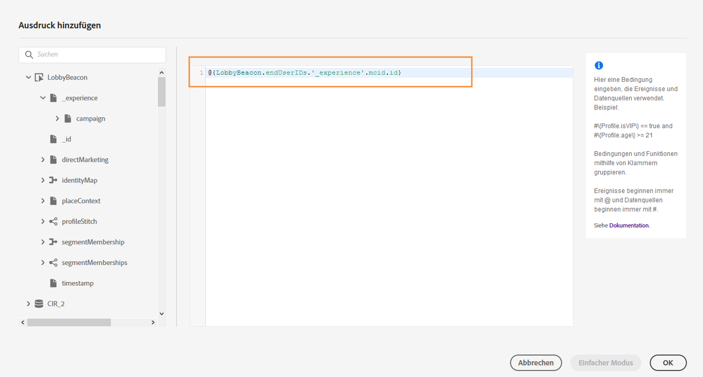

# Informationen zum erweiterten Ausdruckseditor {#concept_uyj_trt_52b}

>[!CAUTION]
>
>**Sie möchten mehr über Adobe Journey Optimizer erfahren**? Klicken Sie [hier](https://experienceleague.adobe.com/de/docs/journey-optimizer/using/ajo-home){target="_blank"}, um auf die Journey Optimizer-Dokumentation zuzugreifen.
>
>
>_Diese Dokumentation bezieht sich auf veraltete Journey Orchestration-Materialien, die durch Journey Optimizer ersetzt wurden. Wenden Sie sich an Ihr Accountteam, wenn Sie Fragen zu Ihrem Zugriff auf Journey Orchestration oder Journey Optimizer haben._

Verwenden Sie den erweiterten Ausdruckseditor, um in verschiedenen Bildschirmen der Benutzeroberfläche erweiterte Ausdrücke zu erstellen. Beispielsweise können Sie Ausdrücke erstellen, wenn Sie Journeys konfigurieren und verwenden oder eine Datenquellenbedingung definieren.
Er ist auch immer dann verfügbar, wenn Sie Aktionsparameter definieren müssen, die bestimmte Datenmanipulationen erfordern. Sie können Daten aus den Ereignissen oder zusätzliche Informationen aus der Datenquelle nutzen. Bei einer Journey ist die angezeigte Liste der Ereignisfelder kontextbezogen und variiert entsprechend den Ereignissen, die in der Journey hinzugefügt werden.

Der erweiterte Ausdruckseditor bietet eine Reihe integrierter Funktionen und Operatoren, mit denen Sie Werte bearbeiten und einen Ausdruck definieren können, der Ihren Anforderungen entspricht. Mit dem erweiterten Ausdruckseditor können Sie auch die Werte des Parameters für die externe Datenquelle definieren sowie Zuordnungsfelder und Sammlungen bearbeiten, z. B. Erlebnisereignisse.

_Benutzeroberfläche des erweiterten Ausdruckseditors_

Der erweiterte Ausdruckseditor kann für folgende Aufgaben verwendet werden:

* Erstellen [erweiterter Bedingungen](../building-journeys/condition-activity.md#about_condition) für Datenquellen und Ereignisinformationen
* Definieren benutzerdefinierter [Warteaktivitäten](../building-journeys/wait-activity.md#custom)
* Definieren der Zuordnung von Aktionsparametern

Wenn möglich, können Sie mithilfe der Schaltfläche **[!UICONTROL Erweiterter Modus]** / **[!UICONTROL Einfacher Modus]** zwischen den beiden Modi wechseln. Der einfache Modus wird [hier](../building-journeys/condition-activity.md#about_condition) beschrieben.

>[!NOTE]
>
>Bedingungen können im einfachen oder erweiterten Ausdruckseditor definiert werden. Sie geben immer einen booleschen Typ zurück.
>
>Aktionsparameter können durch die Auswahl von Feldern oder über den erweiterten Ausdruckseditor definiert werden. Sie geben je nach Ausdruck einen bestimmten Datentyp zurück.

## Zugreifen auf den erweiterten Ausdruckseditor {#section_fdz_4nj_cjb}

Sie können auf verschiedene Weise auf den erweiterten Ausdruckseditor zugreifen:

* Wenn Sie eine Bedingung für die Datenquelle erstellen, können Sie auf den erweiterten Editor zugreifen, indem Sie auf **[!UICONTROL Erweiterter Modus]** klicken.

  

* Wenn Sie einen benutzerdefinierten Timer erstellen, wird der erweiterte Editor direkt angezeigt.
* Wenn Sie Aktionsparameter zuordnen, klicken Sie auf **[!UICONTROL Erweiterter Modus]**.

## Vorstellung der Benutzeroberfläche{#section_otq_tnj_cjb}

In diesem Bildschirm können Sie Ihren Ausdruck manuell schreiben.

Auf der linken Bildschirmseite werden die verfügbaren Felder und Funktionen angezeigt:

* **[!UICONTROL Ereignisse]**: Wählen Sie eines der Felder aus, die vom eingehenden Ereignis empfangen wurden. Die angezeigte Liste der Ereignisfelder ist kontextbezogen und variiert entsprechend den Ereignissen, die in der Journey hinzugefügt werden. [Weitere Informationen](../event/about-events.md)
* **[!UICONTROL Segmente]**: Wenn Sie ein Ereignis vom Typ **[!UICONTROL Segmentqualifizierung]** abgelegt haben, wählen Sie das Segment aus, das Sie in Ihrem Ausdruck verwenden möchten. [Weitere Informationen](../segment/using-a-segment.md)
* **[!UICONTROL Datenquellen]**: Wählen Sie aus der Liste der Felder aus, die in den Feldergruppen Ihrer Datenquellen verfügbar sind. [Weitere Informationen](../datasource/about-data-sources.md)
* **[!UICONTROL Journey-Eigenschaften]**: Dieser Abschnitt gruppiert die technischen Felder neu, die mit der Journey für ein bestimmtes Profil verbunden sind. [Weitere Informationen](../expression/journey-properties.md)
* **[!UICONTROL Funktionen]**: Wählen Sie aus der Liste der integrierten Funktionen, die eine komplexe Filterung ermöglichen. Die Funktionen sind nach Kategorien geordnet. [Weitere Informationen](../expression/functions.md)

Ein Mechanismus zur automatischen Vervollständigung zeigt kontextbezogene Vorschläge an.

Ein Mechanismus zur Syntax-Validierung überprüft die Integrität Ihres Codes. Fehler werden über dem Editor angezeigt.

**Bedarf an Parametern beim Erstellen von Bedingungen mit dem erweiterten Ausdruckseditor**

Wenn Sie ein Feld aus einer externen Datenquelle auswählen, für das ein Parameter aufgerufen werden muss, siehe [diese Seite](../datasource/external-data-sources.md). In einer wetterbezogenen Datenquelle lautet der häufig verwendete Parameter beispielsweise „city“. Daher müssen Sie auswählen, wo Sie diesen Parameter „city“ abrufen möchten. Funktionen können auch auf Parameter angewendet werden, um Formatänderungen oder Verkettungen durchzuführen.

Bei komplexeren Anwendungsfällen können Sie, wenn Sie die Parameter der Datenquelle in den Hauptausdruck aufnehmen möchten, deren Werte mit dem Keyword „params“ definieren. Weitere Informationen finden Sie auf [dieser Seite](../expression/field-references.md).
