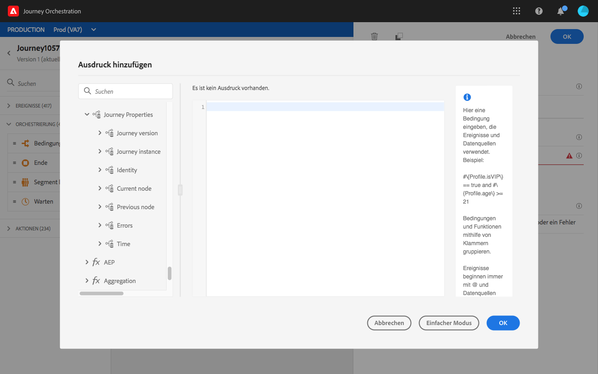

# Reiseeigenschaften {#journey-properties}

Im erweiterten Ausdruck-Editor finden Sie die Kategorie **Reiseeigenschaften** unter den Kategorien Ereignis und Datenquelle. Diese Kategorie enthält technische Bereiche, die sich auf die Reise eines bestimmten Profils beziehen. Dies sind die Informationen, die das System von Live-Reisen abruft, wie z. B. die Reise-ID oder die spezifischen aufgetretenen Fehler.

Sie finden hier beispielsweise Informationen zu folgenden Themen:

* Reiseversion: Reise-UID, Reiseversion-UID, Instanz-UID usw.
* Fehler: Datenabruf, Aktionsausführung usw.
* aktueller Schritt, letzter aktueller Schritt usw.
* verworfene Profil

Sie können diese Felder zum Aufbau von Ausdrücken verwenden. Während der Ausführung der Reise werden die Werte direkt von der Reise abgerufen.

Im Folgenden finden Sie einige Beispiele für Verwendungsfälle:

* **Verworfene Profil**: Sie können alle Profil, die von einer Nachricht ausgeschlossen sind, mit einer Sperrregel zu Protokollierungszwecken an ein Drittanbietersystem senden. Dazu richten Sie im Fall von Timeout und Fehler einen Pfad ein und fügen eine Bedingung hinzu, um nach einem bestimmten Fehlertyp zu filtern, z. B.: &quot;Verwerfen von Personen durch Deckelung der Regel&quot;. Anschließend können Sie die verworfenen Profil über eine benutzerdefinierte Aktion an ein Drittanbietersystem senden.

* **Gesendete Push-Benachrichtigungen bei Fehlern**: Sie können eine Benachrichtigung an ein Drittanbietersystem senden, sobald ein Fehler in einer Nachricht auftritt. Dazu richten Sie im Fehlerfall einen Pfad ein, fügen eine Bedingung und eine benutzerdefinierte Aktion hinzu. Sie können beispielsweise eine Benachrichtigung an einen Slack-Kanal mit der Fehlerbeschreibung senden.

* **Fehler in Berichte**  optimieren: Statt nur einen Pfad für Fehlermeldungen zu haben, können Sie eine Bedingung pro Fehlertyp definieren. Auf diese Weise können Sie den Berichte und die Ansicht aller Fehlertypen verfeinern.

## Feldliste {#journey-properties-fields}

| Kategorie | Feldname | Titel | Beschreibung  |
|---|---|---|------------|
| Journey-Version | travelUID | Reisekennung |  |
|  | travelVersionUID | Versionskennung für die Reise |  |
|  | journeyVersionName | Name der Journey-Version |  |
|  | travelVersionDescription | Beschreibung der Reiseversion |  |
|  | journeyVersion | Journey-Version |  |
| Journey-Instanz | instanceUID | Kennung der Reiseinstanz | ID der Instanz |
|  | externalKey | Externer Schlüssel | Individuelle Kennung, die die Reise auslöst |
| Identity | profileId | Profil-Identitätskennung | Kennzeichen des Profils auf der Reise |
|  | namensraum | Profil Identity Namensraum | Namensraum des Profils auf der Reise (Beispiel: ECID) |
| Aktueller Knoten | currentNodeId | Aktuelle Node-ID | Bezeichner der aktuellen Aktivität (Node) |
|  | currentNodeName | Name des aktuellen Knotens | Name der aktuellen Aktivität (Node) |
| Vorheriger Knoten | previousNodeId | Vorherige Node-ID | Bezeichner der vorherigen Aktivität (Node) |
|  | previousNodeName | Vorheriger Knotenname | Name der vorherigen Aktivität (Node) |
| Fehler | lastNodeUIDInError | Letzte Node-ID in Fehler | Bezeichner der neuesten Aktivität (Node) in Fehler |
|  | lastNodeNameInError | Name des letzten Knotens in Fehler | Name der neuesten Aktivität (Node) in Fehler |
|  | lastNodeTypeInError | Letzter Knotentyp: Fehler | Fehlertyp der neuesten Aktivität (Node) bei Fehler. Mögliche Typen:<ul><li>Ereignisse: Ereignis, Reaktionen, SQ (Beispiel: Segmentqualifikation)</li><li>Flusssteuerung: Ende, Bedingung, warten</li><li>Aktionen: ACS-Aktionen, Sprung, benutzerdefinierte Aktion</li></ul> |
|  | lastErrorCode | Letzter Fehlercode | Fehlercode der neuesten Aktivität (Node) in Fehler. Mögliche Fehler: <ul><li>HTTP-Fehlercodes</li><li>gezählt</li><li>timedOut</li><li>error (Beispiel: Standard bei unerwartetem Fehler. Sollte nicht/extrem selten vorkommen)</li></ul> |
|  | lastExecuteActionErrorCode | Fehlercode der letzten ausgeführten Aktion | Fehlercode der letzten Aktion in Fehler |
|  | lastDataFetchErrorCode | Letzter Datenabruf-Fehlercode | Fehlercode des neuesten Datenabrufs aus Datenquellen |
| Uhrzeit | lastActionExecutionElapsedTime | Ausführung der letzten Aktion abgelaufen | Dauer der Ausführung der letzten Aktion |
|  | lastDataFetchElapsedTime | Letzter Datenabruf verstrichen | Zeit zum Ausführen des letzten Datenabrufs aus Datenquellen |
