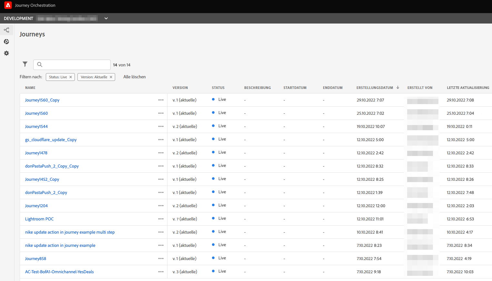
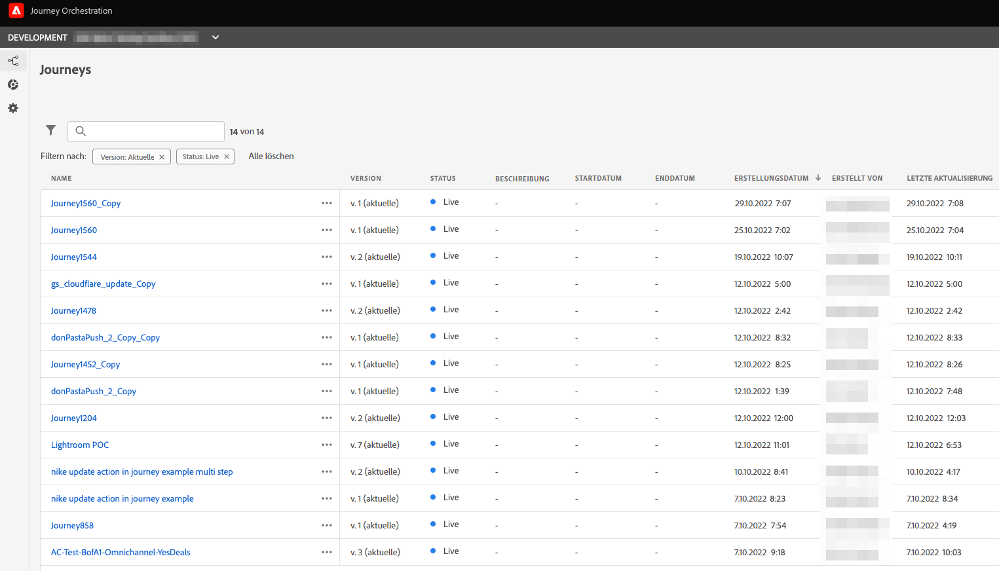
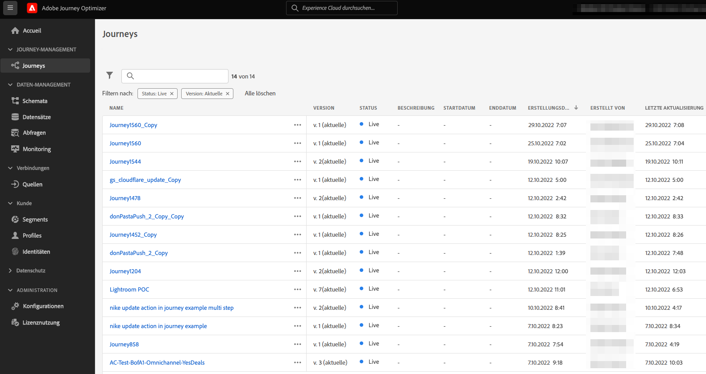
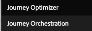

# Journey Orchestration-Umgebung auf Adobe Journey Optimizer aktualisieren{#migration-jo}

## Was ist Adobe Journey Optimizer?

Adobe Journey Optimizer ist eine agile und skalierbare Anwendung, die nativ auf der Adobe Experience Platform zur Orchestrierung und Bereitstellung personalisierter, vernetzter und zeitnaher Journey über Apps, Geräte, Bildschirme oder Kanäle hinweg entwickelt wurde. &#x200B;

## Was ist Adobe Journey Orchestration?

Journey Orchestration ist ein Dienst, der auf Adobe Experience Platform basiert und es Ihnen ermöglicht, individuelle Journey auf Grundlage des bisherigen Verhaltens und der bisherigen Präferenzen für jeden Kunden anzupassen. Journey Orchestration ist die Vorläuferanwendung für Journey Optimizer.

## Warum sollte ich nach Adobe Journey Optimizer ziehen?

**Zugriff auf eine optimierte Benutzeroberfläche** mit Experience Platform-Funktionen, die schnellen Zugriff auf Journey, Datensätze, Profile, Warnhinweise und mehr bieten. Es ist nicht mehr erforderlich, zwischen Adobe Experience Platform und Journey Orchestration hin- und herzuwechseln, um auf Schemas oder Datensätze zuzugreifen. Alles ist direkt in Adobe Journey Optimizer verfügbar. Weiterführende Informationen dazu finden Sie auf dieser [Seite](https://experienceleague.adobe.com/docs/journey-optimizer/using/get-started/user-interface.html).

<table>
<tr>
<th>Vorher</th>
<th>Nachher</th>
</tr>
<tr>
<td>
Zugriff auf Journey, Segmente und Admin-Bereich (Datenquellen, Ereignisse und Aktionen) in Journey Orchestration. Auf Segmente und Datensätze kann in Adobe Experience Platform zugegriffen werden. 
</td>
<td>
Zugriff auf Journey, Segmente, Admin, Segmente und Datensätze, <strong>innerhalb von Adobe Journey Optimizer</strong>. <strong>Zusätzliche Adobe Experience Platform-Funktionen</strong> sind hier auch zugänglich.
</td>
</tr>
</table>

**Neue Reporting-Benutzeroberfläche** und Zugriff auf neue Berichtsfunktionen:

<table>
<tr>
<th>Vorher</th>
<th>Nachher</th>
</tr>
<tr>
<td></td>
<td>
<strong>Globale Ansicht</strong> ermöglicht es Ihnen, die Wirkung Ihrer Journey und Sendungen über einen bestimmten Zeitraum zu messen. Für weitere Echtzeit-Metriken können Sie auf die <strong>Live-Ansicht</strong>. Für jeden in Ihren Journey verwendeten Versandkanal (E-Mail, SMS, Push) wird eine <strong>dedizierter Abschnitt</strong> ist im Bericht verfügbar, um Metriken anzuzeigen. Dies gilt nur, wenn Sie vordefinierte <strong>Adobe Journey Optimizer-Messaging-Funktionen</strong>. Weitere Informationen erhalten Sie von Ihrem Account-Team.
</td>
</tr>
</table>

Jede Weiterentwicklung zur Verbesserung des Berichtserlebnisses oder zur Anreicherung nach neuen Funktionsveröffentlichungen ist nur auf der neuen Berichtsoberfläche verfügbar. Beginnen Sie mit der Verwendung, um ein vollständiges Adobe Journey Optimizer-Erlebnis zu erhalten.

Nutzen Sie die Vorteile anderer aktueller **Adobe Journey Optimizer-Funktionen** und neue, wie die Zugriffskontrolle auf Feldebene und die Zugriffskontrolle auf Objektebene. Wenden Sie sich an Ihr Account-Team, um weitere Informationen zu erhalten.

## Wie kann ich meine Journey Orchestration-Umgebung aktualisieren?

1. Wenden Sie sich an Ihr Account-Team, um Ihre Vereinbarung mit Adobe kostenlos zu aktualisieren.

1. Warten Sie, bis unser Engineering-Team die Änderung abgeschlossen hat.

1. Aktualisieren Sie Ihre Berechtigungen mithilfe der Journey Optimizer-Produktprofile. Mehr dazu erfahren Sie auf [dieser Seite](https://experienceleague.adobe.com/docs/journey-optimizer/using/administration/ootb-product-profiles.html?lang=de).

1. Sie haben jetzt Zugriff auf Adobe Journey Optimizer!

## Häufig gestellte Fragen

## Muss ich etwas planen, um von Journey Orchestration nach Adobe Journey Optimizer zu wechseln?

Nein, es gibt keine Migration, keine Arbeit von Ihnen, keine Ausfallzeiten und keine zusätzlichen Investitionen. Sie müssen nur Ihre Vereinbarung mit Adobe aktualisieren, und wir machen den Rest. Wenden Sie sich an Ihren Kundenbetreuer, um Anweisungen zur Einleitung dieses Prozesses zu erhalten.

## Verliere ich etwas nach dem Wandel?

Nein, Sie behalten alle vorhandenen Journey Orchestration- und Adobe Experience Platform-Objekte bei: Schemas, Datensätze, Journey, Ereignisse, Datenquellen, Aktionen. Nichts wird verloren gehen, alle lebenden Journey werden weiterhin ohne Unterbrechung funktionieren.

<table>
<tr>
<th>Vorher</th>
<th>Nachher</th>
</tr>
<tr>
<td></td>
<td></td>
</tr>
</table>

### Ich sehe immer noch Journey Orchestration im Anwendungsschalter, ist es normal?

Ja, es ist normal. Sie behalten den Zugriff auf Journey Orchestration einen Monat nach dem Upgrade bei. Dadurch haben Sie genug Zeit, um alle Benutzerberechtigungen zu aktualisieren und Adobe Journey Optimizer besser kennenzulernen. Nach einem Monat wird der Zugriff entfernt.

### Was passiert, wenn ich heute Journey Orchestration mit Adobe Campaign Standard verwende?

Wenn Sie zu Adobe Journey Optimizer wechseln, können Sie die Integration zwischen Journey und Adobe Campaign Standard weiterhin nutzen, indem Sie Ihre Kunden-Journey in Adobe Journey Optimizer entwerfen und Adobe Campaign Standard den Versand senden lassen.

Aufgrund der Funktionsweise des Adobe Journey Optimizer-Berichtstapels werden bei der Berichterstellung jedoch keine Journey- und Campaign Standard-Daten kombiniert. Journey-Informationen sind in Adobe Journey Optimizer-Berichten und Versandinformationen in Adobe Campaign Standard verfügbar. Es kann eine Experience Platform vorgenommen werden, um Adobe Campaign Standard-Daten in Adobe Experience Platform zurückzubringen und sie dem Customer Journey Analytics ([Weitere Informationen](https://business.adobe.com/products/experience-platform/customer-journey-analytics.html)) oder anderen Drittanbieter-Reporting-Tools wie Tableau oder PowerBI.

Adobe Journey Optimizer-Berichte eignen sich am besten für die Verwendung der vordefinierten Messaging-Funktionen von Adobe Journey Optimizer (verfügbar in dedizierten Adobe Journey Optimizer-Angeboten). Weiterführende Informationen zur Erstellung von Nachrichten auf der Journey-Arbeitsfläche finden Sie in diesem Abschnitt [page](https://experienceleague.adobe.com/docs/journey-optimizer/using/messages/messages-in-journeys.html).

Weitere Informationen erhalten Sie von Ihrem Account-Team.