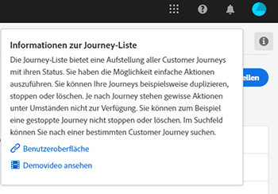

# Versionshinweise {#release-notes}

Auf dieser Seite werden alle neuen Funktionen und Verbesserungen bei Journey Orchestration aufgelistet.
Sie können auch den Abschnitt [Aktualisierungen der Dokumentation](../release-notes/documentation-updates.md) lesen.

## November 2020 Release {#november-release}

<table>
<thead>
<tr>
<th><strong>Springen zwischen Journeys</strong> </th>
</tr>
</thead>
<tbody>
<tr>
<td>

Wir haben eine neue Action-Aktivität hinzugefügt, die es Ihnen ermöglicht, Individuen von einer Reise zur nächsten zu bewegen. Die Aktivität "Sprung"ermöglicht Ihnen Folgendes:

<ul>
<li>Vereinfachung der Gestaltung sehr komplexer Journeys durch Aufteilung in mehrere Journeys </li>
<li>Erstellung von Journeys anhand allgemeiner und wiederverwendbarer Journey-Muster</li>
</ul>

Weitere Informationen finden Sie im <a href="../building-journeys/jump.md">entsprechenden Handbuch</a>.

</td>
</tr>
</tbody>
</table>

<table>
<thead>
<tr>
<th><strong>Verwenden der Eigenschaften von "Journey"im Ausdruck-Editor</strong> </th>
</tr>
</thead>
<tbody>
<tr>
<td>

Im erweiterten Ausdruck-Editor haben wir eine neue Kategorie zur Liste von Feldern und Funktionen hinzugefügt. Dies sind die Informationen, die das System von Live-Reisen abruft, wie z. B. die Reise-ID oder die spezifischen aufgetretenen Fehler. Dadurch erhalten Sie mehr Möglichkeiten beim Aufbau Ihrer Reisen. Sie können beispielsweise Systeme von Drittanbietern warnen, wenn in einer Bedingung oder Aktion Fehler auftreten.

Beachten Sie, dass diese Funktion in den nächsten Tagen verfügbar sein wird.

Weitere Informationen finden Sie im <a href="../expression/journey-properties.md">entsprechenden Handbuch</a>.

</td>
</tr>
</tbody>
</table>

<table>
<thead>
<tr>
<th><strong>Regelbasierte Ereignisse (Beta)</strong> </th>
</tr>
</thead>
<tbody>
<tr>
<td>

Wir haben eine neue Methode hinzugefügt, um Ihre Ereignis einfacher einzurichten. Diese Funktion, die über das Alpha-Programm bei einer begrenzten Anzahl von Kunden getestet wurde, ist jetzt in Beta für alle Kunden verfügbar. Für diese neue Methode ist keine eventID erforderlich. Es wird bewertet, ob das Ereignis gemäß einer Bedingung ausgelöst werden soll. Sie können weiterhin die vorhandene Methode verwenden, die jetzt als "systemgeneriert"bezeichnet wird.

Beachten Sie, dass diese Funktion in den nächsten Tagen verfügbar sein wird.

Weitere Informationen finden Sie im <a href="../expression/journey-properties.md">entsprechenden Handbuch</a>.

</td>
</tr>
</tbody>
</table>

### Sonstige Verbesserungen{#october-november}

Einschränkungen wurden hinzugefügt, wenn neue Versionen einer Reise erstellt werden. Diese Einschränkungen vermeiden zu drastische Änderungen auf der Reise, um eine gewisse Konsistenz zwischen den Versionen zu erhalten. [Mehr dazu](../about/limitations.md#journey-versions-limitations)

Die Aktivität **Segmentqualifikation** kann nicht mehr für eine Reise verwendet werden, die Aktivitäten für Campaign Standard-Nachrichten enthält. Diese Einschränkung schützt die Integrität von Adobe Campaign Standard-Instanzen. Die Nutzung der Segmentqualifikation kann sogar zu täglichen Spitzen beim Senden von Nachrichten führen, die die Transaktionsnachrichten des Campaign Standards überladen würden. [Mehr dazu](../about/limitations.md#segment-qualification)

## Version Oktober 2020 {#october-release}

<table>
<thead>
<tr>
<th><strong>Zeitüberschreitung für Ereignisse</strong> </th>
</tr>
</thead>
<tbody>
<tr>
<td>

Sie können jetzt eine Zeitüberschreitung für ein Ereignis konfigurieren, damit eine Journey ein Ereignis nur während einer bestimmten Zeit überwacht. Dazu müssen Sie nicht mehr parallel zum Ereignispfad eine Warteaktivität hinzufügen.

Weitere Informationen finden Sie im <a href="../building-journeys/event-activities.md#listening-to-events-during-a-specific-time">entsprechenden Handbuch</a>.

</td>
</tr>
</tbody>
</table>

### Sonstige Verbesserungen{#october-other}

* Wenn Sie eine neue Version einer Journey veröffentlichen, endet die vorherige Version automatisch und wechselt in den Status „Geschlossen“. [Mehr dazu](../building-journeys/journey-versions.md)

## Version September 2020 {#september-release}

### Allgemein verfügbare Updates{#september-ga-update}

<table>
<thead>
<tr>
<th><strong>Verbesserungen bei der Bedingungsaktivität</strong> </th>
</tr>
</thead>
<tbody>
<tr>
<td>

Wenn Sie Bedingungen zu Ihrer Journey hinzufügen, können Sie jetzt einen Titel definieren. Wenn Sie mehrere Bedingungen in einer Journey verwenden, können Sie diese so leichter identifizieren.

Weitere Informationen finden Sie im <a href="../building-journeys/condition-activity.md#about_condition">entsprechenden Handbuch</a>.

</td>
</tr>
</tbody>
</table>

### Alpha-Updates{#september-alpha-update}

Informationen zum Geltungsbereich des Alpha-Programms finden Sie in diesem [Abschnitt](../alpha/alpha-overview.md).

<table>
<thead>
<tr>
<th><strong>Verbesserungen bei der Segment-Lese-Aktivität</strong> </th>
</tr>
</thead>
<tbody>
<tr>
<td>

Folgende Verbesserungen wurden an der Aktivität <strong>Segment lesen</strong> vorgenommen:

<ul>
<li>
Segmentbasierte Journeys zeigen nun über der Arbeitsfläche eine Erinnerung an den Zeitplantyp der Journey an. Sie können auf diese Erinnerung klicken, um das Menü für die Konfiguration des Zeitplans aufzurufen.

</li>
<li>
Die Granularität der Testmodusprotokolle wurde verbessert, um den Fortschrittsstatus des Segmentexports anzuzeigen.

</li>
</ul>

Weitere Informationen zur Aktivität <strong>Segment lesen</strong> finden Sie in der <a href="../alpha/alpha-segment-trigger.md">ausführlichen Dokumentation</a>.

</td>
</tr>
</tbody>
</table>

## Version August 2020 {#august-release}

### Allgemein verfügbare Updates{#august-ga-update}

Die Payload von Segmentqualifkationsereignissen enthält jetzt die folgenden in Bedingungen und Aktionen verwendbaren Kontextinformationen: Verhalten (Eintreten, Verlassen), Zeitstempel der Qualifikation und Segmentkennung – [mehr dazu](../building-journeys/segment-qualification-events.md)

### Alpha-Updates{#august-alpha-update}

Informationen zum Geltungsbereich des Alpha-Programms finden Sie in diesem [Abschnitt](../alpha/alpha-overview.md).

<table>
<thead>
<tr>
<th><strong>Segmentauslöser-Aktivität</strong> </th>
</tr>
</thead>
<tbody>
<tr>
<td>

Folgende Verbesserungen wurden an der Segmentauslöser-Aktivität vorgenommen:

<ul>
<li>
Der Name der Aktivität wurde in „Segment lesen“ geändert. 

</li>
<li>
Die Konfiguration der Journey-Planung wurde aus den Eigenschaften der Aktivität entfernt. Sie ist jetzt direkt über die Eigenschaften der Journey in einem eigenen Bereich aufrufbar, der angezeigt wird, wenn eine „Segment lesen“-Aktivität auf der Arbeitsfläche abgelegt wurde. 

</li>
<li>
Sie können die Journey jetzt auf einem unitären Profil testen und den Fortschritt der Journey über den visuellen Verlauf verfolgen.

</li>
</ul>

Weitere Informationen finden Sie im <a href="../alpha/alpha-segment-trigger.md">entsprechenden Handbuch</a>.

</td>
</tr>
</tbody>
</table>

<table>
<thead>
<tr>
<th><strong>Regelbasierte Ereignisse</strong> </th>
</tr>
</thead>
<tbody>
<tr>
<td>

Die folgenden Verbesserungen wurden an regelbasierten Ereignissen vorgenommen:

<ul>
<li>
Sie können jetzt alle verhaltensbezogenen Ereignisdaten, die Sie in Adobe Analytics bereits erfassen und an Platform streamen, zum Auslösen von Journeys und zur Automatisierung von Erlebnissen für Ihre Kunden nutzen – <a href="../event/about-analytics.md">mehr dazu</a>

</li>
<li>
Beim Auslösen eines regelbasierten Ereignisses im Testmodus können Sie jetzt die Ereignis-ID-Bedingung direkt anzeigen. Außerdem ist jetzt neben jedem Feld, das Teil der Regelauswertung ist, eine QuickInfo verfügbar – <a href="../building-journeys/testing-the-journey.md#test-rule-based">mehr dazu</a>

</li>
<li>
Der Bildschirm zur Definition regelbasierter Ereignisse wurde zur Optimierung der Benutzerumgebung neu organisiert – <a href="../event/about-creating.md">mehr dazu</a>

</li>
</ul>
</td>
</tr>
</tbody>
</table>

## Alpha-Version – Juli 2020 {#alpha-release---july-2020}

Das Alpha-Programm bietet Funktionen, die derzeit von einer begrenzten Anzahl von Kunden getestet werden. Dies ermöglicht es uns, unser Produkt basierend auf dem erhaltenen Feedback zu verbessern. Diese Funktionen stehen nicht allen Kunden von Journey Orchestration zur Verfügung.

Diese Funktionen werden in einem eigenen [Abschnitt](../alpha/alpha-overview.md) erläutert.

<table>
<thead>
<tr>
<th><strong>Verbesserte Benutzeroberfläche</strong> </th>
</tr>
</thead>
<tbody>
<tr>
<td>

Die Navigation innerhalb der Menüs von Journey Orchestration wurde dahingehend verbessert, dass sie an die Benutzeroberfläche von Adobe Experience Platform angeglichen wurde:

<ul>
<li>
Die Menüs wurden von der oberen zur linken Seite der Benutzeroberfläche verschoben. 

</li>
<li>
Gruppierung der Admin-Funktionen in einem einzigen Dashboard.

</li>
</ul>

Weitere Informationen finden Sie im <a href="../alpha/alpha-interface.md">entsprechenden Handbuch</a>.

</td>
</tr>
</tbody>
</table>

<table>
<thead>
<tr>
<th><strong>Segmentauslöser-Aktivität</strong> </th>
</tr>
</thead>
<tbody>
<tr>
<td>

Mit der Segmentauslöser-Aktivität können Sie alle Kontakte, die zu einem Adobe Experience Platform-Segment gehören, in eine Journey eintreten lassen. Der Eintritt in eine Journey kann entweder einmalig oder regelmäßig erfolgen. <a href="../alpha/alpha-segment-trigger.md">mehr dazu</a>

</td>
</tr>
</tbody>
</table>

<table>
<thead>
<tr>
<th><strong>Regelbasierte Ereignisse</strong> </th>
</tr>
</thead>
<tbody>
<tr>
<td>

Die Einrichtung von Erlebnisereignissen wurde vereinfacht. Bei der neuen Methode muss keine eventID verwendet werden. Wenn Sie Ihr Ereignis in Journey Orchestration einrichten, können Sie jetzt ein regelbasiertes Ereignis definieren. <a href="../event/about-events.md">mehr dazu</a>

</td>
</tr>
</tbody>
</table>

## Version 2. Quartal - Juni 2020 {#q2-release---june-2020}

<table>
<thead>
<tr>
<th><strong>Verbesserungen bei der Adobe Experience Platform-Integration</strong> </th>
</tr>
</thead>
<tbody>
<tr>
<td>

An der Adobe Experience Platform-Integration wurden folgende Verbesserungen vorgenommen:

<ul>
<li>
Eine neue Aktivität ermöglicht das Überwachen von Eintritten/Austritten in Adobe Experience Platform-Segmenten, um Personen dazu zu bringen, in eine Journey einzutreten oder in einer Journey fortzufahren. <a href="../building-journeys/segment-qualification-events.md">Mehr dazu</a>

</li>
<li>
Adobe Experience Platform-Segmente können jetzt erstellt und bearbeitet werden, ohne dass Sie die Benutzeroberfläche von Journey Orchestration verlassen müssen. Dafür sorgt ein neuer <strong>Segmente</strong>-Tab. <a href="../segment/about-segments.md">Mehr dazu</a>

</li>
<li>
Im einfachen Ausdruckseditor werden Adobe Experience Platform-Segmente jetzt direkt in der Navigationsstruktur aufgeführt, um eine einfache Einrichtung von Bedingungen wie „Gehört diese Person zu Segment A?“ zu ermöglichen. <a href="../segment/using-a-segment.md">Mehr dazu</a>

</li>
<li>
Journey Orchestration leitet nun die bei den Journeys ausgeführten Schritte automatisch an Adobe Experience Platform weiter. Dazu gehören potenziell auch Fehler. Diese Informationen können für die Berichterstellung und Fehlerbehebung verwendet werden, indem Abfragen zu den Journey-Schrittereignissen für eine bestimmte Journey oder für alle Journeys ausgeführt werden. <a href="../building-journeys/sharing-overview.md">mehr dazu</a>

</li>
<li>
Journey Orchestration kann jetzt mit der Adobe Experience Platform-Sandbox für Produktion und Nicht-Produktion verbunden werden. Beachten Sie, dass Sandboxes eine Beta-Funktion sind. <a href="../about/access-management.md#sandboxes">mehr dazu</a>

</li>
</ul>
</td>
</tr>
</tbody>
</table>

<table>
<thead>
<tr>
<th><strong>Verbesserungen beim Journey-Designer und Testmodus</strong> </th>
</tr>
</thead>
<tbody>
<tr>
<td>

Am Journey-Designer und Testmodus wurden folgende Verbesserungen vorgenommen:

<ul>
<li>
Sie können jetzt Aktivitäten aus einer Journey kopieren und in eine andere einfügen, indem Sie eine oder N Journey-Aktivitäten auswählen. <a href="../building-journeys/using-the-journey-designer.md#copy-paste">mehr dazu</a>

</li>
<li>
Nach Auslösung eines Ereignisses, damit ein Testprofil in eine Journey eintritt, können Sie nun anhand eines farbigen Verlaufs den Fortschritt der Journey anzeigen. Bei Fehlern in der Journey werden auch Fehlerdetails angezeigt. <a href="../building-journeys/testing-the-journey.md#firing_events">mehr dazu</a>

</li>
<li>Der Journey-Status <strong>Beendet</strong> wurde in <strong>Geschlossen (kein Eintritt)</strong>umbenannt, um besser zu kennzeichnen, was dieser Status bedeutet.</li>
</ul>
</td>
</tr>
</tbody>
</table>

**Sonstige Verbesserungen**

Um ein Senden zu vieler API-Aufrufe an Drittanbietersysteme zu vermeiden, führen wir eine neue öffentliche API für die Einrichtung von Begrenzungsregeln ein. Mit Begrenzungsregeln können Sie eine maximale Anzahl von Aufrufen an einen API-Endpunkt pro Millisekunde festlegen. [mehr dazu](../api/capping.md)

Die Zugriffskontrolle ermöglicht nun eine größere Granularität bei der Verwaltung des Benutzerzugriffs. Tatsächliche Verfügbarkeit: 30. Juni 2020. [mehr dazu](../about/access-management.md#create-product-profile)

Journey Orchestration ist jetzt im Raum APAC verfügbar (australisches Rechenzentrum). Tatsächliche Verfügbarkeit: 30. Juni 2020

Die Benutzeroberfläche von Journey Orchestration ist auf Japanisch verfügbar.

## Version 1. Quartal – März 2020 {#q1-release---march-2020}

<table>
<thead>
<tr>
<th><strong>Verbesserungen am Testmodus</strong> </th>
</tr>
</thead>
<tbody>
<tr>
<td>

Die folgenden Verbesserungen wurden am Testmodus vorgenommen:

<ul>
<li>Wenn in einer Journey mehrere Ereignisse verwendet werden, können diese jetzt einzeln ausgelöst werden, indem Sie sie im Testmodus im Bildschirm <strong>Ereigniskonfiguration</strong> aus einer Dropdown-Liste auswählen. <a href="../building-journeys/testing-the-journey.md#firing_events">Mehr dazu</a>
</li>
<li>
Wenn in einer Journey eine oder mehrere <strong>Warteaktivitäten</strong> verwendet werden, können Sie jetzt festlegen, wie lange diese Aktivitäten im Testmodus dauern sollen. Die standardmäßige Dauer beträgt 10 Sekunden. Sie können diese mithilfe des Parameters <strong>Wartezeit im Test</strong> unten links ändern. <a href="../building-journeys/testing-the-journey.md">Mehr dazu</a>

</li>
<li>In den <strong>Testprotokollen</strong> werden bei einem Fehler beim Aufrufen eines Drittanbietersystems (Datenquelle oder Aktion) der Fehlercode und die Fehlerantwort angezeigt. <a href="../building-journeys/testing-the-journey.md#viewing_logs">Mehr dazu</a>
</li>
</ul>
</td>
</tr>
</tbody>
</table>

<table>
<thead>
<tr>
<th><strong>Zentrales Zeitzonen-Management</strong> </th>
</tr>
</thead>
<tbody>
<tr> 
<td>

Das Zeitzonen-Management ist jetzt im Eigenschaften-Bereich der Journey gebündelt. In den Eigenschaften der Journey wurden zwei Parameter hinzugefügt:

<ul>
<li>In der Dropdown-Liste <strong>Zeitzone</strong> können Sie eine bestimmte Zeitzone auswählen. Standardmäßig wird die Zeitzone des Browsers verwendet. </li>
<li>Sofern verfügbar, können Sie mit dem Kontrollkästchen <strong>Zeitzone des Profils</strong> die Zeitzone des Adobe Experience Platform-Profils der Person verwenden, die in die Journey eintritt. Andernfalls wird die in der Dropdown-Liste definierte Zeitzone verwendet. Diese Funktion ist nicht mit Journeys kompatibel, die Ereignisse ohne Namespace verwenden.</li>
</ul>

Weitere Informationen finden Sie in den Abschnitten <a href="../building-journeys/changing-properties.md#timezone">Ändern von Eigenschaften</a> und <a href="../building-journeys/timezone-management.md">Zeitzonen-Management</a>.

</td>
</tr>
</tbody>
</table>

<table>
<thead>
<tr>
<th><strong>Verbesserungen am Journey-Designer</strong> </th>
</tr>
</thead>
<tbody>
<tr> 
<td>

Die <strong>Palette</strong> „Journey“ auf der linken Seite im Journey-Designer wurde erweitert:

<ul>
<li>Mit einem neuen Symbol neben der <strong>Suchleiste</strong> können Sie nicht verfügbare Elemente in der Palette ein- oder ausblenden (z. B. Ereignisse, die einen anderen Namespace als den in Ihrer Journey verwenden). Standardmäßig werden nicht verfügbare Elemente ausgeblendet.</li>
<li>Wenn Sie das Feld <strong>Suchen</strong> verwenden, wird jetzt die Anzahl der Ergebnisse für jede Aktivitätskategorie der Arbeitsfläche angezeigt.</li>
<li>Die Navigation zwischen den verschiedenen Aktivitätskategorien wurde verbessert.</li>
</ul>

Im Journey-Designer können Sie jetzt feststellen, ob Sie auf die aktuelle Version der Journey zugreifen. Diese Information wird neben der Versionsnummer angezeigt.

Wenn zwei Aktivitäten auf der <strong>Arbeitsfläche</strong> einer Journey getrennt werden, wird jetzt eine Warnmeldung angezeigt.

Weitere Informationen finden Sie im <a href="../building-journeys/using-the-journey-designer.md">entsprechenden Handbuch</a>.

</td>
</tr>
</tbody>
</table>

<table>
<thead>
<tr>
<th><strong>Kontexthilfe</strong> </th>
</tr>
</thead>
<tbody>
<tr>
<td>

In den verschiedenen Listenbildschirmen (Journeys, Ereignisse, Aktionen und Datenquellen) von Journey Orchestration ist jetzt eine Kontexthilfe verfügbar. Auf diese Weise können Sie eine kurze Beschreibung der aktuellen Funktion anzeigen und auf zugehörige Artikel und Videos zugreifen.

Durch Anklicken des -Symbols oben rechts im Bildschirm können Sie die Kontexthilfe anzeigen. 

</td>
</tr>
</tbody>
</table>

**Sonstige Verbesserungen**

* Zusätzlich zu den USA ist Journey Orchestration jetzt in der Region **EMEA** verfügbar. Die Anwendung und die Dokumentation sind in Französisch und Deutsch verfügbar.

* Experience League ist jetzt in das Produkt integriert. Dies vereinfacht den Zugriff auf verwandte Inhalte und hilft Ihnen, Experience Cloud optimal zu nutzen. Unten im Tab „Hilfe“ können Sie direkt auf die Dokumentation für Journey Orchestration zugreifen. Sie können auch auf „Hilfe > Feedback“ klicken, um Adobe Probleme oder Anregungen mitzuteilen.

* Der Tastaturbefehl **C**, mit dem Sie ein neues Element erstellen können, ist jetzt in allen Listenbildschirmen verfügbar: Journeys, Datenquellen, Aktionen und Ereignisse. [Mehr dazu](../about/user-interface.md#section_ksq_zr1_ffb)

* Sie können jetzt gestoppte Journeys **löschen**. Berichte für diese gelöschten Journeys werden nicht mehr verfügbar sein.

* Beim Durchsuchen von **Adobe Experience Platform-Feldern** (XDM-Format) wird nun neben dem Feldnamen der Anzeigename angezeigt. Diese Informationen werden aus der Schemadefinition im Experience-Datenmodell abgerufen. Wenn verfügbar, wird der alternative Anzeigename angezeigt. Mit dieser benutzerfreundlichen Beschreibung, die insbesondere bei eVar-Feldern nützlich ist, können Sie Ihre Felder leichter wiedererkennen. [Mehr dazu](../about/user-interface.md#friendly-names-display)

## GA-Version - Dezember 2019 {#ga-release---december-2019}

Journey Orchestration ist jetzt allgemein verfügbar.

Erstellen Sie Anwendungsfälle für Echtzeit-Orchestrierung mithilfe von Kontextdaten, die in Ereignissen oder Datenquellen gespeichert sind.

Journey Orchestration erlaubt eine Echtzeit-Orchestrierung auf Basis von Kontextdaten aus Ereignissen, Informationen aus Adobe Experience Platform oder Daten aus API-Diensten von Drittanbietern. Die Anwendung bestimmt in mehrstufigen Flüssen, die Journeys genannt werden, je nach Profil und Verhalten des Benutzers die nächsten für den Kunden optimalen Aktionen. Dies umfasst sowohl den besten Zeitpunkt als auch die Art der Aktion, z. B. das Senden einer Push-Benachrichtigung über die Transaktionsnachrichtenfunktion von Adobe Campaign Standard (Adobe Campaign Standard erforderlich) oder das Benachrichtigen eines Drittanbietersystems. Diese Entscheidungen werden auf Grundlage von Regeln und Sensei-Werten getroffen.

[Weitere Informationen](../action/working-with-adobe-campaign.md) zu Journey Orchestration.

Zusätzliche Ressourcen:

* [Tutorials](https://docs.adobe.com/content/help/de-DE/journey-orchestration-learn/tutorials/understanding-journey-orchestration.html)
* [Community](https://www.adobe.com/go/journeyorchestrationcommunity_de)
