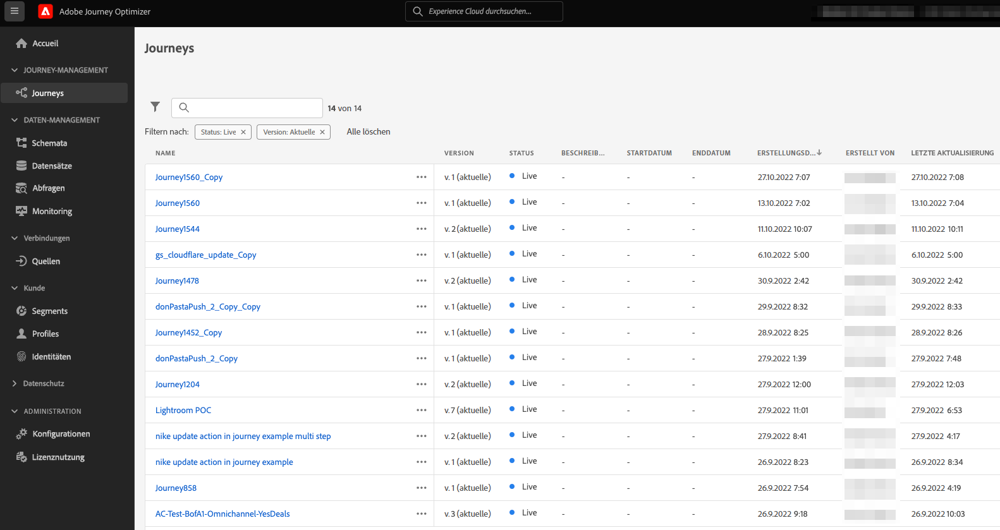

# Aktualisieren Ihrer Journey Orchestration-Umgebung auf Adobe Journey Optimizer{#ugrade-ajo}

## Was ist Adobe Journey Optimizer?

Adobe Journey Optimizer ist ein agiles und skalierbares Programm, das nativ auf Adobe Experience Platform zur Orchestrierung und Bereitstellung personalisierter, vernetzter und zeitnaher Customer Journeys über Apps, Geräte, Bildschirme oder Kanäle hinweg entwickelt wurde. 

## Was ist Journey Orchestration?

Journey Orchestration ist ein Service, der auf Adobe Experience Platform basiert und es Ihnen ermöglicht, individuelle Journeys für jeden Kunden auf Grundlage des bisherigen Verhaltens und der bisherigen Präferenzen zu schaffen. Journey Orchestration ist das Vorgängerprogramm von Journey Optimizer.

## Warum sollte ich auf Adobe Journey Optimizer umsteigen?

**Zugriff auf eine optimierte Benutzeroberfläche** mit Experience Platform-Funktionen, die schnellen Zugriff auf Journeys, Datensätze, Profile, Warnhinweise und vieles mehr bieten. Keine Notwendigkeit, zwischen Adobe Experience Platform und Journey Orchestration hin- und herzuwechseln, um auf Schemata oder Datensätze zuzugreifen – alles ist direkt über Adobe Journey Optimizer verfügbar. Weiterführende Informationen dazu finden Sie auf [dieser Seite](https://experienceleague.adobe.com/docs/journey-optimizer/using/get-started/user-interface.html?lang=de).

<table>
<tr>
<th>Vorher</th>
<th>Nachher</th>
</tr>
<tr>
<td>
Zugriff auf Journeys, Segmente und den Admin-Bereich (Datenquellen, Ereignisse und Aktionen) in Journey Orchestration. Auf Segmente und Datensätze kann in Adobe Experience Platform zugegriffen werden. 
</td>
<td>
Zugriff auf Journeys, Segmente, den Admin-Bereich und Datensätze, und zwar alles <strong>innerhalb von Adobe Journey Optimizer</strong>. <strong>Zusätzliche Adobe Experience Platform-Funktionen</strong> sind hier ebenfalls verfügbar.
</td>
</tr>
</table>

**Neue Reporting-Benutzeroberfläche** und Zugriff auf neue Berichtsfunktionen:

<table>
<tr>
<th>Vorher</th>
<th>Nachher</th>
</tr>
<tr>
<td></td>
<td>
Mit der <strong>globalen Ansicht</strong> können Sie die Wirkung Ihrer Journeys und Sendungen über einen bestimmten Zeitraum messen. Für weitere Echtzeit-Metriken können Sie auf die <strong>Live-Ansicht</strong> zugreifen. Für jeden in Ihren Journey verwendeten Versandkanal (E-Mail, SMS, Push) steht im Bericht ein <strong>dedizierter Abschnitt</strong> zur Verfügung, um die Metriken anzuzeigen. Dies gilt nur, wenn Sie vordefinierte <strong>Messaging-Funktionen von Adobe Journey Optimizer</strong> verwenden. Wenden Sie sich für weitere Informationen an Ihre Kundenbetreuer.
</td>
</tr>
</table>

Nur die neue Reporting-Benutzeroberfläche bietet die Möglichkeit, Weiterentwicklungen in der Berichterstellung zu integrieren oder sie durch neu veröffentlichte Funktionen zu erweitern. Nutzen Sie diese Möglichkeit für ein noch vollständigeres Adobe Journey Optimizer-Erlebnis.

Profitieren Sie von den Vorteilen anderer aktueller **Adobe Journey Optimizer-Funktionen** und neuer Optionen wie der Zugriffskontrolle auf Feld- und Objektebene. Wenden Sie sich an Ihre Kundenbetreuer, um weitere Informationen zu erhalten.

## Wie kann ich meine Journey Orchestration-Umgebung aktualisieren?

1. Wenden Sie sich an Ihr Konto-Team, um Ihre Vereinbarung mit Adobe kostenlos zu aktualisieren.

1. Warten Sie, bis unser Engineering-Team die Änderung abgeschlossen hat.

1. Aktualisieren Sie Ihre Berechtigungen mithilfe der Journey Optimizer-Produktprofile. Mehr dazu erfahren Sie auf [dieser Seite](https://experienceleague.adobe.com/docs/journey-optimizer/using/administration/ootb-product-profiles.html?lang=de).

1. Sie haben jetzt Zugriff auf Adobe Journey Optimizer!

## Häufig gestellte Fragen

### Muss ich etwas planen, um von Journey Orchestration auf Adobe Journey Optimizer umzusteigen?

Nein, Sie müssen nicht migrieren und nichts unternehmen. Weder gibt es Ausfallzeiten, noch müssen Sie zusätzliche Investitionen tätigen. Sie müssen nur Ihre Vereinbarung mit Adobe aktualisieren, wir erledigen den Rest. Wenden Sie sich an Ihre Kundenbetreuer, um Anweisungen zur Einleitung dieses Prozesses zu erhalten.

### Geht durch den Wechsel irgendetwas verloren?

Nein, Sie behalten alle vorhandenen Journey Orchestration- und Adobe Experience Platform-Objekte: Schemata, Datensätze, Journeys, Ereignisse, Datenquellen, Aktionen. Nichts geht verloren. Alle Livejourneys werden weiterhin unterbrechungsfrei funktionieren.

<table>
<tr>
<th>Vorher</th>
<th>Nachher</th>
</tr>
<tr>
<td></td>
<td></td>
</tr>
</table>

### Ich sehe immer noch Journey Orchestration im Programmumschalter. Ist das normal?

Ja, das ist normal. Möglicherweise wird das Element „Journey Orchestration“ noch einige Tage nach dem Upgrade angezeigt. Bitte verwenden Sie die Journey Optimizer-Version.

### Was passiert, wenn ich heute Journey Orchestration mit Adobe Campaign Standard verwende?

Wenn Sie auf Adobe Journey Optimizer umsteigen, können Sie die Integration zwischen Journeys und Adobe Campaign Standard weiterhin nutzen, indem Sie Ihre Customer Journey in Adobe Journey Optimizer entwickeln und den Versand Adobe Campaign Standard überlassen.

Aufgrund der Funktionsweise des Berichtstapels in Adobe Journey Optimizer werden beim Reporting jedoch keine Journey- und Campaign Standard-Daten kombiniert. Journey-Informationen sind in Adobe Journey Optimizer-Berichten und Versandinformationen in Adobe Campaign Standard verfügbar. Experience Platform kann so konfiguriert werden, dass Adobe Campaign Standard-Daten nach Adobe Experience Platform zurückgeholt und dadurch Customer Journey Analytics ([weitere Informationen](https://business.adobe.com/products/experience-platform/customer-journey-analytics.html)) oder anderen Reporting-Tools von Drittanbietern wie Tableau oder PowerBI zur Verfügung gestellt werden können.

Adobe Journey Optimizer-Berichte eignen sich am besten für die Verwendung der vordefinierten Messaging-Funktionen von Adobe Journey Optimizer (verfügbar in dedizierten Adobe Journey Optimizer-Angeboten). Weitere Informationen zur Erstellung von Nachrichten in der Journey-Arbeitsfläche finden Sie auf [dieser Seite](https://experienceleague.adobe.com/docs/journey-optimizer/using/messages/messages-in-journeys.html?lang=de).

Wenden Sie sich für weitere Informationen an Ihre Kundenbetreuer.
