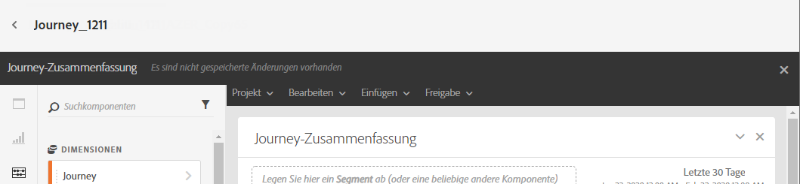
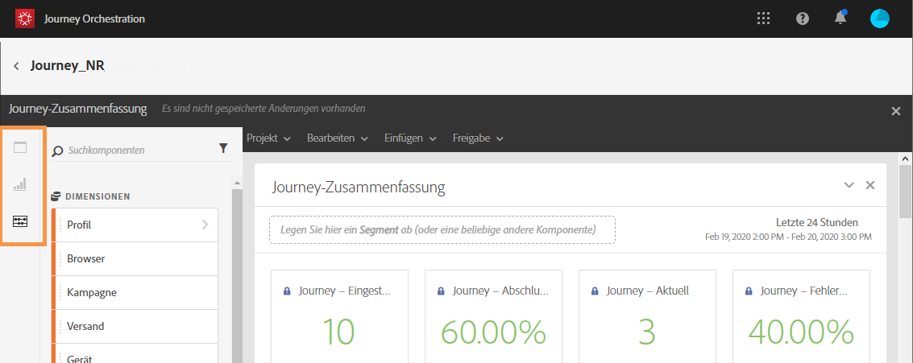
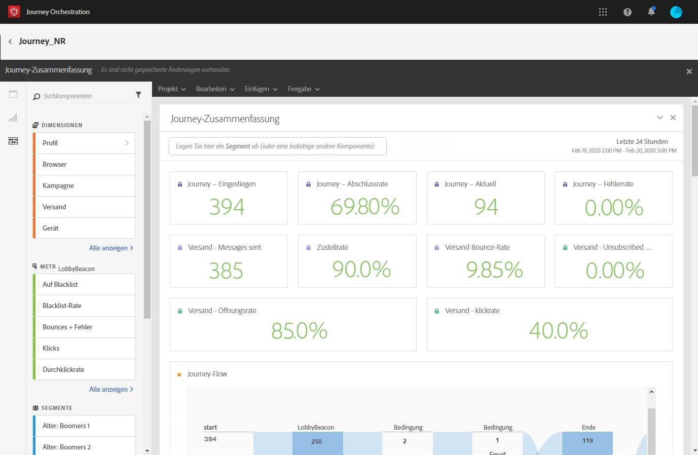
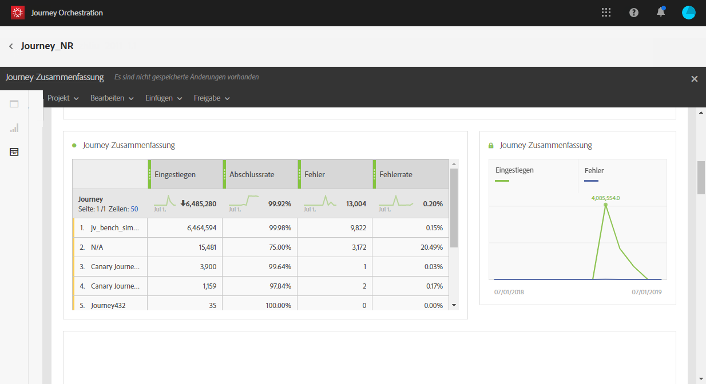
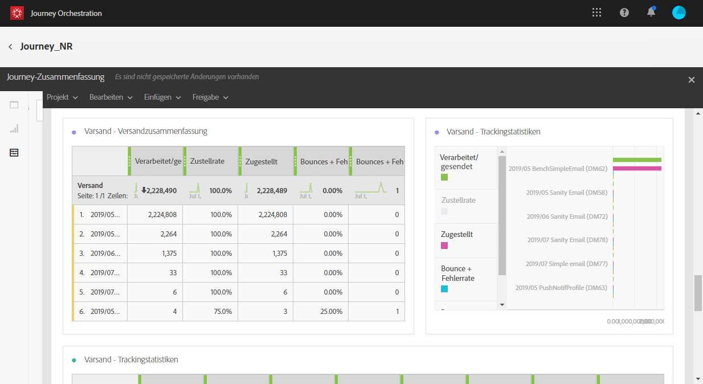

# Informationen zu Journey-Berichten {#concept_rfj_wpt_52b}

>[!NOTE]
>
>Die Versanddaten und die Komponente „Segmente“ werden nur dann ausgefüllt, wenn Sie über Adobe Campaign Standard verfügen.

In diesem Abschnitt erfahren Sie, wie Sie Berichte aufrufen und verwenden können, um die Effektivität Ihrer Journey zu messen.

## Reporting-Benutzeroberfläche {#reporting-interface}

Über die am oberen Seitenrand befindliche Symbolleiste können Sie beispielsweise einen Bericht ändern, speichern oder ausdrucken.

Im Tab **[!UICONTROL Projekt]** haben Sie folgende Möglichkeiten:

* **[!UICONTROL Öffnen]**: Öffnet einen zuvor erstellten Bericht oder eine Vorlage.
* **[!UICONTROL Sichern unter]**: Dupliziert Vorlagen, damit sie geändert werden können.
* **[!UICONTROL Projekt aktualisieren]**: Aktualisiert Ihren Bericht auf der Basis neuer Daten und Filteränderungen.
* **[!UICONTROL CSV herunterladen]**: Exportiert Ihre Berichte in eine CSV-Datei.
* **[!UICONTROL Drucken]**: Druckt den Bericht.

Im Tab **[!UICONTROL Bearbeiten]** haben Sie folgende Möglichkeiten:

* **[!UICONTROL Rückgängig]**: Bricht den zuletzt im Dashboard ausgeführten Vorgang ab.
* **[!UICONTROL Wiederholen]**: Bricht den zuletzt im Dashboard ausgeführten **[!UICONTROL Rückgängig]**-Vorgang ab.
* **[!UICONTROL Alle löschen]**: Löscht alle Bedienfelder in Ihrem Dashboard.

Im Tab **[!UICONTROL Einfügen]** können Sie Ihre Berichte anpassen, indem Sie Diagramme und Tabellen zum Dashboard hinzufügen:

* **[!UICONTROL Neues leeres Bedienfeld]**: Fügt ein neues leeres Bedienfeld zu Ihrem Dashboard hinzu.
* **[!UICONTROL Neue Freiform]**: Fügt eine neue Freiformtabelle zu Ihrem Dashboard hinzu.
* **[!UICONTROL Neue Zeile]**: Fügt einen neuen Kantengraphen zu Ihrem Dashboard hinzu.
* **[!UICONTROL Neuer Balken]**: Fügt ein neues Balkendiagramm zu Ihrem Dashboard hinzu.

In den linken Tabs können Sie nach Bedarf Berichte erstellen und Daten filtern.

Über diese Tabs haben Sie Zugriff auf folgende Elemente:

* **[!UICONTROL Bedienfelder]**: Fügt Ihrem Bericht ein leeres Bedienfeld oder eine Freiform hinzu, um Ihre Daten zu filtern. Weiterführende Informationen hierzu finden Sie im Abschnitt [Bedienfelder hinzufügen](../reporting/creating-your-journey-reports.md#adding-panels).
* **[!UICONTROL Visualisierungen]**: Legen Sie die gewünschten Visualisierungselemente ab, um Ihren Bericht grafisch aufzubereiten. Weiterführende Informationen hierzu finden Sie im Abschnitt [Visualisierungen hinzufügen](../reporting/creating-your-journey-reports.md#adding-visualizations).
* **[!UICONTROL Komponenten]**: Passen Sie Ihren Bericht mit unterschiedlichen Dimensionen, Metriken, Segmenten und Zeiträumen an. Weiterführende Informationen hierzu finden Sie im Abschnitt [Komponenten hinzufügen](../reporting/creating-your-journey-reports.md#adding-components).

## Vorlage für Journey-Zusammenfassung {#ootb-template}

Berichte sind in zwei Kategorien unterteilt: in eine vordefinierte Vorlage und in benutzerdefinierte Berichte.
Die vordefinierte Vorlage **[!UICONTROL Journey-Zusammenfassung]** bietet einen Überblick über die wichtigsten Tracking-Daten.

Für jede Tabelle werden Zusammenfassungen und Grafiken erstellt. Die Darstellung dieser Details können Sie in deren Einstellungen ändern.

Die folgenden KPIs stehen oben im Bericht zur Verfügung:

* **[!UICONTROL Journey - Eingestiegen]**: Gesamtzahl der Kontakte, die das Eintrittsereignis der Journey erreicht haben.
* **[!UICONTROL Journey - Abschlussrate]**: Gesamtzahl der Kontakte, die das Ende der Journey erreicht haben (oder der Kontakte, die keiner Bedingung entsprechen), in Bezug auf die Gesamtzahl der Kontakte, die in die Journey eingestiegen sind.
* **[!UICONTROL Journey - Aktuell]**: Gesamtzahl der Kontakte, die sich derzeit in der Journey befinden.
* **[!UICONTROL Journey - Fehlerrate]**: Gesamtzahl der Journeys, die nicht erfolgreich durchgeführt wurden, in Bezug auf die Zahl der ausgeführten Journeys .
* **[!UICONTROL Versand - Gesendete Nachrichten]**: Gesamtzahl der gesendeten Nachrichten.
* **[!UICONTROL Zustellbarkeitsrate]**: Gesamtzahl der erfolgreich zugestellten Nachrichten in Bezug auf die gesendeten Nachrichten.
* **[!UICONTROL Versand - Bounce-Rate]**: Gesamtzahl der Nachrichten, bei denen es zu einem Bounce gekommen ist, in Bezug auf die gesendeten Nachrichten .
* **[!UICONTROL Versand - Abmelderate]**: Gesamtzahl der Abmeldungen nach Empfänger in Bezug auf die zugestellten Nachrichten.
* **[!UICONTROL Versand - Öffnungsrate]**: Gesamtzahl der geöffneten Nachrichten in Bezug auf die Zahl der zugestellten Nachrichten.
* **[!UICONTROL Versand - Klickrate]**: Gesamtzahl der Klicks in einem Versand in Bezug auf die Zahl der zugestellten Nachrichten.

Mit der Visualisierung des Journey Flow können Sie den Pfad Ihrer Zielprofile durch Ihre Journey Schritt für Schritt anzeigen. Diese Option ist nur verfügbar, wenn Sie eine Journey als Ziel ausgewählt haben. Sie wird automatisch generiert und kann nicht geändert werden.

Die Tabelle **[!UICONTROL Journey-Zusammenfassung]** enthält die für Ihre Journey verfügbaren Daten, z. B.:

* **[!UICONTROL Eingestiegen]**: Gesamtzahl der Kontakte, die das Eintrittsereignis der Journey erreicht haben.
* **[!UICONTROL Abschlussrate]**: Gesamtzahl der Kontakte, die die Flusskontrolle am Ende der Journey erreicht haben, in Bezug auf die Gesamtzahl der Kontakte, die in die Journey eingestiegen sind.
* **[!UICONTROL Aktuell]**: Gesamtzahl der Kontakte, die sich derzeit in der Journey befinden.
* **[!UICONTROL Fehlgeschlagen]**: Gesamtzahl der Journeys, die nicht erfolgreich ausgeführt wurden.
* **[!UICONTROL Fehlerrate]**: Gesamtzahl der Journeys, die nicht erfolgreich ausgeführt wurden, in Bezug auf die Zahl der ausgeführten Journeys.

In der Tabelle **[!UICONTROL Top-Ereignisse]** werden die erfolgreichsten Ereignisse und in **[!UICONTROL Top-Aktionen]** die erfolgreichsten Aktionen in Ihren Journeys angezeigt.

Die Tabelle **[!UICONTROL Versand - Versandzusammenfassung]** enthält die für die Sendungen Ihrer Journey verfügbaren Daten, z. B.:

* **[!UICONTROL Verarbeitet/gesendet]**: Gesamtzahl der gesendeten Nachrichten.
* **[!UICONTROL Zustellrate]**: Gesamtzahl der erfolgreich zugestellten Nachrichten in Bezug auf die gesendeten Nachrichten.
* **[!UICONTROL Zugestellt]**: Zahl der erfolgreich gesendeten Nachrichten in Bezug auf die Gesamtzahl der gesendeten Nachrichten.
* **[!UICONTROL Bounce + Fehlerrate]**: Gesamtzahl der Nachrichten, bei denen es zu einem Bounce gekommen ist, in Bezug auf die gesendeten Nachrichten.
* **[!UICONTROL Bounces + Fehler]**: Gesamtzahl der über alle Sendungen hinweg kumulierten Fehler und der automatischen Bounce-Verarbeitung in Bezug auf die Gesamtzahl der gesendeten Nachrichten.

Die Tabelle **[!UICONTROL Versand - Tracking-Zusammenfassung]** enthält die Daten, die zur Verfolgung des Erfolgs bei den Sendungen Ihrer Journey verfügbar sind, z. B.:

* **[!UICONTROL Öffnungsrate]**: Prozentsatz der geöffneten Nachrichten.
* **[!UICONTROL Öffnungen]**: Zahl der Öffnungen einer Nachricht in einem Versand.
* **[!UICONTROL Klickrate]**: Gesamtzahl der Klicks in einem Versand in Bezug auf die Zahl der zugestellten Nachrichten.
* **[!UICONTROL Klicks]**: Zahl der Klicks auf einen Inhalt in einem Versand.
* **[!UICONTROL Abmelderate]**: Prozentsatz der Abmeldungen nach Empfänger in Bezug auf die zugestellten Nachrichten.
* **[!UICONTROL Abmeldungen]**: Gesamtzahl der Abmeldungen nach Empfänger in Bezug auf die zugestellten Nachrichten.
