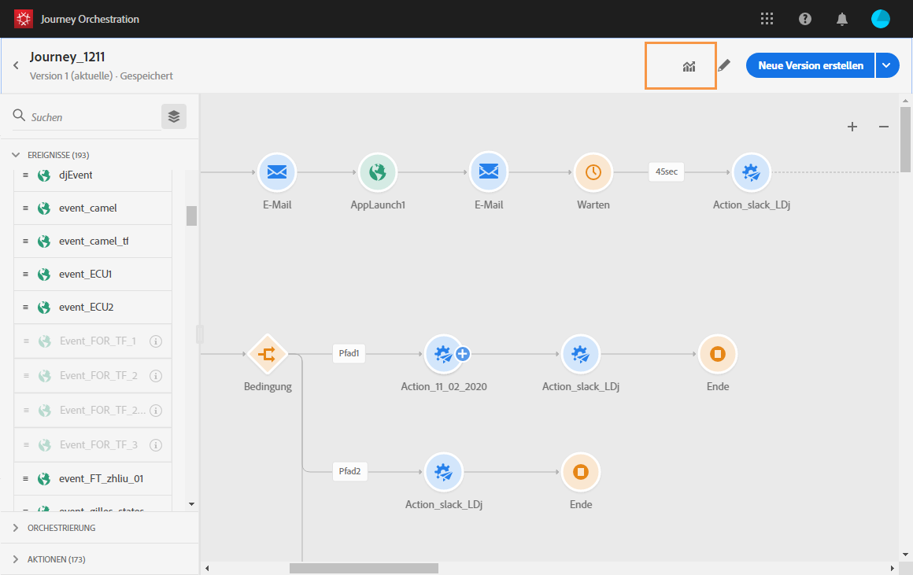

# Erstellen von Journey-Berichten {#concept_rfj_wpt_52b}

## Aufrufen und Erstellen von Berichten {#accessing-reports}

>[!NOTE]
>
>Nach dem Löschen einer Journey stehen alle zugehörigen Berichte nicht mehr zur Verfügung.

In diesem Abschnitt erfahren Sie, wie Sie vordefinierte Berichte erstellen oder verwenden können. Kombinieren Sie Bedienfelder, Komponenten und Visualisierungen, um den Erfolg Ihrer Journeys besser verfolgen zu können.

So greifen Sie auf die Berichte zu Ihren Journeys zu und beginnen damit, den Erfolg Ihrer Lieferungen zu verfolgen:

1. Klicken Sie oben im Menü auf den Tab **[!UICONTROL Startseite]**.

1. Wählen Sie die Journey aus, für die Sie einen Bericht erstellen möchten.

   Beachten Sie, dass Sie alternativ auf Ihre Berichte zugreifen können, indem Sie auf **Bericht** klicken, während Sie in der Liste der Journeys mit dem Mauszeiger über eine Journey fahren.

   

1. Klicken Sie oben rechts im Bildschirm auf das Symbol **[!UICONTROL Bericht]**.

   

1. Der vordefinierte Bericht **[!UICONTROL Journey-Zusammenfassung]** wird auf dem Bildschirm angezeigt. Klicken Sie auf die Schaltfläche **[!UICONTROL Schließen]**, um auf benutzerdefinierte Berichte zuzugreifen.

   

1. Klicken Sie auf **[!UICONTROL Neues Projekt erstellen]**, um Ihren Bericht von Grund auf neu zu erstellen.

   

1. Legen Sie vom Tab **[!UICONTROL Bedienfelder]** aus so viele Bedienfelder oder Freiformtabellen wie nötig per Drag-and-Drop ab. Weiterführende Informationen hierzu finden Sie in diesem [Abschnitt](#adding-panels).

   

1. Anschließend können Sie Ihre Daten filtern, indem Sie Dimensionen und Metriken vom Tab **[!UICONTROL Komponenten]** aus in Ihre Freiformtabelle ziehen. Weiterführende Informationen hierzu finden Sie in diesem [Abschnitt](#adding-components).

   

1. Für eine bessere Übersicht über Ihre Daten können Sie auf dem Tab **[!UICONTROL Visualisierungen]** Visualisierungen hinzufügen. Weiterführende Informationen hierzu finden Sie in diesem [Abschnitt](#adding-visualizations).

## Bedienfelder hinzufügen{#adding-panels}

### Leeres Bedienfeld hinzufügen {#adding-a-blank-panel}

Um mit der Berichterstellung zu beginnen, fügen Sie einem vordefinierten oder benutzerdefinierten Bericht Bedienfelder hinzu. Jedes Bedienfeld enthält unterschiedliche Datensätze und besteht aus Freiformtabellen und Visualisierungen.

In diesen Bedienfeldern können Sie nach Bedarf Ihre Berichte erstellen. Sie können beliebig viele Bedienfelder in Ihre Berichte einfügen, um Ihre Daten nach unterschiedlichen Zeiträumen zu filtern.

1. Klicken Sie auf das **[!UICONTROL Bedienfeldsymbol.]** Sie können auch ein Bedienfeld hinzufügen, indem Sie das **[!UICONTROL Einfügen-Tab]** und **[!UICONTROL Neues leeres Bedienfeld]** auswählen.

   

1. Ziehen Sie das **[!UICONTROL leere Bedienfeld]** in Ihr Dashboard.

   

Dann können Sie eine Freiformtabelle in Ihr Bedienfeld einfügen, um mit der Datensuche zu beginnen.

### Freiformtabelle hinzufügen       {#adding-a-freeform-table}

Mit Freiformtabellen kann eine Tabelle erstellt werden, in der Daten unter Verwendung der unterschiedlichen Messwerte und Dimensionen im Bereich **[!UICONTROL Komponente]** analysiert werden.

Die Größe jeder Tabelle und Grafik kann entsprechend Ihrem Bericht geändert und verschoben werden.

1. Klicken Sie auf das **[!UICONTROL Bedienfeldsymbol]**.

   

1. Ziehen Sie das **[!UICONTROL Freiformfeld]** in Ihr Dashboard.

   Sie können auch eine Tabelle hinzufügen, indem Sie in einem leeren Bedienfeld den Tab **[!UICONTROL Einfügen]** und anschließend **[!UICONTROL Neue Freiform]** oder **[!UICONTROL Neue Freiform-Tabelle]** auswählen.

   

1. Ziehen Sie Elemente aus dem Tab **[!UICONTROL Komponenten]** in die Spalten und Zeilen, um Ihre Tabelle zu erstellen.

   

1. Klicken Sie auf das Symbol **[!UICONTROL Einstellungen]**, um die Darstellung der Daten in den Spalten zu ändern.

   

   Die **[!UICONTROL Spalteneinstellungen]** beinhalten folgende Optionen:

   * **[!UICONTROL Zahl]**: Ermöglicht das Anzeigen oder Verbergen der Zusammenfassungszahlen in der Spalte.
   * **[!UICONTROL Prozent]**: Ermöglicht das Anzeigen oder Verbergen der Prozentwerte in der Spalte.
   * **[!UICONTROL Null als keinen Wert auffassen]**: Ermöglicht es, den Wert null anzuzeigen oder zu verbergen.
   * **[!UICONTROL Hintergrund]**: Ermöglicht das Anzeigen oder Verbergen des Fortschrittsbalkens in Zellen.
   * **[!UICONTROL Wiederholungsversuche einbeziehen]**: Ermöglicht das Einbeziehen von weiteren Zustellversuchen in das Ergebnis. Diese Option ist nur bei **[!UICONTROL Gesendet]** und **[!UICONTROL Bounces + Fehler]** verfügbar.

1. Wählen Sie eine oder mehrere Zeilen aus und danach das Symbol **[!UICONTROL Visualisieren]**. Die ausgewählten Zeilen werden daraufhin grafisch dargestellt.

   

Jetzt können Sie beliebig viele Komponenten und Visualisierungen hinzufügen, um Ihre Daten grafisch darzustellen.

## Komponenten hinzufügen{#adding-components}

Mit Komponenten können Sie Ihren Berichten unterschiedliche Dimensionen, Messwerte und Zeiträume hinzufügen.

1. Klicken Sie auf den Tab **[!UICONTROL Komponenten]**, um die Liste mit Komponenten aufzurufen.

   

1. Jede im Tab **[!UICONTROL Komponenten]** angezeigte Kategorie enthält die fünf am häufigsten verwendeten Elemente. Klicken Sie auf den Namen einer Kategorie, um die gesamte Liste mit Komponenten zu öffnen.

   Der Komponentenbereich ist in drei Kategorien unterteilt:

   * **[!UICONTROL Dimensionen]**: Hier erhalten Sie Informationen vom Versandlog, wie Details zum Browser oder zur Domain des Benutzers oder darüber, wie erfolgreich ein Versand war.
   * **[!UICONTROL Metriken]**: Hier erhalten Sie Details zum Status einer Nachricht, z. B. ob eine Nachricht zugestellt und von einem Benutzer geöffnet wurde.
   * **[!UICONTROL Zeitraum]**: Hier können Sie für Ihre Tabelle einen Zeitraum festlegen.

1. Verschieben Sie Komponenten per Drag-and-Drop in ein Bedienfeld, um Ihre Daten zu filtern.

Sie können beliebig viele Komponenten verschieben und miteinander vergleichen.

## Visualisierungen hinzufügen{#adding-visualizations}

Im Tab **[!UICONTROL Visualisierungen]** können Sie per Drag-and-Drop Visualisierungselemente wie Bereich, Kreis und Diagramm auswählen. Durch diese Elemente können Sie Ihre Daten unterschiedlich grafisch darstellen.

1. Ziehen Sie im Tab **[!UICONTROL Visualisierungen]** ein Visualisierungselement in ein Bedienfeld.

   

1. Nachdem Sie eine Visualisierung zu Ihrem Bedienfeld hinzugefügt haben, erkennen Ihre Berichte die Daten in Ihrer Freiformtabelle automatisch. Wählen Sie die Visualisierungseinstellungen aus.
1. Wenn mehr als eine Freiformtabelle vorhanden ist, wählen Sie im Fenster **[!UICONTROL Datenquelleneinstellungen]** die verfügbare Datenquelle, die Ihrem Diagramm hinzugefügt werden soll. Dieses Fenster können Sie auch öffnen, indem Sie den Farbpunkt neben dem Darstellungstitel auswählen.

   

1. Mit der Schaltfläche für die **[!UICONTROL Darstellungseinstellungen]** können Sie die Art des Diagramms oder dessen Inhalt ändern, z. B.:

   * **[!UICONTROL Prozentsatz]**: Zeigt die Werte in Prozenten an.
   * **[!UICONTROL Y-Achse bei null verankern]**: Erzwingt für die y-Achse den Wert null, selbst wenn deren Werte über null liegen.
   * **[!UICONTROL Legende eingeblendet]**: Ermöglicht das Verbergen der Legende.
   * **[!UICONTROL Normalisierung]**: Erzwingt die Übereinstimmung von Werten.
   * **[!UICONTROL Zwei Achsen anzeigen]**: Fügt Ihrem Diagramm eine weitere Achse hinzu.
   * **[!UICONTROL Grenzwert für max. Anzahl Elemente]**: Beschränkt die Anzahl der dargestellten Diagramme.
   * **[!UICONTROL Schwellenwert]**: Ermöglicht das Festlegen eines Schwellenwerts für Ihr Diagramm. Sie wird als schwarz gepunktete Linie dargestellt.

   

Mit dieser Visualisierung können die Daten in Ihren Berichte übersichtlicher dargestellt werden.