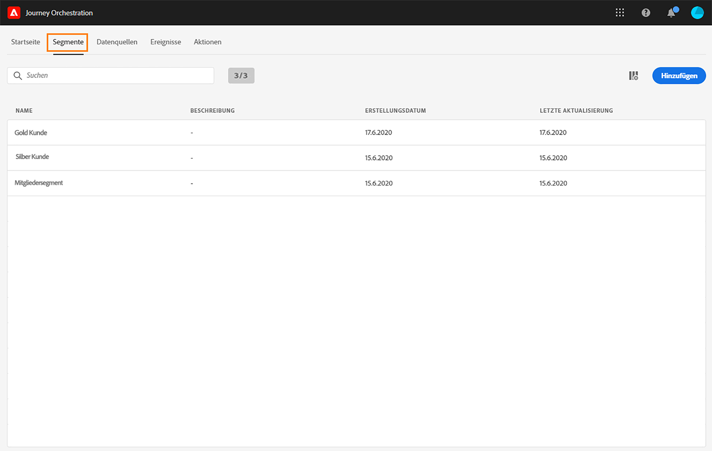
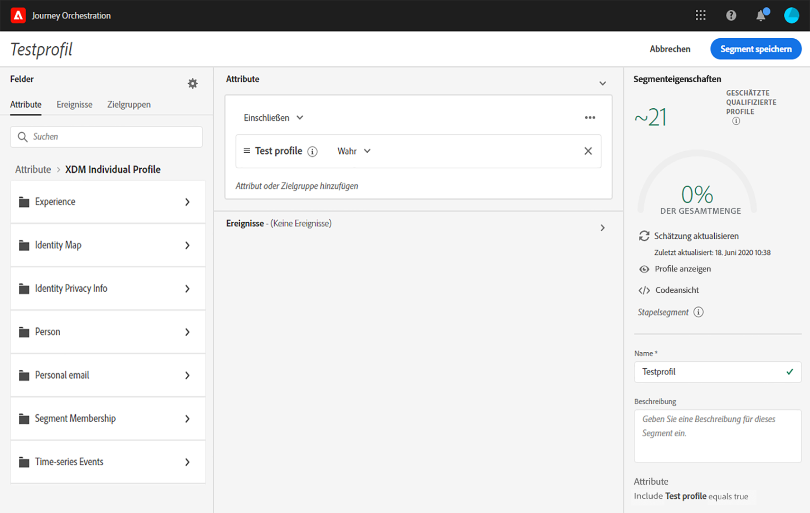

# Erstellen eines Segments {#creating-a-segment}

Sie können ein Segment entweder mit dem [Segmentierungsdienst von Platform](https://docs.adobe.com/content/help/de-DE/experience-platform/segmentation/home.html) erstellen oder direkt in [!DNL Journey Orchestration] aufrufen und einrichten.

1. Klicken Sie oben im Menü auf den Tab **[!UICONTROL Segmente]**. Die Liste der Platform-Segmente wird angezeigt. Sie können in der Liste nach einem bestimmten Segment suchen.

1. Klicken Sie auf **[!UICONTROL Hinzufügen]**, um ein neues Segment zu erstellen. Im Bildschirm für die Segmentdefinition können Sie alle erforderlichen Felder konfigurieren, um Ihr Segment einzurichten. Die Konfiguration verläuft genauso wie beim Segmentierungsdienst. Weiterführende Informationen finden Sie im [Benutzerhandbuch zu Segment Builder](https://docs.adobe.com/content/help/de-DE/experience-platform/segmentation/ui/overview.html).

Ihr Segment kann nun für Journeys verwendet werden, um Bedingungen zu erstellen oder ein Ereignis vom Typ **Segmentqualifizierung** hinzuzufügen. Siehe [Verwenden von Segmenten in Bedingungen](../segment/using-a-segment.md) und [Ereignisaktivitäten](../building-journeys/event-activities.md#segment-qualification).