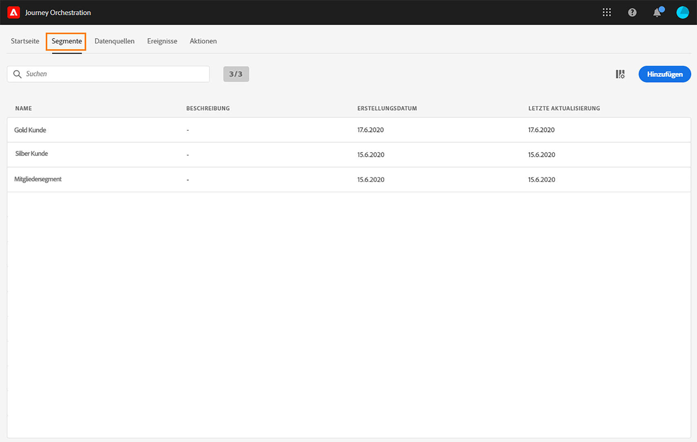
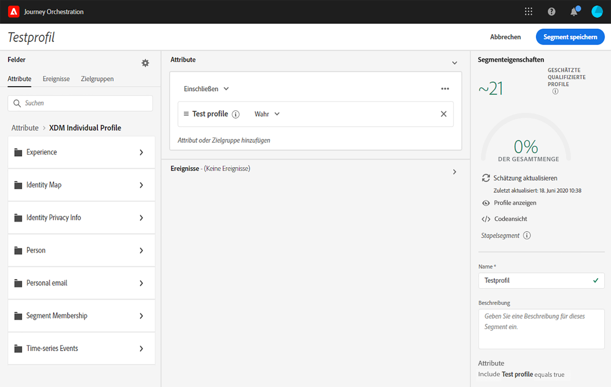

# Erstellen eines Segments {#creating-a-segment}

>[!CAUTION]
>
>**Sie möchten mehr über Adobe Journey Optimizer erfahren**? Klicken Sie [hier](https://experienceleague.adobe.com/de/docs/journey-optimizer/using/ajo-home){target="_blank"}, um auf die Journey Optimizer-Dokumentation zuzugreifen.
>
>
>_Diese Dokumentation bezieht sich auf veraltete Journey Orchestration-Materialien, die durch Journey Optimizer ersetzt wurden. Wenden Sie sich an Ihr Accountteam, wenn Sie Fragen zu Ihrem Zugriff auf Journey Orchestration oder Journey Optimizer haben._

Sie können ein Segment entweder mit dem [Segmentierungsdienst von Adobe Experience Platform](https://experienceleague.adobe.com/docs/experience-platform/segmentation/home.html?lang=de) erstellen oder direkt in [!DNL Journey Orchestration] aufrufen und einrichten.

1. Klicken Sie oben im Menü auf den Tab **[!UICONTROL Segmente]**. Die Liste der Adobe Experience Platform-Segmente wird angezeigt. Sie können in der Liste nach einem bestimmten Segment suchen.

   

1. Klicken Sie auf **[!UICONTROL Hinzufügen]**, um ein neues Segment zu erstellen. Im Bildschirm für die Segmentdefinition können Sie alle erforderlichen Felder konfigurieren, um Ihr Segment einzurichten. Die Konfiguration verläuft genauso wie beim Segmentierungsdienst. Weiterführende Informationen finden Sie im [Benutzerhandbuch zu Segment Builder](https://experienceleague.adobe.com/docs/experience-platform/segmentation/ui/overview.html?lang=de).

   

Ihr Segment kann nun für Journeys verwendet werden, um Bedingungen zu erstellen oder ein Ereignis vom Typ **[!UICONTROL Segmentqualifikation]** hinzuzufügen. Siehe [Verwenden von Segmenten in Bedingungen](../segment/using-a-segment.md) und [Ereignisaktivitäten](../building-journeys/segment-qualification-events.md).
