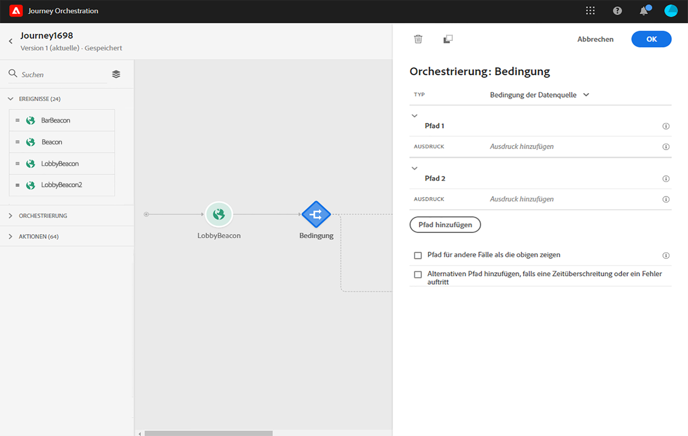
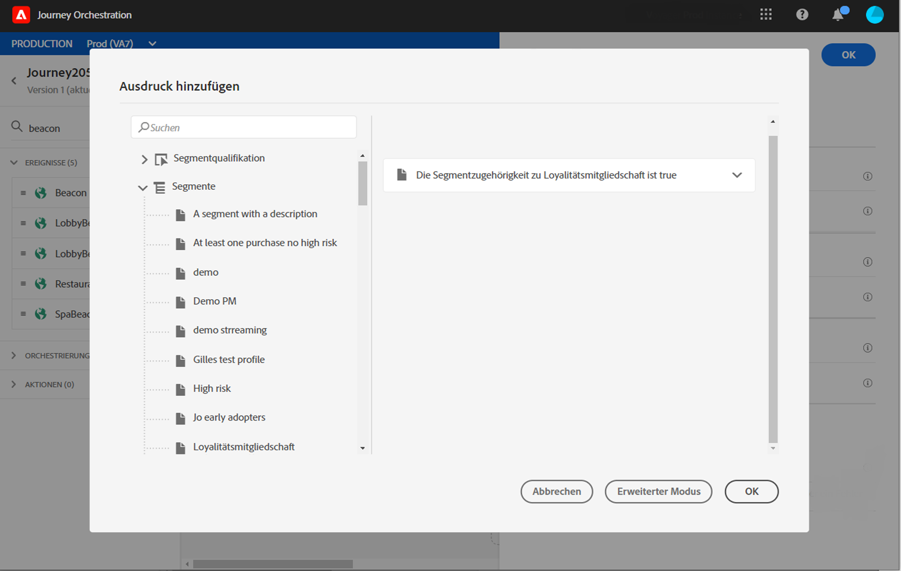

# Verwenden von Segmenten in Bedingungen {#using-a-segment}

In diesem Abschnitt wird erläutert, wie sich ein Segment in einer Journey-Bedingung verwenden lässt. Weitere Informationen zur Verwendung eines **[!UICONTROL Segmentqualifizierung]**-Ereignisses in Ihrer Journey finden Sie in diesem [Abschnitt](../building-journeys/segment-qualification-events.md).

Gehen Sie wie folgt vor, um in einer Journey-Bedingung ein Segment zu verwenden:

1. Öffnen Sie eine Journey, legen Sie eine Aktivität vom Typ **[!UICONTROL Bedingung]** ab und wählen Sie die **Bedingung der Datenquelle**.
   

1. Klicken Sie für jeden zusätzlichen Pfad auf **[!UICONTROL Pfad hinzufügen]**. Klicken Sie für jeden Pfad auf das Feld **[!UICONTROL Ausdruck]**.

   

1. Erweitern Sie auf der linken Seite den Knoten **[!UICONTROL Segmente]**. Legen Sie das Segment, das Sie für Ihre Bedingung verwenden möchten, im Arbeitsbereich ab. Standardmäßig lautet die Bedingung für das Segment „true“.

   

Weiterführende Informationen zu Journey-Bedingungen und zur Verwendung des einfachen Ausdruckseditors finden Sie unter [Bedingungsaktivität](../building-journeys/condition-activity.md#about_condition).
