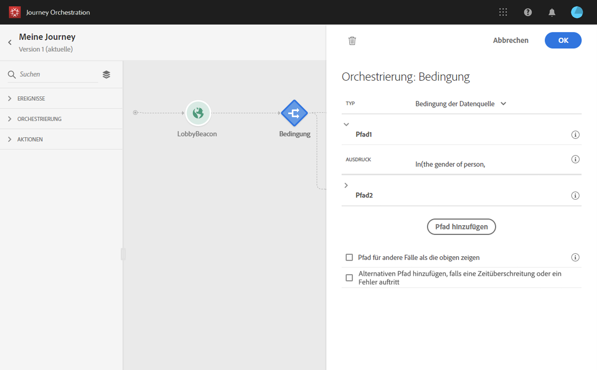
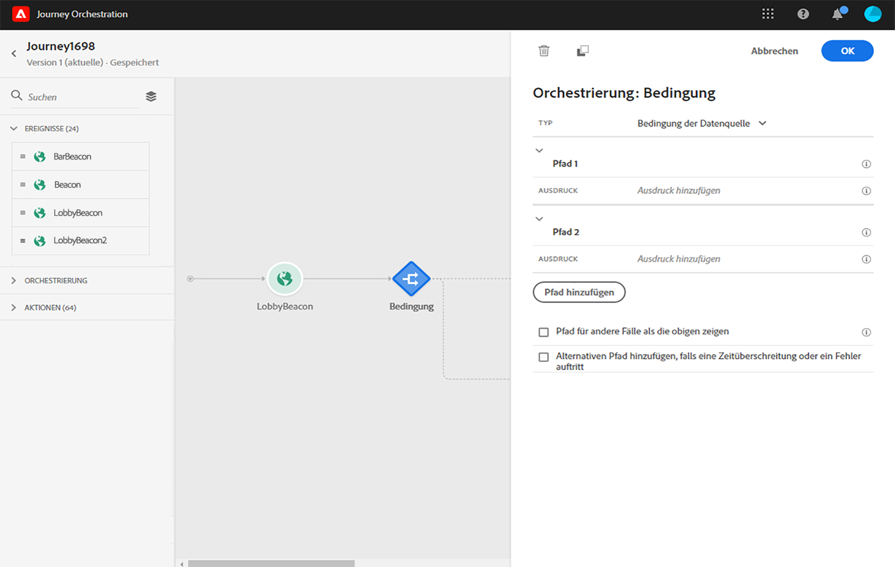
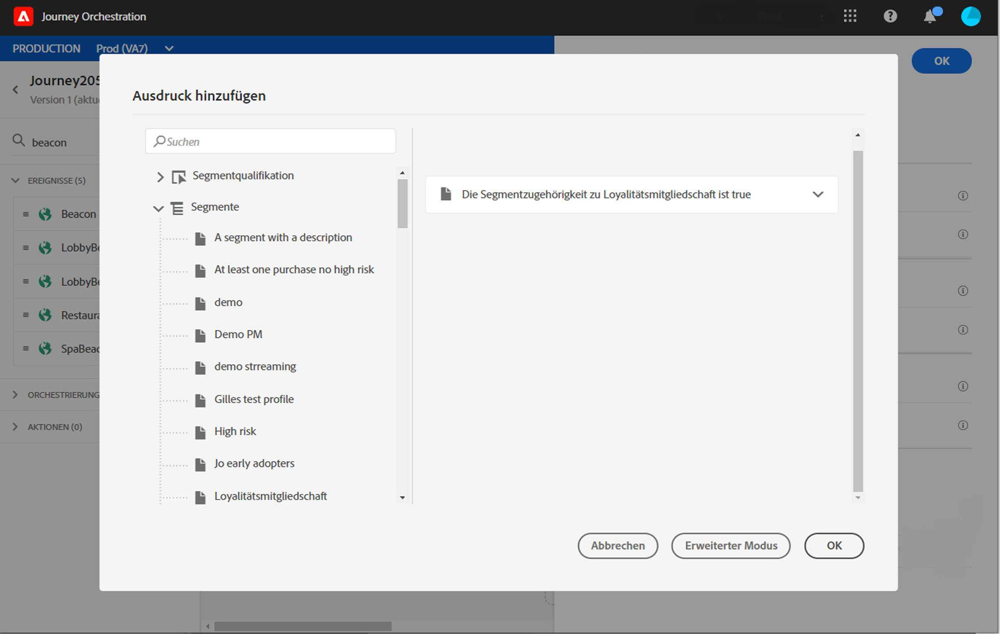

# Verwenden von Segmenten in Bedingungen {#using-a-segment}

>[!CAUTION]
>
>**Sie möchten mehr über Adobe Journey Optimizer erfahren**? Klicken Sie [hier](https://experienceleague.adobe.com/de/docs/journey-optimizer/using/ajo-home){target="_blank"}, um auf die Journey Optimizer-Dokumentation zuzugreifen.
>
>
>_Diese Dokumentation bezieht sich auf veraltete Journey Orchestration-Materialien, die durch Journey Optimizer ersetzt wurden. Wenden Sie sich an Ihr Accountteam, wenn Sie Fragen zu Ihrem Zugriff auf Journey Orchestration oder Journey Optimizer haben._

In diesem Abschnitt wird erläutert, wie sich ein Segment in einer Journey-Bedingung verwenden lässt. Informationen zur Nutzung eines Ereignisses vom Typ **[!UICONTROL Segmentqualifikation]** in Ihrer Journey finden Sie in diesem [Abschnitt](../building-journeys/segment-qualification-events.md).

Gehen Sie wie folgt vor, um in einer Journey-Bedingung ein Segment zu verwenden:

1. Öffnen Sie eine Journey, legen Sie eine Aktivität vom Typ **[!UICONTROL Bedingung]** ab und wählen Sie die **Datenquellenbedingung**.
   

1. Klicken Sie für jeden zusätzlichen Pfad auf **[!UICONTROL Pfad hinzufügen]**. Klicken Sie für jeden Pfad auf das Feld **[!UICONTROL Ausdruck]**.

   

1. Erweitern Sie auf der linken Seite den Knoten **[!UICONTROL Segmente]**. Legen Sie das Segment, das Sie für Ihre Bedingung verwenden möchten, im Arbeitsbereich ab. Standardmäßig lautet die Bedingung für das Segment „true“.

   

   >[!NOTE]
   >
   >Nur Personen mit den Segmentteilnahmestatus **Realisiert** und **Vorhanden** werden als Mitglieder des Segments betrachtet. Weitere Informationen zum Auswerten eines Segments finden Sie in der [Dokumentation zum Segmentierungs-Service](https://experienceleague.adobe.com/docs/experience-platform/segmentation/tutorials/evaluate-a-segment.html?lang=de#interpret-segment-results).

Weiterführende Informationen zu Journey-Bedingungen und zur Verwendung des einfachen Ausdruckseditors finden Sie unter [Bedingungsaktivität](../building-journeys/condition-activity.md#about_condition).
