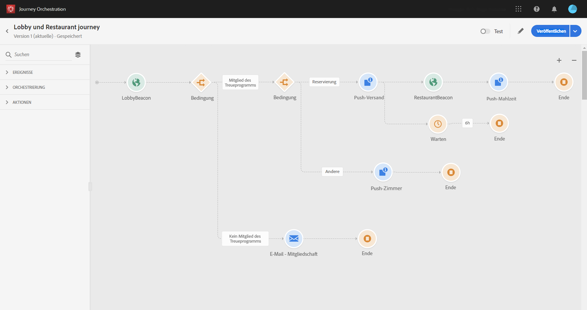

# Informationen zum erweiterten Anwendungsfall{#concept_vzy_ncy_w2b}

## Zweck {#purpose}

Nehmen wir als Beispiel eine Hotelmarke namens Marlton. In den Hotels der Kette wurden Beacon-Geräte in der Nähe aller strategischen Punkte angebracht: Lobby, Etagen, Restaurant, Fitness-Raum, Pool usw.

>[!NOTE]
>
>In diesem Anwendungsfall verwenden wir Adobe Campaign Standard zum Senden von Nachrichten.

In diesem Anwendungsfall werden wir sehen, wie sich in Echtzeit personalisierte Nachrichten an Kunden senden lassen, wenn diese einen bestimmten Beacon passieren.

Zunächst möchten wir eine Nachricht senden, sobald eine Person ein Marlton-Hotel betritt. Allerdings wollen wir nur dann eine Nachricht senden, wenn die Person innerhalb der letzten 24 Stunden keine Mitteilung von uns erhalten hat.

Anschließend prüfen wir zwei Bedingungen:

* Wenn die Person kein Mitglied des Treueprogramms ist, senden wir ihr eine E-Mail, um ihr eine Mitgliedschaft im Treueprogramm anzubieten.
* Wenn die Person bereits Mitglied des Treueprogramms ist, prüfen wir, ob sie über eine Zimmerreservierung verfügt:
   * Wenn das nicht der Fall ist, senden wir eine Push-Benachrichtigung mit Zimmerpreisen.
   * Wenn eine Reservierung vorhanden ist, senden wir der Person eine Willkommens-Push-Benachrichtigung. Wenn diese Person dann in den nächsten 6 Stunden das Restaurant betritt, senden wir ihr eine Push-Benachrichtigung mit einem Rabatt für eine Mahlzeit.

For this use case, we will need to create two events (see [this page](../usecase/configuring-the-events.md)):

* das Beacon-Ereignis „Lobby“, das an das System gesendet wird, sobald ein Kunde das Hotel betritt;
* das Beacon-Ereignis „Restaurant“, das gesendet wird, sobald ein Kunde das Restaurant betritt.

We will need to configure a connection to two data sources (see [this page](../usecase/configuring-the-data-sources.md)):

* zur integrierten Adobe Experience Platform-Datenquelle zum Abrufen der Informationen für die beiden Bedingungen (Mitgliedschaft im Treueprogramm und Datum des letzten Kontakts) sowie der Informationen für die Personalisierung der Nachricht.
* zum Hotelreservierungssystem zum Abrufen der Informationen über den Reservierungsstatus.

## Voraussetzungen:       {#prerequisites}

Für unseren Anwendungsfall haben wir mit Adobe Campaign Standard drei Transaktionsnachrichtenvorlagen entwickelt. Wir nutzen Transaktionsnachrichtenvorlagen für Ereignisse. Mehr dazu erfahren Sie auf [dieser Seite](https://docs.adobe.com/content/help/de-DE/campaign-standard/using/communication-channels/transactional-messaging/about-transactional-messaging.html).

Adobe Campaign Standard ist so konfiguriert, dass E-Mails und Push-Benachrichtigungen gesendet werden.

Als Schlüssel zur Identifizierung des Kunden im Hotelreservierungssystem dient die Experience Cloud-ID.

Ereignisse werden vom Mobiltelefon des Kunden gesendet, sobald es in der Nähe eines Beacons entdeckt wird. Sie müssen eine App einrichten, damit Ereignisse vom Mobiltelefon des Kunden an das Mobile SDK gesendet werden.

Das Feld „Mitglied des Treueprogramms“ ist ein benutzerdefiniertes Feld und wurde in XDM für unsere spezielle Organisations-ID hinzugefügt.
