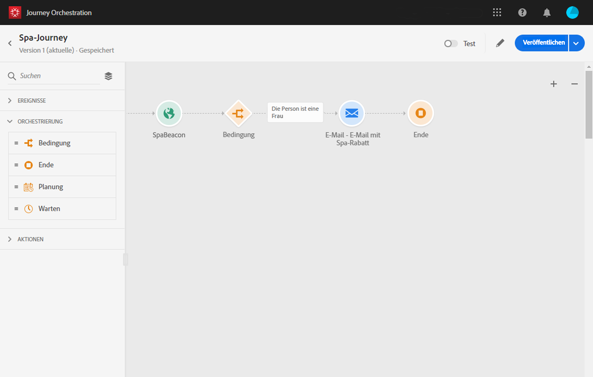

# Über den einfachen Verwendungsfall{#concept_grh_vby_w2b}

## Zweck {#purpose}

Nehmen wir das Beispiel einer Hotelmarke namens Marlton. In ihren Hotels haben sie Beacon-Geräte in der Nähe aller strategischen Bereiche positioniert: Lobby, Fußböden, Restaurant, Fitnessraum, Pool, etc.

In diesem Fall werden wir sehen, wie man eine personalisierte Nachricht in Echtzeit an eine Person, die neben einem Beacon in der Nähe des Kurortes zu Fuß.

Wir wollen eine Nachricht nur senden, wenn die Person eine Frau ist. Die Nachricht muss innerhalb von Sekunden empfangen werden.

## Voraussetzungen: {#prerequisites}

Für unseren Verwendungsfall haben wir in Adobe Campaign Standard eine E-Mail-Vorlage für Transaktionsnachrichten entwickelt. Wir verwenden eine Ereignistransaktionsnachrichtenvorlage. Refer to this [page](https://docs.adobe.com/content/help/en/campaign-standard/using/communication-channels/transactional-messaging/about-transactional-messaging.html).

Adobe Campaign Standard ist so konfiguriert, dass E-Mails gesendet werden.

Ereignisse werden vom Handy des Kunden gesendet, wenn sie in der Nähe eines Beacons erkannt werden. Sie müssen eine Mobilanwendung entwerfen, um Ereignisse vom Handy des Kunden an das Mobile SDK zu senden.