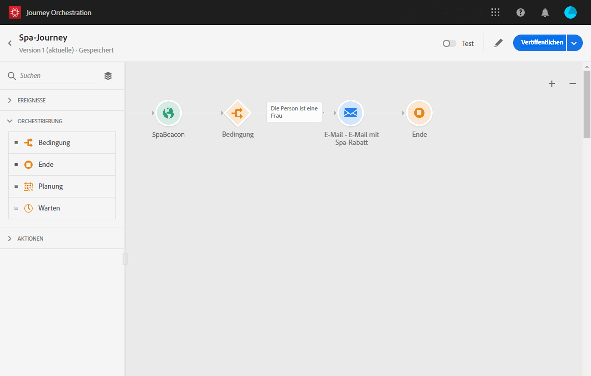

# Informationen zum einfachen Anwendungsfall{#concept_grh_vby_w2b}

>[!CAUTION]
>
>**Sie möchten mehr über Adobe Journey Optimizer erfahren**? Klicken Sie [hier](https://experienceleague.adobe.com/de/docs/journey-optimizer/using/ajo-home){target="_blank"}, um auf die Journey Optimizer-Dokumentation zuzugreifen.
>
>
>_Diese Dokumentation bezieht sich auf veraltete Journey Orchestration-Materialien, die durch Journey Optimizer ersetzt wurden. Wenden Sie sich an Ihr Accountteam, wenn Sie Fragen zu Ihrem Zugriff auf Journey Orchestration oder Journey Optimizer haben._

## Zweck {#purpose}

Nehmen wir als Beispiel eine Hotelmarke namens Marlton. In den Hotels der Kette wurden Beacon-Geräte in der Nähe aller strategischen Punkte angebracht: Lobby, Etagen, Restaurant, Fitness-Raum, Pool usw.

In diesem Anwendungsfall sehen wir, wie sich in Echtzeit eine personalisierte Nachricht an eine Person senden lässt, die einen Beacon nahe des Spa passiert.

Wir wollen nur dann eine Nachricht senden, wenn die Person weiblich ist. Die Nachricht muss innerhalb von Sekunden empfangen werden.

## Voraussetzungen {#prerequisites}

Für unseren Anwendungsfall haben wir in Adobe Campaign Standard eine Transaktionsnachrichtenvorlage in Form einer E-Mail entwickelt. Wir verwenden eine Transaktionsnachrichtenvorlage für Ereignisse. Mehr dazu erfahren Sie auf [dieser Seite](https://experienceleague.adobe.com/docs/campaign-standard/using/communication-channels/transactional-messaging/getting-started-with-transactional-msg.html?lang=de).

Adobe Campaign Standard ist so konfiguriert, dass E-Mails gesendet werden.

Ereignisse werden vom Mobiltelefon des Kunden gesendet, sobald es in der Nähe eines Beacons erkannt wird. Sie müssen eine App einrichten, damit Ereignisse vom Mobiltelefon des Kunden an das Mobile SDK gesendet werden.
