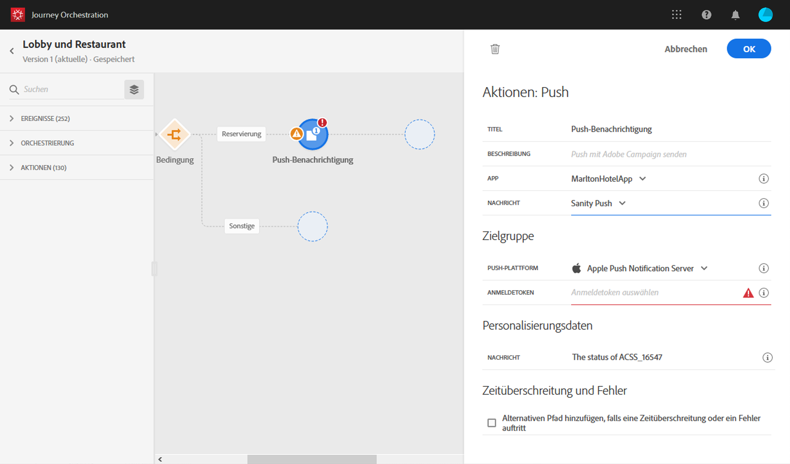
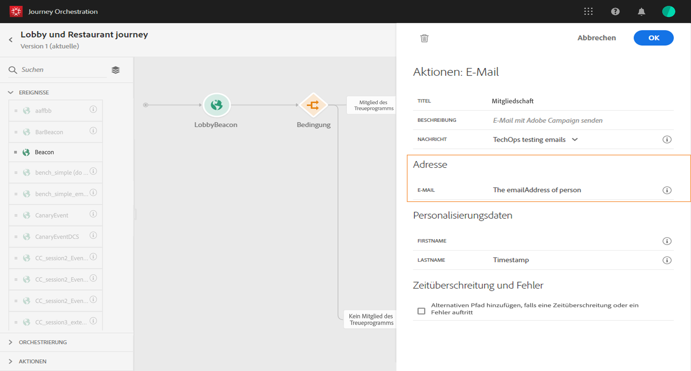

# Erstellen der Journey {#concept_owm_kdy_w2b}

Der **Business-Anwender** kann nun die Journey einrichten. Unsere Journey umfasst folgende Aktivitäten:

* Zwei Aktivitäten vom Typ **[!UICONTROL Ereignis]**: „LobbyBeacon“ und „RestaurantBeacon“
* zwei Aktivitäten vom Typ **[!UICONTROL Bedingung]**
* drei Aktivitäten vom Typ **[!UICONTROL Push]** und eine **[!UICONTROL E-Mail]**-Aktivität (mit Adobe Campaign Standard)
* eine Aktivität vom Typ **[!UICONTROL Warten]**
* vier Aktivitäten vom Typ **[!UICONTROL Ende]**

>[!NOTE]
>
>Die Aktivitäten **[!UICONTROL Push]** und **[!UICONTROL E-Mail]** sind in der Palette nur dann verfügbar, wenn Sie Adobe Campaign Standard verwenden.

Weitere Informationen zum Erstellen einer Journey finden Sie auf [dieser Seite](../building-journeys/journey.md).

## Erste Schritte{#section_ntb_ws1_ffb}

1. Klicken Sie im oberen Menü auf den Tab **[!UICONTROL Startseite]** und dann auf **[!UICONTROL Erstellen]**, um eine neue Journey einzurichten.

   

1. Bearbeiten Sie im Konfigurationsbereich auf der rechten Seite die Eigenschaften der Journey. Fügen Sie einen Namen hinzu und legen Sie die Journey auf eine Dauer von einem Monat fest (vom 1. bis 31. Dezember).

   

1. Beginnen Sie mit der Gestaltung Ihrer Journey, indem Sie das Ereignis „LobbyBeacon“ per Drag-and-Drop von der Palette auf die Arbeitsfläche ziehen. Alternativ können Sie in der Palette auf das Ereignis doppelklicken, um es der Arbeitsfläche hinzuzufügen.

   

1. Nun fügen wir eine Bedingung hinzu, um sicherzustellen, dass die Person in den letzten 24 Stunden nicht kontaktiert wurde, und zu prüfen, ob sie Mitglied des Treueprogramms ist. Ziehen Sie per Drag-and-Drop eine Bedingungsaktivität in die Journey.

   

1. Wählen Sie den Typ **[!UICONTROL Bedingung der Datenquelle]** und klicken Sie auf das Feld **[!UICONTROL Ausdruck]**. Alternativ können Sie eine Bedingungsbezeichnung definieren, die in der Arbeitsfläche auf dem Pfeil angezeigt wird. In unserem Beispiel ersetzen wir „Bedingung 1“ durch „Mitglied des Treueprogramms“.

   

1. Klicken Sie auf **[!UICONTROL Erweiterter Modus]** und definieren Sie die folgende Bedingung basierend auf den Feldern „timestamp“ und „directMarketing.send.value“, die aus der Adobe Experience Platform-Datenquelle kommen. Die Syntax des Ausdrucks lautet:

   ```
   count(#{ExperiencePlatformDataSource.MarltonExperience.experienceevent.all(
       currentDataPackField.directMarketing.sends.value > 0 and
       currentDataPackField.timestamp > nowWithDelta(-1, "days")).timestamp}) == 0
   and
       #{ExperiencePlatformDataSource.MarltonProfiles.Profile._customer.marlton.loyaltyMember}
   ```

   

1. Klicken Sie auf die Schaltfläche **[!UICONTROL Pfad hinzufügen]** und erstellen Sie einen zweiten Pfad für Kunden, die in den letzten 24 Stunden nicht kontaktiert wurden und keine Mitglieder des Treueprogramms sind. Nennen Sie den Pfad „Kein Mitglied des Treueprogramms“. Die Syntax des Ausdrucks lautet:

   ```
   count(#{ExperiencePlatformDataSource.MarltonExperience.experienceevent.all(
       currentDataPackField.directMarketing.sends.value > 0 and
       currentDataPackField.timestamp > nowWithDelta(-1, "days").timestamp}) == 0
   and not
       #{ExperiencePlatformDataSource.MarltonProfiles.Profile._customer.marlton.loyaltyMember}
   ```

   >[!NOTE]
   >
   >Im zweiten Teil des Ausdrucks ist „Profil“ optional.

1. Ein Namespace muss ausgewählt werden. Basierend auf Schemaeigenschaften ist schon vorab ein Namespace ausgewählt. Sie können die Auswahl beibehalten. Weitere Informationen zu Namespaces finden Sie auf [dieser Seite](../event/selecting-the-namespace.md).

In unserem Anwendungsfall wollen wir nur auf diese beiden Bedingungen reagieren, sodass wir das Kontrollkästchen **[!UICONTROL Pfad für andere Fälle als die obigen zeigen]** deaktivieren.

Nach der Bedingung werden zwei Pfade erstellt:

* _Kunden, die in den letzten 24 Stunden nicht kontaktiert wurden und Mitglieder des Treueprogramms sind._
* _Kunden, die in den letzten 24 Stunden nicht kontaktiert wurden und nicht Mitglieder des Treueprogramms sind._


## Erster Pfad: der Kunde ist Mitglied des Treueprogramms {#section_otb_ws1_ffb}

1. Im ersten Pfad fügen wir nun eine Bedingung hinzu, um zu überprüfen, ob der Kunde eine Reservierung hat. Ziehen Sie per Drag-and-Drop eine Bedingungsaktivität in die Journey.

   

1. Wählen Sie den Typ **[!UICONTROL Bedingung der Datenquelle]** und definieren Sie die Bedingung anhand der vom Reservierungssystem abgerufenen Informationen zum Buchungsstatus:

   ```
   #{MarltonReservation.MarltonFieldGroup.reservation} == true
   ```

   

1. Wenn Sie ein Feld aus einer externen Datenquelle auswählen, wird im rechten Teil des Bildschirms die Liste der Parameter angezeigt, die beim Konfigurieren der externen Datenquelle definiert wurden (siehe [diese Seite](../usecase/configuring-the-data-sources.md)). Klicken Sie auf den Parameternamen und definieren Sie den Wert des Reservierungssystemschlüssels (die Experience Cloud-ID), in unserem Beispiel:

   ```
   @{LobbyBeacon.endUserIDs._experience.mcid.id}
   ```

   

1. Da wir auch auf Kunden reagieren wollen, die keine Reservierung haben, müssen wir das Kontrollkästchen **[!UICONTROL Pfad für andere Fälle als die obigen anzeigen]** aktivieren.

   

   Es werden zwei Pfade erstellt:

   * _Kunden, die ein Zimmer gebucht haben_;
   * _Kunden, die kein Zimmer gebucht haben_.

   

1. Legen Sie im ersten Pfad (Zimmer gebucht) eine Aktivität vom Typ **[!UICONTROL Push]** ab und wählen Sie Ihre App sowie Ihre „Willkommens“-Vorlage.

   

1. Definieren Sie die **[!UICONTROL Zielgruppenfelder]**, die vom System zum Senden der Push-Benachrichtigung benötigt werden.

   * **[!UICONTROL Push-Plattform]**: Wählen Sie die Plattform: **[!UICONTROL Apple Push Notification Server]** (Apple) oder **[!UICONTROL Firebase Cloud Messaging]** (Android).
   * **[!UICONTROL Anmeldetoken]**: Fügen Sie im erweiterten Modus den folgenden Ausdruck hinzu (basierend auf dem konfigurierten Ereignis):

      ```
      @{LobbyBeacon._experience.campaign.message.profileSnapshot.pushNotificationTokens.first().token}
      ```

1. Definieren Sie die Personalisierungsfelder der Push-Benachrichtigung. In unserem Beispiel: Vorname und Nachname.

1. Fügen Sie ein Ereignis vom Typ „RestaurantBeacon“ hinzu.

   

1. Fügen Sie eine neue Aktivität vom Typ **[!UICONTROL Push]** hinzu, wählen Sie die Vorlage „Rabatt für Mahlzeit“ und definieren Sie die Felder **[!UICONTROL Adresse]** und **[!UICONTROL Personalisierung]**. Fügen Sie eine Aktivität vom Typ **[!UICONTROL Ende]** hinzu.

   

1. Wir wollen die Push-Benachrichtigung für eine ermäßigte Mahlzeit nur dann senden, wenn die Person das Restaurant innerhalb von 6 Stunden nach Erhalt der Willkommens-Push-Benachrichtigung betritt. Dafür müssen wir eine Warteaktivität verwenden. Platzieren Sie den Cursor in der Willkommens-Push-Aktivität und klicken Sie auf das Symbol „+“. Fügen Sie im neuen Pfad eine Warteaktivität hinzu und legen Sie eine Dauer von 6 Stunden fest. Die erste zulässige Aktivität wird ausgewählt. Wenn das Restaurantereignis weniger als 6 Stunden nach der Willkommens-Push-Benachrichtigung empfangen wird, wird die Push-Aktivität gesendet. Wird in den folgenden 6 Stunden kein Restaurantereignis empfangen, wird „Warten“ gewählt. Platzieren Sie eine Aktivität vom Typ **[!UICONTROL Ende]** nach der Warteaktivität.

   

1. Fügen Sie im zweiten Pfad, der auf die Reservierungsbedingung folgt (kein Zimmer gebucht), eine **[!UICONTROL Push]**-Aktivität hinzu und wählen Sie die Vorlage „Zimmerpreise“. Fügen Sie eine Aktivität vom Typ **[!UICONTROL Ende]** hinzu.

   

## Zweiter Pfad: der Kunde ist kein Mitglied des Treueprogramms{#section_ptb_ws1_ffb}

1. Fügen Sie im zweiten Pfad, der auf die erste Bedingung folgt (Kunde ist kein Mitglied des Treueprogramms), eine **[!UICONTROL E-Mail]**-Aktivität hinzu und wählen Sie die Vorlage „Mitgliedschaft im Treueprogramm“.

   

1. Wählen Sie im Feld **[!UICONTROL Adresse]** die E-Mail-Adresse aus der Datenquelle.

   

1. Definieren Sie die Personalisierungsfelder für Vorname und Nachname aus der Datenquelle.

   

1. Fügen Sie eine Aktivität vom Typ **[!UICONTROL Ende]** hinzu.

Klicken Sie auf den Umschalter **[!UICONTROL Testen]** und testen Sie Ihre Journey. Wenn ein Fehler auftritt, deaktivieren Sie den Testmodus, ändern Sie Ihre Journey und testen Sie sie erneut. Weitere Informationen zum Testmodus finden Sie auf [dieser Seite](../building-journeys/testing-the-journey.md).


Nach Abschluss des Tests können Sie Ihre Journey über das Dropdown-Menü oben rechts veröffentlichen.


