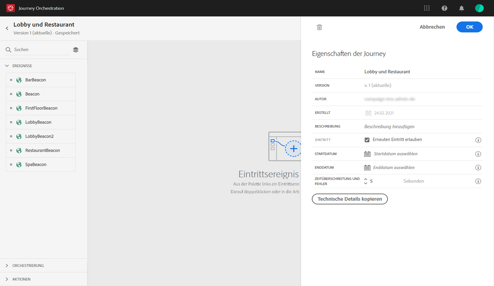
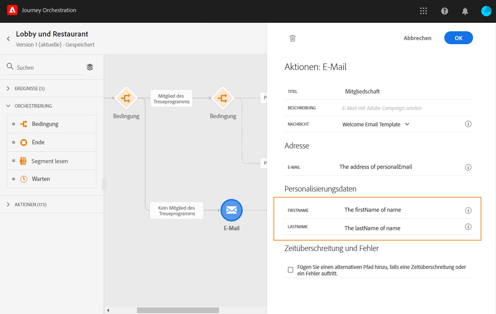

# Aufbau der Reise {#concept_owm_kdy_w2b}

Der **Geschäftsbenutzer** kann nun die Reise gestalten. Unsere Reise umfasst die folgenden Aktivitäten:

* zwei **[!UICONTROL Veranstaltungen]**: &quot;LobbyBeacon&quot;und &quot;RestaurantBeacon&quot;
* zwei **[!UICONTROL Bedingungsaktivitäten]**
* drei **[!UICONTROL Push]**-Aktivitäten und eine**[!UICONTROL  E-Mail]** -Aktivität (mit Adobe Campaign Standard)
* eine **[!UICONTROL Wait]**-Aktivität
* vier **[!UICONTROL End]**-Aktivitäten

>[!NOTE]
>
>Die **[!UICONTROL Aktivitäten &quot;Push]**&quot;und &quot;**[!UICONTROL  E-Mail]** &quot;stehen nur dann in der Palette zur Verfügung, wenn Sie über Adobe Campaign Standard verfügen.

Weitere Informationen zum Aufbau einer Reise finden Sie unter [](../building-journeys/journey.md).

## Erste Schritte{#section_ntb_ws1_ffb}

1. Klicken Sie im oberen Menü auf die Registerkarte **[!UICONTROL Start]**und**[!UICONTROL  Erstellen]** , um eine neue Reise zu erstellen.

   

1. Bearbeiten Sie die Eigenschaften der Reise im Konfigurationsbereich auf der rechten Seite. Fügen Sie einen Namen hinzu und legen Sie ihn auf einen Monat lang fest, vom 1. bis 31. Dezember.

   

1. Beginnen Sie Ihre Reise mit Drag &amp; Drop des &quot;LobbyBeacon&quot;-Ereignisses von der Palette auf die Arbeitsfläche. Sie können auch auf das Ereignis in der Palette doppelklicken, um es der Arbeitsfläche hinzuzufügen.

   

1. Fügen wir nun eine Bedingung hinzu, um zu überprüfen, ob die Person in den letzten 24 Stunden nicht kontaktiert wurde und ob sie ein Treuemitglied ist. Ziehen Sie eine Bedingungsaktivität per Drag &amp; Drop in Ihre Reise.

   

1. Wählen Sie den **[!UICONTROL Datenquellenbedingungstyp]**aus und klicken Sie auf das Feld**[!UICONTROL  Ausdruck]** . Sie können auch eine Bedingungsbeschriftung definieren, die auf dem Pfeil auf der Arbeitsfläche angezeigt wird. In unserem Beispiel ersetzen wir &quot;Bedingung 1&quot;durch &quot;Treuemitglied&quot;.

   

1. Klicken Sie auf **[!UICONTROL Erweiterter Modus]**und definieren Sie die folgende Bedingung basierend auf den Feldern &quot;timestamp&quot;und &quot;directMarketing.send.value&quot;aus der Experience Platform-Datenquelle. Die Syntax des Ausdrucks lautet:

   ```
   count(#{ExperiencePlatformDataSource.MarltonExperience.experienceevent.all(
       currentDataPackField.directMarketing.sends.value > 0 and
       currentDataPackField.timestamp > nowWithDelta(-1, "days")).timestamp}) == 0
   and
       #{ExperiencePlatformDataSource.MarltonProfiles.Profile._customer.marlton.loyaltyMember}
   ```

   

1. Klicken Sie auf die Schaltfläche &quot;Pfad ****hinzufügen&quot;und erstellen Sie einen zweiten Pfad für Kunden, die in den letzten 24 Stunden nicht kontaktiert wurden und keine Treuemitgliedschaft haben. Benennen Sie den Pfad &quot;Kein Treuemitglied&quot;. Die Syntax des Ausdrucks lautet:

   ```
   count(#{ExperiencePlatformDataSource.MarltonExperience.experienceevent.all(
       currentDataPackField.directMarketing.sends.value > 0 and
       currentDataPackField.timestamp > nowWithDelta(-1, "days").timestamp}) == 0
   and not
       #{ExperiencePlatformDataSource.MarltonProfiles.Profile._customer.marlton.loyaltyMember}
   ```

   >[!NOTE]
   >
   >Im zweiten Teil des Ausdrucks ist &quot;Profil&quot;optional.

1. Wir müssen einen Namespace auswählen. Ein Namespace wird basierend auf Schemaeigenschaften vorab ausgewählt. Sie können die Auswahl beibehalten. Weitere Informationen zu Namespaces finden Sie unter [](../event/selecting-the-namespace.md).

In unserem Anwendungsfall wollen wir nur auf diese beiden Bedingungen reagieren, sodass wir nicht das Kontrollkästchen Pfad **[!UICONTROL anzeigen für andere Fälle als die oben]**.

Nach der Bedingung werden zwei Pfade erstellt:

* _Kunden, die in den letzten 24 Stunden nicht kontaktiert wurden und Treuemitglieder sind._
* _Kunden, die in den letzten 24 Stunden nicht kontaktiert wurden und keine Treuemitglieder sind._


## Erster Pfad: der Kunde ein Treuemitglied ist {#section_otb_ws1_ffb}

1. Im ersten Pfad fügen wir eine Bedingung hinzu, um zu überprüfen, ob er eine Reservierung hat. Ziehen Sie eine Bedingungsaktivität per Drag &amp; Drop in Ihre Reise.

   

1. Wählen Sie den **[!UICONTROL Datenquellenbedingungstyp]**und definieren Sie die Bedingung anhand der vom Reservierungssystem abgerufenen Informationen zum Buchungsstatus:

   ```
   #{MarltonReservation.MarltonFieldGroup.reservation} == true
   ```

   

1. Wenn Sie ein Feld aus einer externen Datenquelle auswählen, wird im rechten Teil des Bildschirms die Liste der Parameter angezeigt, die beim Konfigurieren der externen Datenquelle definiert wurden (siehe [](../usecase/configuring-the-data-sources.md)). Klicken Sie auf den Parameternamen und definieren Sie den Wert des Reservierungssystemschlüssels, die Experience Cloud ID, in unserem Beispiel:

   ```
   @{LobbyBeacon.endUserIDs._experience.mcid.id}
   ```

   

1. Da wir auch auf Kunden reagieren wollen, die keine Reservierung haben, müssen wir das Kästchen Pfad **[!UICONTROL anzeigen für andere Fälle als die oben]**.

   

   Es werden zwei Pfade erstellt:

   * _Kunden, die ein Zimmer gebucht haben_
   * _Kunden, die kein Zimmer gebucht haben._
   

1. Legen Sie im ersten Pfad (Zimmer gebucht) eine **[!UICONTROL Push]**-Aktivität ab, wählen Sie Ihre mobile App und Ihre &quot;Willkommen&quot;-Vorlage.

   

1. Definieren Sie die **[!UICONTROL Target]**-Felder, die vom System zum Senden des Push-Vorgangs benötigt werden.

   * **[!UICONTROL Push-Plattform]**: Plattform auswählen:**[!UICONTROL  Apple Push Notification Server]** (Apple) oder **[!UICONTROL Firebase Cloud Messaging]**(Android).
   * **[!UICONTROL Registrierungstoken]**: fügen Sie den folgenden Ausdruck (basierend auf dem konfigurierten Ereignis) im erweiterten Modus hinzu:

      ```
      @{LobbyBeacon._experience.campaign.message.profileSnapshot.pushNotificationTokens.first().token}
      ``
      
1. Definieren Sie die Personalisierungsfelder für Push-Benachrichtigungen. In unserem Beispiel: Vorname und Nachname.

1. Fügen Sie ein &quot;RestaurantBeacon&quot; Ereignis hinzu.

   

1. Fügen Sie eine neue **[!UICONTROL Push]**-Aktivität hinzu, wählen Sie die Vorlage &quot;Meal Discount&quot; und definieren Sie die Felder**[!UICONTROL  Adresse]** und **[!UICONTROL Personalisierung]**. Add an**[!UICONTROL  End]** activity.

   

1. Wir möchten eine Push-Benachrichtigung über eine Mahlzeit-Rabatt nur senden, wenn die Person innerhalb der nächsten 6 Stunden nach dem Willkommensschub ins Restaurant kommt. Dazu müssen wir eine Warteaktivität verwenden. Platzieren Sie den Cursor auf die Begrüßungs-Push-Aktivität und klicken Sie auf das &quot;+&quot;-Symbol. Fügen Sie im neuen Pfad eine Warteaktivität hinzu und definieren Sie eine Dauer von 6 Stunden. Die erste förderfähige Maßnahme wird ausgewählt. Wenn das Restaurantereignis weniger als 6 Stunden nach dem Begrüßungs-Push empfangen wird, wird die Push-Aktivität gesendet. Wenn innerhalb der nächsten 6 Stunden kein Restaurantereignis eingeht, wird die Wartezeit gewählt. Platzieren Sie eine **[!UICONTROL End]**-Aktivität nach der Warteaktivität.

   

1. Fügen Sie im zweiten Pfad, der der Reservierungsbedingung folgt (kein Zimmer gebucht), eine **[!UICONTROL Push]**-Aktivität hinzu und wählen Sie Ihre Vorlage &quot;Zimmerpreise&quot;. Add an**[!UICONTROL  End]** activity.

   

## Zweiter Pfad: der Kunde kein Treuemitglied ist{#section_ptb_ws1_ffb}

1. Fügen Sie im zweiten Pfad, der der ersten Bedingung folgt (Kunde ist kein Treuemitglied), eine **[!UICONTROL E-Mail]**-Aktivität hinzu und wählen Sie Ihre Vorlage &quot;Treuemitgliedschaft&quot;.

   

1. Wählen Sie im Feld **[!UICONTROL Adresse]**die E-Mail-Adresse aus der Datenquelle aus.

   

1. Definieren Sie die Personalisierungsfelder für Vornamen und Nachnamen aus der Datenquelle.

   

1. Add an **[!UICONTROL End]**activity.

Klicken Sie auf den **[!UICONTROL Test]**-Umschalter und testen Sie Ihre Reise. Wenn ein Fehler auftritt, deaktivieren Sie den Testmodus, ändern Sie Ihre Reise und testen Sie sie erneut. For more information on the test mode, refer to[](../building-journeys/testing-the-journey.md).


Wenn der Test abgeschlossen ist, können Sie Ihre Reise über das Dropdown-Menü oben rechts veröffentlichen.


