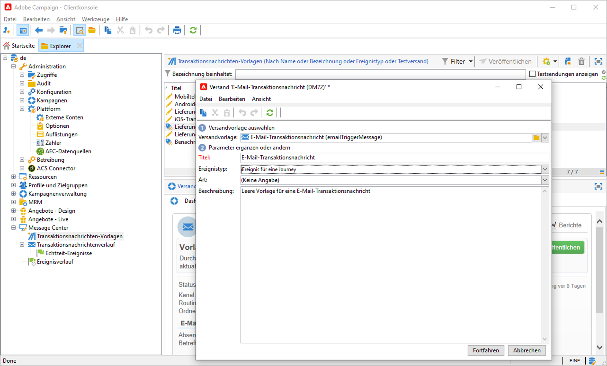
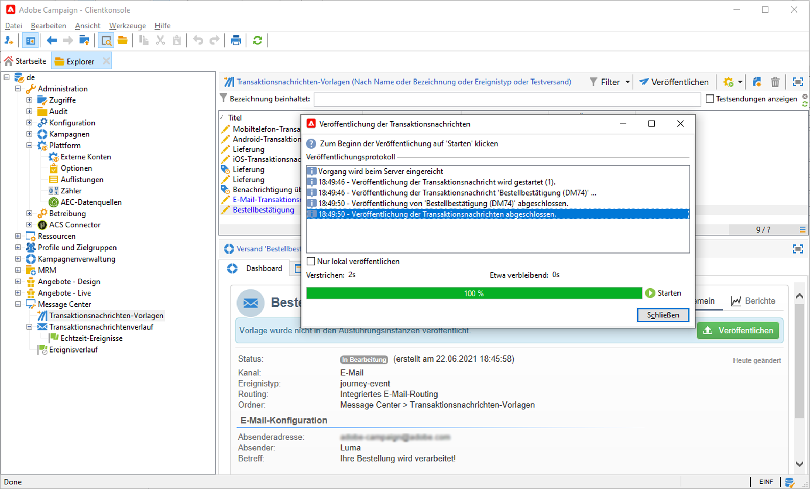
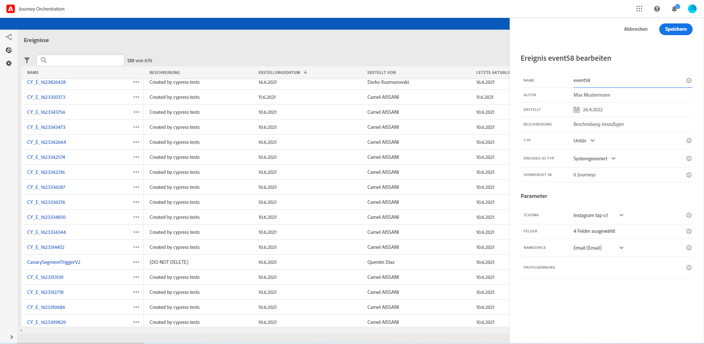
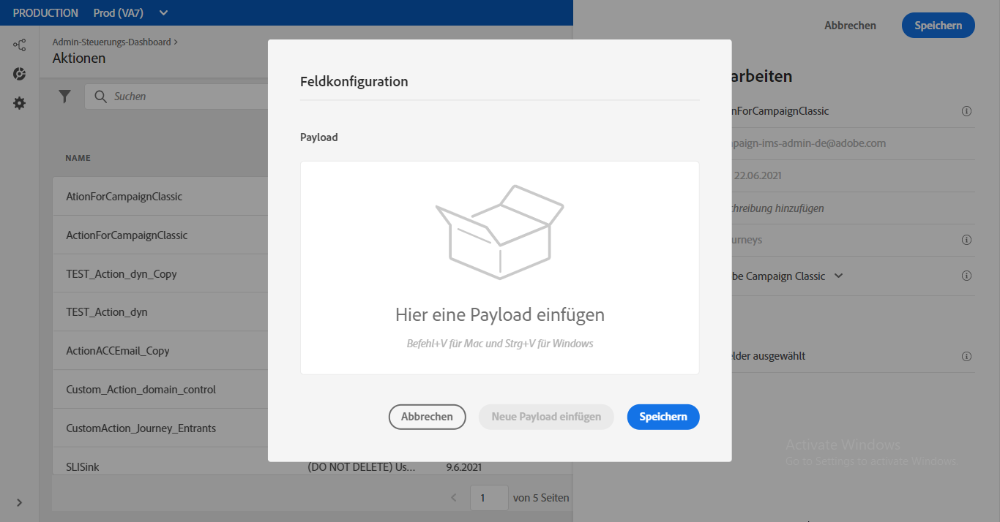
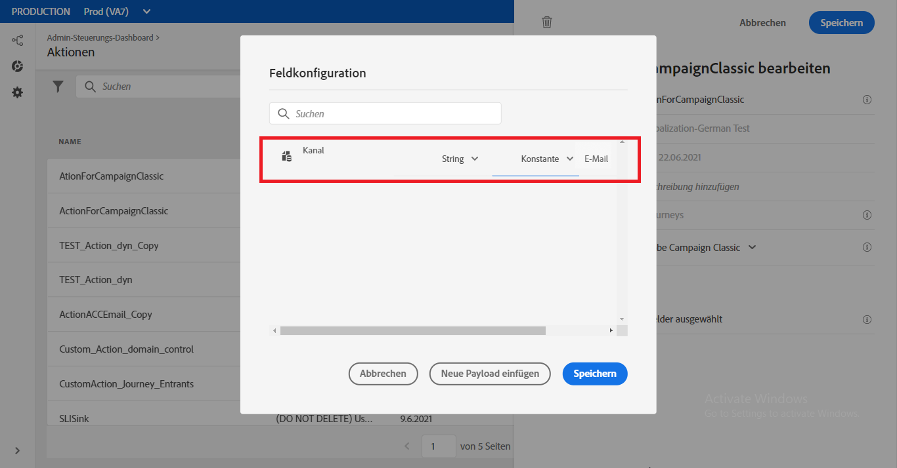
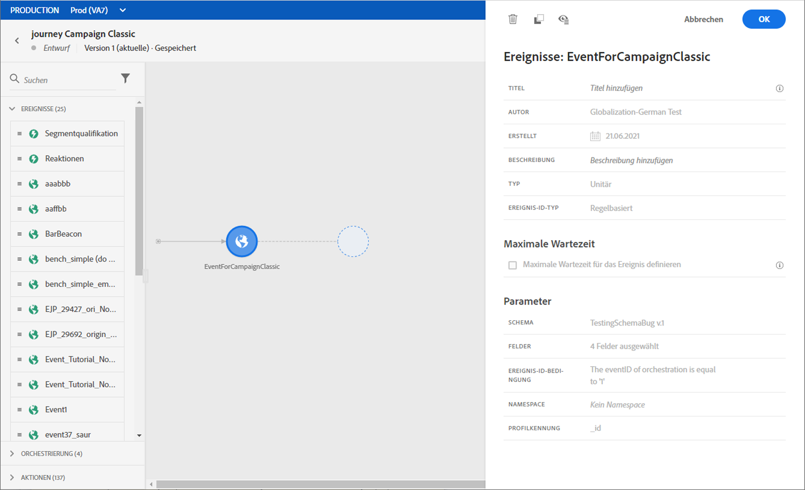

# Versand einer Nachricht mit Campaign {#campaign-v7-v8-use-case}

In diesem Anwendungsbeispiel werden alle erforderlichen Schritte zum Senden einer E-Mail mithilfe der Adobe Campaign-Integration vorgestellt.

Zunächst wird in Campaign eine Transaktions-E-Mail-Vorlage erstellt. Dann erstellen wir in der Journey Orchestration die Veranstaltung, Aktion und entwerfen die Journey.

Weiterführende Informationen zur Campaign-Integration finden Sie auf diesen Seiten:

* [Erstellen einer Kampagnenaktion](../action/working-with-adobe-campaign.md#using_adobe_campaign_v7_v8)
* [Verwenden der Aktion in einer Journey](../building-journeys/using-adobe-campaign-actions.md).

**Adobe Campaign**

Ihre Campaign-Instanz muss für diese Integration bereitgestellt werden. Die Funktion für Transaktionsnachrichten muss konfiguriert werden.

1. Melden Sie sich bei Ihrer Campaign-Kontrollinstanz an.

1. Wählen Sie unter **Administration** > **Plattform** > **Auflistungen** die Auflistung **Ereignistyp** (eventType). Erstellen Sie einen neuen Ereignistyp ( in unserem Beispiel &quot;Journey-event&quot;). Sie müssen den internen Namen des Ereignistyps beim späteren Schreiben der JSON-Datei verwenden.

   

1. Trennen Sie die Verbindung zur Instanz und verbinden Sie sie erneut, damit die Erstellung wirksam ist.

1. Erstellen Sie unter **Message Center** > **Transaktionsnachrichten-Vorlagen** eine neue E-Mail-Vorlage basierend auf dem zuvor erstellten Ereignistyp.

   

1. Entwerfen Sie Ihre Vorlage. In diesem Beispiel verwenden wir eine Personalisierung für den Vornamen und die Bestellnummer des Profils. Der Vorname befindet sich in der Adobe Experience Platform-Datenquelle und die Bestellnummer ist ein Feld aus unserem Journey Orchestration-Ereignis. Stellen Sie sicher, dass Sie die richtigen Feldnamen in Campaign verwenden.

   

1. Veröffentlichen Sie Ihre Transaktionsvorlage.

   

1. Jetzt müssen Sie die JSON-Payload schreiben, die der Vorlage entspricht.

```
{
     "channel": "email",
     "eventType": "journey-event",
     "email": "Email address",
     "ctx": {
          "firstName": "First name", "purchaseOrderNumber": "Purchase order number"
     }
}
```

* Geben Sie für den Kanal &quot;email&quot;ein.
* Verwenden Sie für eventType den internen Namen des zuvor erstellten Ereignistyps.
* Die E-Mail-Adresse ist eine Variable, sodass Sie einen beliebigen Titel eingeben können.
* Unter ctx sind die Personalisierungsfelder auch Variablen.

**Journey Orchestration**

1. Zunächst müssen Sie ein Ereignis erstellen. Stellen Sie sicher, dass Sie das Feld &quot;purchaseOrderNumber&quot;einschließen.

   

1. Erstellen Sie dann in Journey Orchestration eine Ihrer Campaign-Vorlage entsprechende Aktion. Wählen Sie in der Dropdown-Liste **Aktionstyp** die Option **Adobe Campaign Classic** aus.

   

1. Klicken Sie auf das Feld **Payload** und fügen Sie die zuvor erstellte JSON ein.

   

1. Ändern Sie für die E-Mail-Adresse und die beiden Personalisierungsfelder **Konstante** in **Variable**.

   

1. Erstellen Sie nun eine neue Journey und beginnen Sie mit dem zuvor erstellten Ereignis.

   

1. Fügen Sie die Aktion hinzu und ordnen Sie jedes Feld dem richtigen Feld in der Journey Orchestration zu.

   

1. Fügen Sie die Aktivität **Ende** hinzu und testen Sie Ihre Journey.

   

1. Sie können Ihre Journey jetzt veröffentlichen.
