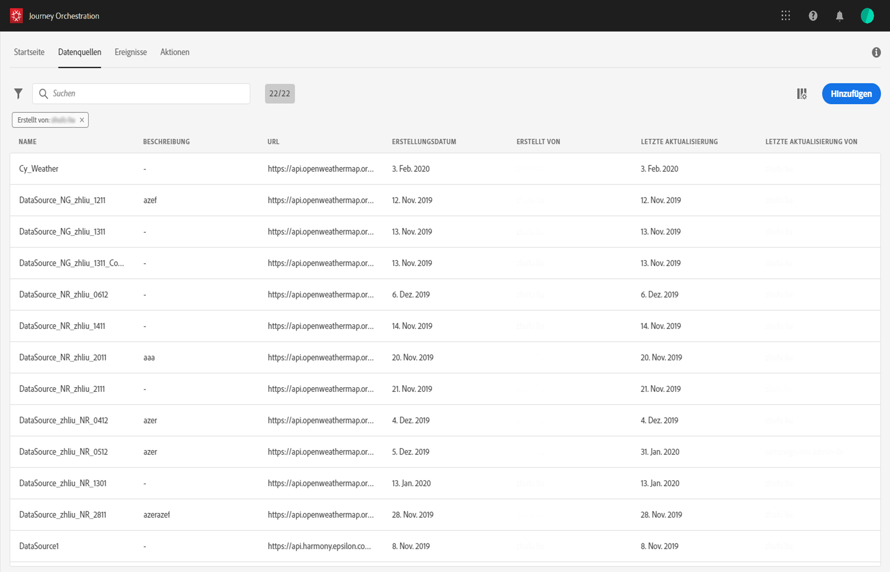

# Datenquellen konfigurieren {#concept_vml_hdy_w2b}

In unserem Anwendungsfall möchten wir Personalisierungsdaten für unsere Nachrichten verwenden. Wir müssen auch überprüfen, ob die Person ein Treuemitglied ist und in den letzten 24 Stunden nicht kontaktiert wurde. Diese Informationen werden in der Echtzeit-Kundenprofildatenbank gespeichert. Der **technische Benutzer** muss die Experience Platform-Datenquelle konfigurieren, um diese Felder abzurufen.

Weitere Informationen zur Datenquellenkonfiguration finden Sie unter [](../datasource/about-data-sources.md).

1. Klicken Sie im oberen Menü auf die Registerkarte **[!UICONTROL Datenquellen]**und wählen Sie die integrierte Experience Platform-Datenquelle.

   

1. Überprüfen Sie in den vorkonfigurierten Gruppenfeldern, ob die folgenden Felder ausgewählt sind:

   * _person > name > firstName_
   * _person > name > lastName_
   * _personalEmail > address_

1. Klicken Sie auf Neue Feldgruppe ****hinzufügen, wählen Sie ein**[!UICONTROL  Profilschema]** aus und fügen Sie das Feld **Treuemenmitglied** für unsere Bedingung hinzu. Das Feld **Treuhandmitglied** ist ein benutzerdefiniertes Feld und wurde in XDM hinzugefügt: &quot;_customer > marlton > loyalty Member&quot;

   

1. Klicken Sie auf Neue Feldgruppe ****hinzufügen, wählen Sie ein**[!UICONTROL  ExperienceEvent]** -Schema aus und wählen Sie die für unsere Bedingung erforderlichen Felder für die Anzahl der in einem bestimmten Zeitraum gesendeten Nachrichten aus: _Zeitstempel_ für das Datum und _directMarketing > sendet > Wert_ für die Anzahl der gesendeten Nachrichten.

   

1. Wählen Sie **[!UICONTROL Speichern]**aus.

Wir müssen auch überprüfen, ob die Person eine Reservierung im Hotelbuchungssystem hat. Der **technische Benutzer** muss eine zweite Datenquelle konfigurieren, um dieses Feld abzurufen.

1. Klicken Sie in der Liste der Datenquellen auf **[!UICONTROL Hinzufügen]**, um eine neue externe Datenquelle hinzuzufügen, um die Verbindung zu Ihrem Hotelreservierungssystem zu definieren.

   

1. Geben Sie einen Namen für Ihre Datenquelle und die URL des externen Dienstes ein, z. B.: _https://marlton.com/reservation_

   >[!CAUTION]
   >
   >Aus Sicherheitsgründen wird die Verwendung von HTTPS dringend empfohlen.

1. Konfigurieren Sie die Authentifizierung je nach Konfiguration des externen Dienstes: **[!UICONTROL Keine Authentifizierung]**,**[!UICONTROL  Grundlegender]**, **[!UICONTROL Benutzerdefinierter]**oder**[!UICONTROL  API-Schlüssel]**. In unserem Beispiel wählen wir &quot;Einfach&quot;für den Typ und geben den Benutzernamen und das Kennwort für den API-Aufruf an.

   

1. Klicken Sie auf Neue Feldgruppe **[!UICONTROL hinzufügen]**, um die abzurufenden Informationen und die API-Parameter zu definieren. Für unser Beispiel gibt es nur einen Parameter (die ID). Daher müssen wir eine Feldgruppe mit den folgenden Informationen erstellen:

   * **[!UICONTROL Methode]**: wählen Sie die POST- oder GET-Methode. In unserem Fall wählen wir die GET-Methode.
   * **[!UICONTROL Cachedauer]**: dies variiert je nach Häufigkeit der API-Aufrufe. In unserem Fall wird das Reservierungssystem alle 10 Minuten aktualisiert.
   * **[!UICONTROL Antwortnutzlast]**: Klicken Sie in das Feld**[!UICONTROL  Nutzlast]** und fügen Sie ein Beispiel der Nutzlast ein. Überprüfen Sie, ob die Feldtypen korrekt sind. Jedes Mal, wenn die API aufgerufen wird, ruft das System alle im Payload-Beispiel enthaltenen Felder ab. In unserem Beispiel enthält die Payload nur den Buchungsstatus:

   ```
   {
       "reservation" : true
   }
   ```

   * **[!UICONTROL Dynamische Werte]**: geben Sie den Parameter ein, der dem Schlüssel entspricht, der zur Identifizierung der einzelnen Kunden verwendet wird, &quot;id&quot;in unserem Beispiel. Der Wert dieses Parameters wird in der Fahrt definiert.
   

1. Wählen Sie **[!UICONTROL Speichern]**aus.

   Die Datenquellen sind jetzt konfiguriert und können auf Ihrer Reise verwendet werden.
