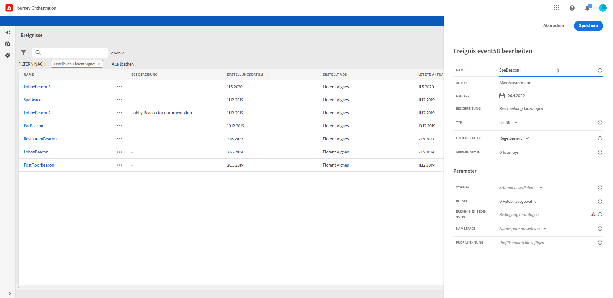
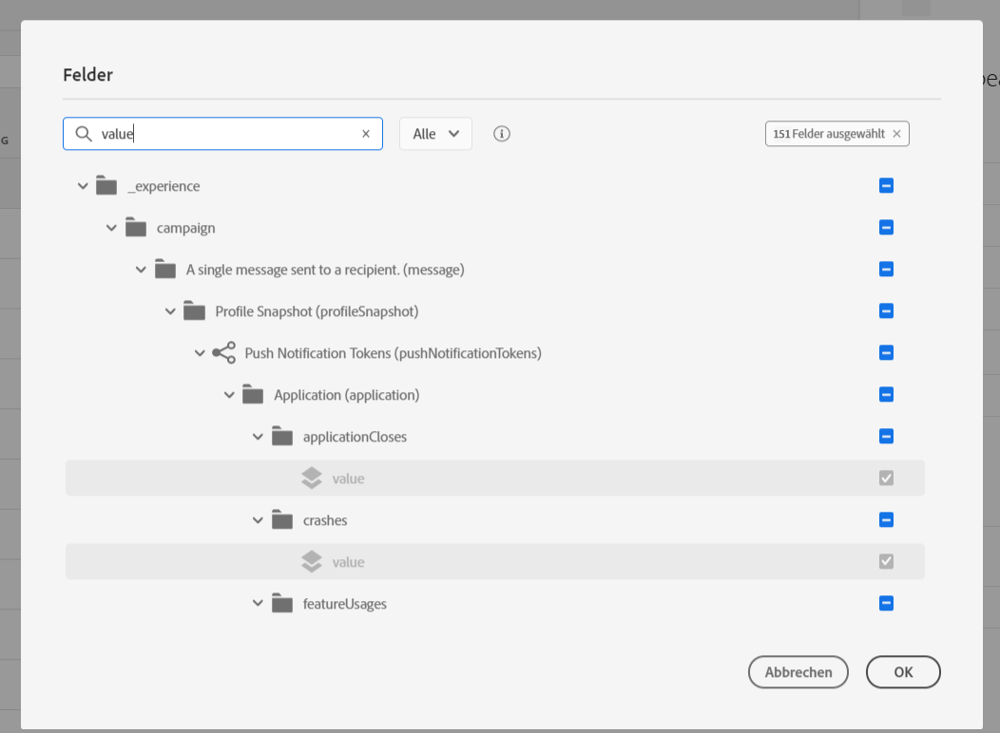
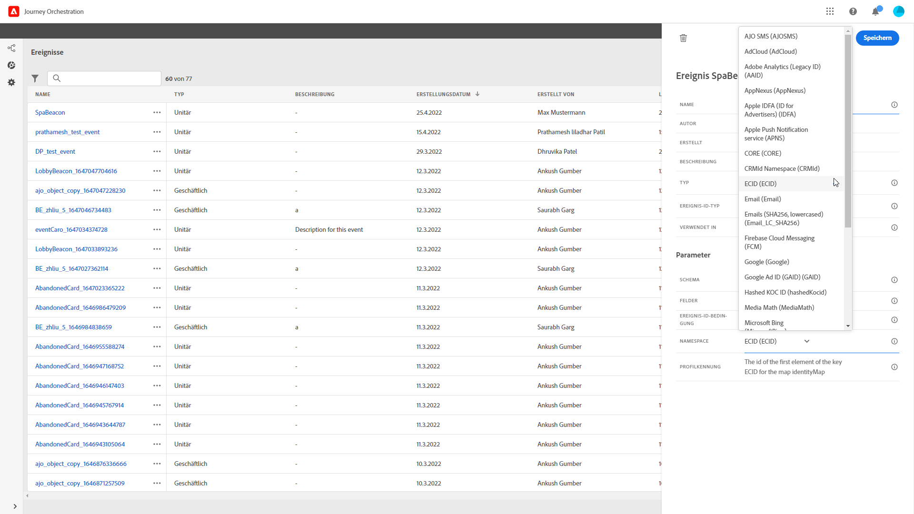
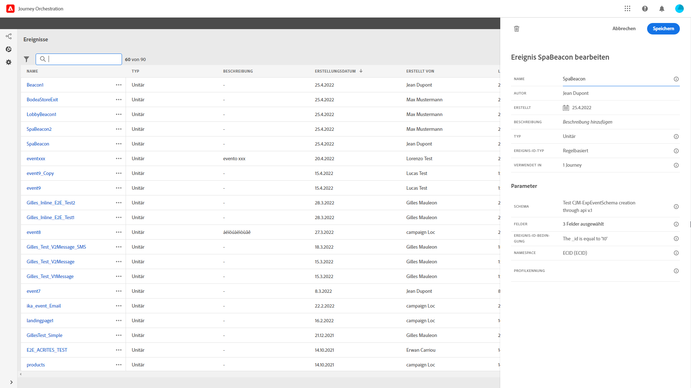
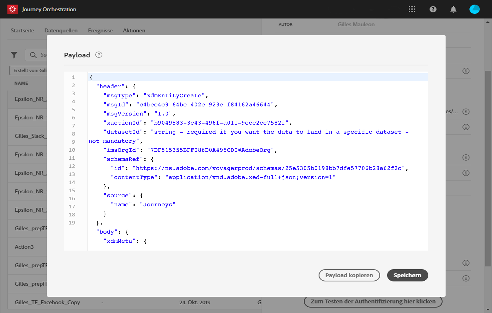

# Konfigurieren des Ereignisses{#concept_y44_hcy_w2b}

In unserem Szenario müssen wir jedes Mal, wenn eine Person den Beacon am Spa passiert, ein Ereignis erhalten. Der **technische Anwender** muss das Ereignis konfigurieren, auf das das System in unserer Journey achten wird.

Weitere Informationen zur Ereigniskonfiguration finden Sie auf [dieser Seite](../event/about-events.md).

1. Klicken Sie im oberen Menü auf den Tab **[!UICONTROL Ereignisse]** und dann auf **[!UICONTROL Hinzufügen]**, um ein neues Ereignis zu erstellen.

   

1. Wir geben den Namen ohne Leer- oder Sonderzeichen ein: „SpaBeacon“.

   

1. Anschließend wählen wir das Schema aus und definieren die für das Ereignis erwartete Payload. Wir wählen die erforderlichen Felder aus dem mit XDM normalisierten Modell. Wir benötigen die Experience Cloud-ID, um die Person in der Echtzeit-Kundenprofildatenbank zu identifizieren: _endUserIDs > _experience > mcid > id_. Für dieses Ereignis wird automatisch eine ID generiert. Die ID wird im Feld **[!UICONTROL eventID]** gespeichert (_experience > campaign > orchestration > eventID_). Das System, das das Ereignis per Push sendet, sollte keine ID generieren, sondern die ID verwenden, die in der Payload-Vorschau verfügbar ist. In unserem Anwendungsfall dient diese ID zur Identifizierung des Beacon-Standorts. Jedes Mal, wenn eine Person den Spa-Beacon passiert, wird ein Ereignis mit dieser spezifischen Ereignis-ID gesendet. So kann das System erkennen, welcher Beacon das Senden des Ereignisses ausgelöst hat.

   

   >[!NOTE]
   >
   >Die Liste der Felder variiert von Schema zu Schema. Gemäß der Schemadefinition können einige Felder obligatorisch und vorausgewählt sein.

1. Ein Namespace muss ausgewählt werden. Basierend auf Schemaeigenschaften ist schon vorab ein Namespace ausgewählt. Sie können die Auswahl beibehalten. Weitere Informationen zu Namespaces finden Sie auf [dieser Seite](../event/selecting-the-namespace.md).

   

1. Je nach den Schemaeigenschaften und dem ausgewählten Namespace wird ein Schlüssel vorausgewählt. Sie können ihn beibehalten.

   

1. Klicken Sie auf **[!UICONTROL Speichern]**.

1. Klicken Sie auf das Symbol **[!UICONTROL Payload zeigen]**, um eine Vorschau der vom System erwarteten Payload anzuzeigen und mit der Person zu teilen, die für das Senden des Ereignisses verantwortlich ist. Diese Payload muss im Postback der Mobile Services-Administrationskonsole konfiguriert werden.

   

   Das Ereignis kann nun in Ihrer Journey genutzt werden. Jetzt müssen Sie die App so konfigurieren, dass sie die erwartete Payload an den Endpunkt der Streaming-Aufnahme-APIs senden kann. Weitere Informationen finden Sie auf [dieser Seite](../event/additional-steps-to-send-events-to-journey-orchestration.md).