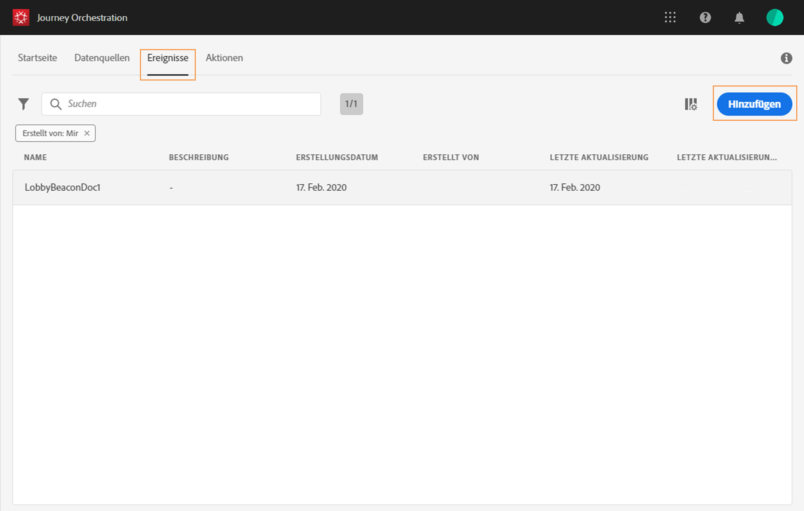

# Konfigurieren des Ereignisses{#concept_y44_hcy_w2b}

In unserem Szenario müssen wir jedes Mal, wenn eine Person in der Nähe eines Beacons neben dem Spa geht, eine Veranstaltung empfangen. Der **technische Benutzer** muss die Veranstaltung konfigurieren, auf die das System während unserer Reise hören wird.

Weitere Informationen zur Ereigniskonfiguration finden Sie unter .

1. Klicken Sie im oberen Menü auf die Registerkarte **[!UICONTROL Ereignisse]**und dann auf**[!UICONTROL  Hinzufügen]** , um ein neues Ereignis zu erstellen.

   

1. Wir geben den Namen ohne Leerzeichen oder Sonderzeichen ein: &quot;SpaBeacon&quot;.

   

   <!--li>Select the **[!UICONTROL Mobile - Streaming Ingestion APIs]** event type. Events are sent from the customers' mobile phone through the Mobile SDK.. Das System, das das Ereignis durchführt, sollte keine ID generieren. Es sollte die ID verwenden, die in der Nutzdatenvorschau verfügbar ist. In unserem Anwendungsfall wird diese ID zur Identifizierung des Beacon-Speicherorts verwendet. Jedes Mal, wenn eine Person in der Nähe des Spa-Beacons spazieren geht, wird ein Ereignis mit dieser spezifischen Ereignis-ID gesendet. Dadurch kann das System erkennen, welcher Beacon das Senden des Ereignisses ausgelöst hat.

   

   >[!NOTE]
   >
   >Die Feldliste variiert von Schema zu Schema. Gemäß der Schemadefinition können einige Felder obligatorisch und vorausgewählt sein.

1. Wir müssen einen Namespace auswählen. Ein Namespace wird basierend auf Schemaeigenschaften vorab ausgewählt. Sie können die Auswahl beibehalten. Weitere Informationen zu Namespaces finden Sie unter .

   

1. Ein Schlüssel wird basierend auf den Schemaeigenschaften und dem ausgewählten Namespace vorausgewählt. Du kannst es behalten.

   

1. Wählen Sie **[!UICONTROL Speichern]**aus.

1. Klicken Sie auf das Symbol **[!UICONTROL Payload]**anzeigen, um eine Vorschau der vom System erwarteten Nutzlast anzuzeigen und diese an die für das Senden des Ereignisses verantwortliche Person freizugeben. Diese Nutzlast muss im Postback von Mobile Services Administration Console konfiguriert werden.

   

   Die Veranstaltung kann auf Ihrer Reise genutzt werden. Sie müssen die mobile Anwendung jetzt so konfigurieren, dass sie die erwartete Nutzlast an den Endpunkt der Streaming Ingestion APIs senden kann. Näheres wird im Abschnitt  beschrieben.